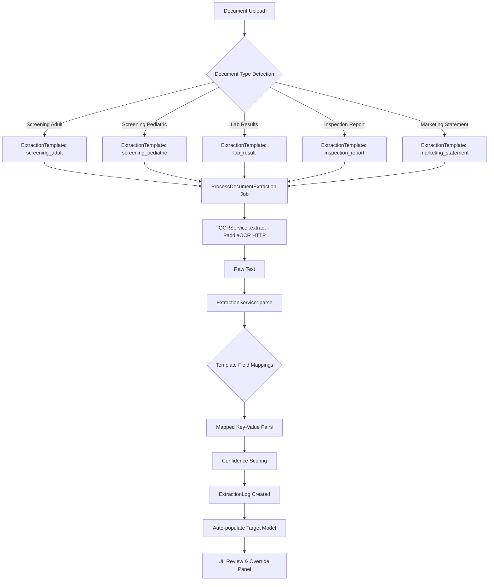
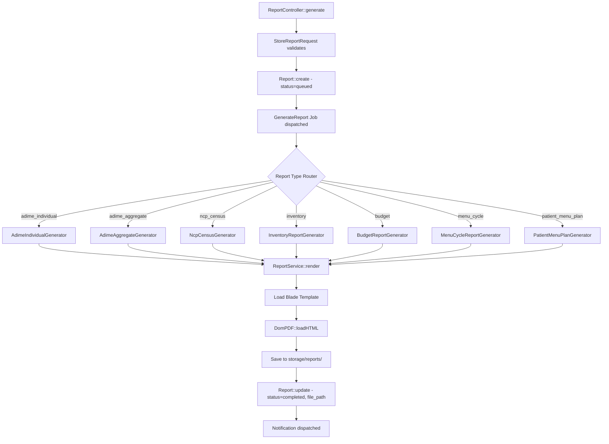
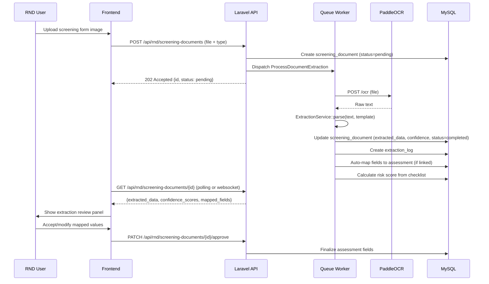
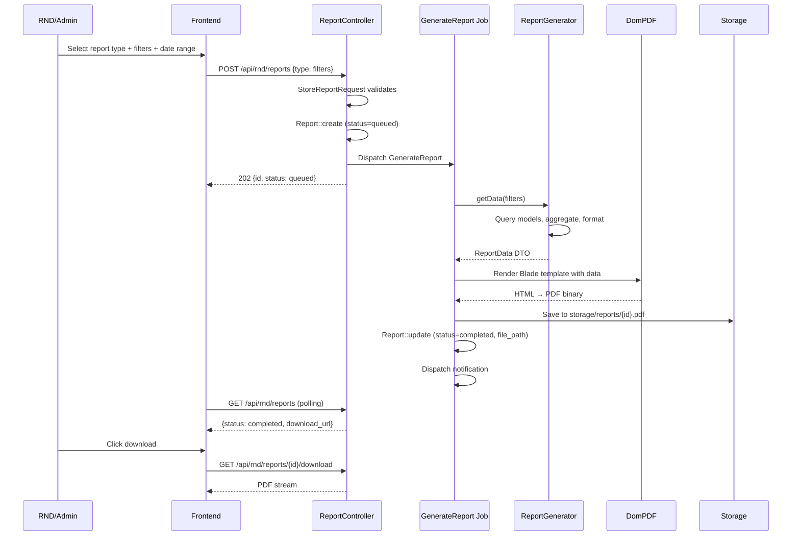
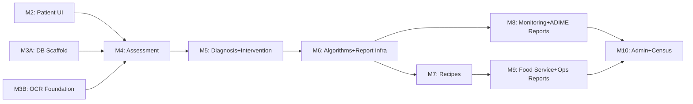

> [!IMPORTANT]
> **OUTDATED REFERENCES IN THIS DOCUMENT**
> This document is a planning artifact created from analysis of hospital 
> reference forms. It predates implementation decisions made during M2.
> 
> Before using anything from this document, note the following corrections:
>
> **Risk Score Field:**
> - Any reference to `ai_risk_score` in this document is WRONG
> - Any reference to "AI risk score" is WRONG  
> - The correct field name is `risk_score` on the `ncp_records` table
> - Risk scoring is PURELY DETERMINISTIC — calculated from the screening 
>   checklist checkboxes (Appendix B.06 pediatric, B.07 adult)
> - There is no AI involvement in risk scoring at any stage
> - The NCP Census mapping table reference to `ai_risk_score` should be 
>   read as `risk_score`
>
> **Announcements:**
> - AnnouncementController is listed under M10 in this document
> - This is WRONG — announcements backend was completed during M2 cleanup
> - Do not reschedule or recreate announcements work
>
> **All other content** in this document remains valid as architectural 
> reference. The extraction templates, report architecture, and milestone 
> structure are accurate.
# NutriScope System Enhancements — Implementation Plan

## Background

NutriScope is at the end of Milestone 1 (Auth complete, Patient CRUD backend done, Patient UI pending). The existing codebase has 14 models, 2 controllers, 15 migrations, and no tables actually created in the database yet. This plan redesigns the system's reporting architecture, integrates OCR incrementally, proposes new schema, and restructures milestones for continuous visibility.

### Reference Documents Analyzed

| Document | Key Data Points Extracted |
|---|---|
| **Nutrition Care Plan (NCP/ADIME)** | Biochemical key-value fields (Albumin→URR, 19 fields), risk scoring (0–3+ scale), nutritional status, PES statement, intervention macros, monitoring checkboxes |
| **Screening Form — Adult** | 15 clinical conditions, 10 intake/weight criteria, referral section (Per Orem/Tube/NPO) |
| **Screening Form — Pediatric** | 18 clinical conditions, 8 intake/weight criteria (z-scores), referral section |
| **NCP Bi-Annual Report (B.08)** | Age groups (0-4→60+), M/F breakdown, metrics: admissions, NAR patients, malnutrition types, comorbidities, ADIME step counts |
| **Acceptance & Inspection Report** | Line items (Item No, Unit, Description, Quantity), supplier, date, inspection verification |
| **Statement of Marketing Purchased** | Period, item/unit-price/total-value line items, grand total, certifications |
| **Summary of Marketing Purchased** | Date purchased, inclusive dates, total amount, certification |

---

## Resolved Decisions

> [!NOTE]
> **OCR Integration Timing**: PaddleOCR Docker service added to `docker-compose.yml` in M3. Development uses a mock/stub `OCRService` until M4 when actual extraction begins. This allows the extraction architecture to be built and tested independently of the OCR microservice.

> [!NOTE]
> **Report Scope**: Partial/seeded data is acceptable for early milestones. Report infrastructure and simpler reports (inventory, budget, procurement) ship first. Complex reports (NCP Census, ADIME Aggregate) ship when underlying data is available.

> [!NOTE]
> **Screening Architecture**: Separate `screening_documents` table with polymorphic extraction — approved. The Assessment model gains a `hasMany` relationship to `screening_documents`. This cleanly separates OCR/extraction concerns from the clinical assessment data.

> [!NOTE]
> **Export Format**: PDF only via DomPDF. No Excel/CSV export needed.

> [!NOTE]
> **Date Ranges**: All reports support arbitrary date ranges. The NCP Census report uses the B.08 format as visual reference but is not locked to bi-annual periods.

> [!NOTE]
> **Procurement Documents**: Dual-direction flow. Documents can be (1) uploaded via OCR to auto-populate procurement records from physical paperwork, AND (2) generated as output PDF reports from existing system data. Both `InspectionReportGenerator` and `MarketingStatementGenerator` classes will be needed in the report pipeline alongside the extraction templates.

---

## Proposed Changes

### Overview: Revised Milestone Architecture

The current milestones are restructured into **5 parallel tracks** with smaller, testable increments per milestone. Each milestone produces a visible deliverable.

```mermaid
gantt
    title NutriScope Development Tracks
    dateFormat X
    axisFormat %s
    
    section Backend Core
    M0 Foundation (Done)     :done, b0, 0, 1
    M1 Auth (Done)           :done, b1, 1, 2
    M2 Patient CRUD          :b2, 2, 3
    M3 DB Scaffold + OCR Base:b3, 3, 4
    M4 NCP Assessment        :b4, 4, 5
    M5 Diagnosis+Intervention:b5, 5, 6
    M6 Algorithms            :b6, 6, 7
    M7 Recipes+Food Library  :b7, 7, 8
    M8 Monitoring+Dashboard  :b8, 8, 9
    M9 Food Service Ops      :b9, 9, 10
    M10 Admin Module         :b10, 10, 11
    
    section Extraction Pipeline
    M3 OCR Service + Base    :e3, 3, 4
    M4 Screening Extraction  :e4, 4, 5
    M5 Lab Result Extraction :e5, 5, 6
    M9 Procurement Docs      :e9, 9, 10
    
    section Reports
    M6 Report Infrastructure :r6, 6, 7
    M8 ADIME Reports         :r8, 8, 9
    M9 Operational Reports   :r9, 9, 10
    M10 Census/Analytics     :r10, 10, 11
    
    section Frontend
    M2 Patient UI            :f2, 2, 3
    M4 Assessment UI         :f4, 4, 5
    M5 Diagnosis UI          :f5, 5, 6
    M7 Recipe Builder UI     :f7, 7, 8
    M9 Food Service UI       :f9, 9, 10
    M10 Admin+Reports UI     :f10, 10, 11
    
    section Documentation
    M3 Schema Docs Update    :d3, 3, 4
    M6 Report Arch Docs      :d6, 6, 7
    M10 Final Docs Sweep     :d10, 10, 11
```



---

### Component 1: Database Schema Additions

#### [NEW] New migration files (18 tables)

The following tables must be added via individual migrations. They extend the existing 15 migrations.

**Extraction & Document Pipeline:**

```
screening_documents     id, patient_id, assessment_id, type(adult/pediatric),
                        file_path, extracted_data(json), mapped_fields(json),
                        status(pending/processing/completed/failed),
                        confidence_score(decimal), reviewed_by(user_id),
                        reviewed_at, timestamps

extraction_templates    id, document_type(screening_adult/screening_pediatric/
                        lab_result/inspection_report/marketing_statement),
                        field_mappings(json), validation_rules(json),
                        version, is_active(bool), timestamps

extraction_logs         id, screening_document_id, ocr_document_id,
                        source_type(screening/lab/procurement),
                        raw_text, parsed_fields(json),
                        confidence_scores(json), errors(json),
                        processing_time_ms, timestamps
```

**Reporting Pipeline:**

```
reports                 id, user_id, title, type(enum: adime_individual/
                        adime_aggregate/ncp_census/inventory/budget/
                        procurement/menu_cycle/patient_menu_plan),
                        filters(json), parameters(json), file_path,
                        status(queued/generating/completed/failed),
                        generated_at, expires_at, timestamps

report_templates        id, type(matches report types above), name,
                        blade_view, default_filters(json),
                        available_filters(json), description,
                        is_active(bool), timestamps
```

**Procurement & Inspection (extends existing procurement tables):**

```
inspection_reports      id, procurement_id, supplier_name, air_no,
                        po_no, invoice_date, requisition_office,
                        date_received, date_inspected,
                        inspection_status(complete/partial),
                        inspected_by, inspected_by_title,
                        certified_by, certified_by_title,
                        verified_by, verified_by_title,
                        approved_by, approved_by_title,
                        file_path, extracted_data(json), timestamps

inspection_report_items id, inspection_report_id, item_no, unit,
                        description, quantity(decimal),
                        food_item_id(nullable FK), timestamps

marketing_statements    id, procurement_id, period_start, period_end,
                        grand_total(decimal),
                        certified_by, certified_by_title,
                        examined_by, examined_by_title,
                        verified_by, verified_by_title,
                        file_path, extracted_data(json), timestamps

marketing_statement_items id, marketing_statement_id, item_description,
                          unit_price(decimal), quantity, total_value(decimal),
                          food_item_id(nullable FK), timestamps

marketing_summaries     id, marketing_statement_id, date_purchased,
                        inclusive_start, inclusive_end,
                        total_amount(decimal),
                        certified_by, certified_by_title, timestamps
```

**Supporting tables (from existing schema doc, not yet migrated):**

```
monitorings             (as documented in database-schema.md)
inventory               (as documented)
menu_cycles             (as documented)
menu_cycle_days         (as documented)
meal_prep_logs          (as documented)
budgets                 (as documented)
budget_daily_logs       (as documented)
procurements            (as documented)
procurement_items       (as documented)
announcements           (as documented)
calendar_events         (as documented)
notifications           (as documented)
audit_logs              (as documented — already via spatie)
ai_usage_logs           (as documented)
```

**Schema updates to existing tables:**

```
ocr_documents           ADD: document_type(screening/lab/procurement),
                        extraction_template_id(nullable FK),
                        parsed_fields(json), confidence_score(decimal),
                        processing_time_ms

patients                ADD: screening_type(adult/pediatric/null),
                        hospital_number, age_group_category
```

---

### Component 2: OCR & Extraction Pipeline Architecture

#### Design: Reusable Extraction System



#### [NEW] `backend/app/Services/ExtractionService.php`

Core reusable service with these responsibilities:
- Accept raw OCR text + template type
- Use `extraction_templates.field_mappings` to parse key-value pairs
- Score confidence per field based on pattern matching quality
- Return structured `ParsedDocument` DTO
- Log to `extraction_logs`

#### [NEW] `backend/app/Services/OCRService.php`

HTTP client to PaddleOCR microservice:
- `extract(string $filePath): string` — returns raw text
- Handles timeout, retry, error logging
- Called only from Jobs, never directly from controllers

#### [NEW] `backend/app/Jobs/ProcessDocumentExtraction.php`

Generic extraction job replacing the single-purpose `ProcessOCRDocument`:
- Accepts `document_id`, `document_type`, `target_model`, `target_id`
- Calls `OCRService` → `ExtractionService`
- Updates target model with mapped fields
- Fires `DocumentExtractionCompleted` event

#### [NEW] `backend/app/DTOs/ParsedDocument.php`

Value object:
```
fields: array<string, mixed>        // extracted key-value pairs
confidenceScores: array<string, float>  // per-field confidence
rawText: string
documentType: string
processingTimeMs: int
errors: array
```

#### [MODIFY] `backend/app/Models/OcrDocument.php` (rename from conceptual)

Add relationships to `extraction_template`, `extraction_logs`. Add `document_type` accessor.

#### Extraction Template Examples

**Screening Adult Template** — `field_mappings`:
```json
{
  "clinical_conditions": {
    "patterns": ["Admission to ICU", "Anorexia Nervosa", "Cachexia", "Cerebrovascular accident", "Coma", "Diabetes Mellitus", "Gastrointestinal disease", "Liver disease", "Malabsorption", "Multiple trauma", "Non-healing wounds", "On tube feeding", "Renal disease", "Sepsis", "Serum albumin <3.5"],
    "target_field": "screening_documents.extracted_data.clinical_conditions",
    "type": "checkbox_array"
  },
  "intake_weight": {
    "patterns": ["Unintentional weight loss", "Reduced dietary intake", "BMI below 18.5", "Pregnant patient"],
    "target_field": "screening_documents.extracted_data.intake_weight_history",
    "type": "checkbox_array"
  },
  "referral_type": {
    "patterns": ["Per Orem", "Tube Feeding", "NPO / TPN"],
    "target_field": "screening_documents.extracted_data.referral_type",
    "type": "single_select"
  },
  "patient_name": {
    "patterns": ["Name of Patient:(.+?)(?:Age|$)"],
    "target_field": "patients.name",
    "type": "text"
  }
}
```

**Biochemical Lab Template** — `field_mappings`:
```json
{
  "albumin": {"patterns": ["Albumin[:\\s]+([\\d.]+)"], "target_field": "biochemical_data.albumin", "type": "decimal"},
  "hematocrit": {"patterns": ["Hematocrit[:\\s]+([\\d.]+)"], "target_field": "biochemical_data.hematocrit", "type": "decimal"},
  "bun": {"patterns": ["BUN[:\\s]+([\\d.]+)"], "target_field": "biochemical_data.bun", "type": "decimal"},
  "hemoglobin": {"patterns": ["Hemoglobin[:\\s]+([\\d.]+)"], "target_field": "biochemical_data.hemoglobin", "type": "decimal"},
  "calcium": {"patterns": ["Calcium[:\\s]+([\\d.]+)"], "target_field": "biochemical_data.calcium", "type": "decimal"},
  "ldl": {"patterns": ["LDL[:\\s]+([\\d.]+)"], "target_field": "biochemical_data.ldl", "type": "decimal"},
  "cholesterol": {"patterns": ["Cholesterol[:\\s]+([\\d.]+)"], "target_field": "biochemical_data.cholesterol", "type": "decimal"},
  "creatinine": {"patterns": ["Creatinine[:\\s]+([\\d.]+)"], "target_field": "biochemical_data.creatinine", "type": "decimal"},
  "glucose": {"patterns": ["Glucose[:\\s]+([\\d.]+)"], "target_field": "biochemical_data.glucose", "type": "decimal"},
  "hba1c": {"patterns": ["HbA1C[:\\s]+([\\d.]+)"], "target_field": "biochemical_data.hba1c", "type": "decimal"},
  "triglycerides": {"patterns": ["Triglycerides[:\\s]+([\\d.]+)"], "target_field": "biochemical_data.triglycerides", "type": "decimal"}
}
```

**Risk Scoring** (from NCP reference — matches existing `ai_risk_score` on `ncp_records`):
```
Total Points = sum of checked risk factors:
  - Screening criteria for potential nutritional risk (1 point)
  - <85% or >130% ideal body weight (1 point)
  - Unintentional weight loss ___% over ___ weeks/months (2 points)
  - Mechanical / digestive problem (1 point)
  - Low albumin (1 point)
  - Significant lab result (1 point)
  - Others (1 point)

Score → Status:
  1     = Low Risk      → Normal
  2-3   = Moderate      → Moderate Malnutrition
  >3    = High Risk     → Severe Malnutrition
```

This scoring replaces/supplements the AI risk score with a deterministic calculation from extracted screening data.

---

### Component 3: Report Architecture

#### Report Types & Data Sources

| # | Report Type | Standalone? | Data Source | Date Range | Output |
|---|---|---|---|---|---|
| 1 | **ADIME Individual** | Yes | Single patient's NCP chain (Assessment→Diagnosis→Intervention→Monitoring) | Per NCP record | PDF — patient nutrition care summary |
| 2 | **ADIME Aggregate** | Yes | All NCP records within date range | Custom range | PDF — aggregate patient analytics (avg risk scores, common diagnoses, intervention outcomes) |
| 3 | **NCP Census (Bi-Annual)** | Yes | Patients + NCP records + demographics | Bi-annual or custom range | PDF — matches Appendix B.08 format: age/sex breakdown, malnutrition categories, ADIME step counts |
| 4 | **Inventory Report** | Groupable | `inventory` + `food_items` | Custom range | PDF — stock levels, expiry tracking, usage rates, low-stock flags |
| 5 | **Budget & Procurement** | Grouped | `budgets` + `budget_daily_logs` + `procurements` + `inspection_reports` + `marketing_statements` | Custom range | PDF — planned vs actual, variance analysis, procurement summaries, inspection records |
| 6 | **Menu Cycle Report** | Yes | `menu_cycles` + `menu_cycle_days` + `recipes` | Week or custom range | PDF — weekly meal schedule with recipes, ingredients, costs, nutritional breakdown |
| 7 | **Patient Menu Plan** | Yes | Search patient → `meal_plans` + `meal_plan_days` + `meal_plan_items` | Per plan | PDF — individual patient's meal plan with daily breakdown |

#### Report Generation Architecture



#### [NEW] Backend file structure for reports:

```
app/Services/
  Reports/
    ReportService.php              — orchestrator: template loading, PDF rendering, storage
    Contracts/
      ReportGeneratorInterface.php — interface: getData(), getTemplateName()
    Generators/
      AdimeIndividualGenerator.php
      AdimeAggregateGenerator.php
      NcpCensusGenerator.php
      InventoryReportGenerator.php
      BudgetReportGenerator.php
      MenuCycleReportGenerator.php
      PatientMenuPlanGenerator.php

app/Http/Controllers/
  RND/ReportController.php        — generate, index, show, download
  Admin/ReportController.php      — all reports across all users

app/Http/Requests/
  RND/StoreReportRequest.php      — type, filters, date_range validation
  
app/Http/Resources/
  ReportResource.php

app/Jobs/
  GenerateReport.php              — dispatches to appropriate generator

resources/views/reports/          — Blade templates for each report type
  adime-individual.blade.php
  adime-aggregate.blade.php
  ncp-census.blade.php
  inventory.blade.php
  budget.blade.php
  menu-cycle.blade.php
  patient-menu-plan.blade.php
```

#### NCP Census Report Mapping (Bi-Annual Reference → System Data)

| B.08 Metric | System Data Source |
|---|---|
| Number of patients admitted | `patients` WHERE `admission_date` in range |
| Number of nutritionally-at-risk (NAR) patients | `ncp_records` WHERE `ai_risk_score > 0` OR screening risk > 0 |
| (1) Wasting | `assessments.bmi` < threshold per age |
| (2) Moderate acute malnutrition | `ncp_records` risk score = 2-3 |
| (3) Severe acute malnutrition | `ncp_records` risk score > 3 |
| b. Stunting | Pediatric: height-for-age z-score (from `assessments`) |
| c. Underweight | `assessments.bmi` < 18.5 (adult) or weight-for-age z-score (pediatric) |
| d. Overweight | `assessments.bmi` 25-29.9 |
| e. Obese | `assessments.bmi` ≥ 30 |
| f. Disease & co-morbidities | `diagnoses.domain` + `assessments.medical_history` |
| NAR patients given nutrition screening | `screening_documents` count |
| Patients given nutrition assessment | `assessments` count |
| Patients given nutrition intervention | `interventions` count |
| Patients given nutrition care documentation (ADIME) | `ncp_records` with all 4 ADIME steps |
| Age/sex breakdown | `patients.dob` → age bucket + `patients.sex` |

---

### Component 4: Revised Milestone Structure

#### Milestone 0: Planning & Architecture ✅ (This Session)

- [x] Analyzed all reference documents (screening forms, NCP, bi-annual report, procurement docs)
- [x] Designed extraction architecture
- [x] Designed report architecture
- [x] Proposed database schema additions
- [x] Created phased implementation roadmap
- [x] Defined parallel development tracks

---

#### Milestone 2: Patient Management

**Backend** (already done):
- [x] `StorePatientRequest`, `UpdatePatientRequest`, `PatientResource`
- [x] `PatientController` CRUD

**Frontend** (pending):
- [ ] Patient List Page with search/filter/pagination
- [ ] Add Patient Modal
- [ ] Patient Profile shell with NCP tabs placeholder

---

#### Milestone 3: Database Scaffold + OCR Foundation

**3A — Database Scaffold (Backend)**
- [ ] Migration: `monitorings` table
- [ ] Migration: `ocr_documents` table (with new columns: `document_type`, `extraction_template_id`, `parsed_fields`, `confidence_score`, `processing_time_ms`)
- [ ] Migration: `screening_documents` table
- [ ] Migration: `extraction_templates` table
- [ ] Migration: `extraction_logs` table
- [ ] Migration: `inventory` table
- [ ] Migration: `menu_cycles` + `menu_cycle_days` tables
- [ ] Migration: `meal_prep_logs` table
- [ ] Migration: `budgets` + `budget_daily_logs` tables
- [ ] Migration: `procurements` + `procurement_items` tables
- [ ] Migration: `inspection_reports` + `inspection_report_items` tables
- [ ] Migration: `marketing_statements` + `marketing_statement_items` + `marketing_summaries` tables
- [ ] Migration: `reports` + `report_templates` tables
- [ ] Migration: `announcements` table
- [ ] Migration: `calendar_events` table
- [ ] Migration: `notifications` table
- [ ] Migration: `ai_usage_logs` table
- [ ] Migration: Alter `patients` — add `screening_type`, `hospital_number`, `age_group_category`
- [ ] Create all Models with relationships and casts
- [ ] Seeder: `ExtractionTemplateSeeder` (adult screening, pediatric screening, lab results, inspection report, marketing statement)
- [ ] Seeder: `ReportTemplateSeeder`

**3B — OCR Foundation (Backend)**
- [ ] Add PaddleOCR service to `docker-compose.yml`
- [ ] Create `OCRService` — HTTP client to PaddleOCR
- [ ] Create `ExtractionService` — template-based parsing engine
- [ ] Create `ParsedDocument` DTO
- [ ] Create `ProcessDocumentExtraction` Job
- [ ] Create `DocumentExtractionCompleted` Event
- [ ] Tests: OCR service mock, extraction service with sample text, job dispatch

**3C — Documentation Update**
- [ ] Update `docs/database-schema.md` with all new tables
- [ ] Update `docs/architecture/folder-structure.md` with new Services/Jobs/DTOs
- [ ] Create `docs/architecture/extraction-pipeline.md`
- [ ] Create `docs/architecture/report-pipeline.md`
- [ ] Update `docs/integrations/integrations.md` with extraction architecture

---

#### Milestone 4: NCP Assessment + Screening Extraction

**4A — NCP Backend**
- [ ] `NcpRecordController` — create, show, update
- [ ] `AssessmentController` — create/update with nested `BiochemicalData` upsert
- [ ] Form Requests: `StoreNcpRecordRequest`, `StoreAssessmentRequest`
- [ ] Resources: `NcpRecordResource`, `AssessmentResource`, `BiochemicalDataResource`

**4B — Screening Form Extraction**
- [ ] `ScreeningDocumentController` — upload, review, approve mapping
- [ ] Upload endpoint: accepts PDF/image → dispatches `ProcessDocumentExtraction` (type=screening_adult or screening_pediatric)
- [ ] Auto-populate matching assessment fields from extraction results
- [ ] UI: Review panel showing extracted values with confidence indicators + manual override
- [ ] Deterministic risk score calculation from screening checklist (replaces/supplements AI risk score)

**4C — Frontend: Assessment UI**
- [ ] Assessment form with tabs: Dietary, Anthropometric, Client History, Biochemical, Referral, RND Summary
- [ ] Screening form upload component with OCR status indicator
- [ ] Extraction review panel: side-by-side extracted vs. form fields
- [ ] Biochemical data grid with monospace font, out-of-range flagging

---

#### Milestone 5: Diagnosis + Intervention + Lab Extraction

**5A — Diagnosis Backend**
- [ ] `DiagnosisController` — CRUD
- [ ] PES statement builder logic
- [ ] Resources: `DiagnosisResource`

**5B — Intervention Backend**
- [ ] `InterventionController` — CRUD
- [ ] Resources: `InterventionResource`

**5C — Lab Result Extraction**
- [ ] Extend `ProcessDocumentExtraction` for `lab_result` template
- [ ] OCR upload on Biochemical tab → auto-populate `biochemical_data` fields
- [ ] Confidence scoring per lab value
- [ ] Manual override UI

**5D — Frontend: Diagnosis + Intervention UI**
- [ ] Diagnosis Builder: tabs for P→E→S→PES
- [ ] Intervention Form: nutrient goals, macro targets, encounter context
- [ ] Lab upload integrated into Assessment Biochemical tab

---

#### Milestone 6: Algorithms + Report Infrastructure

**6A — Core Algorithms**
- [ ] `RecommendService` — clinical_rules-driven recommend/avoid engine
- [ ] `MealPlanService` — algorithm-based 7-day meal plan generation
- [ ] Validation: 10% target tolerance, allergen/restriction enforcement

**6B — Report Infrastructure**
- [ ] `ReportService` (orchestrator)
- [ ] `ReportGeneratorInterface` contract
- [ ] `GenerateReport` Job
- [ ] `ReportController` (RND) — generate, index, show, download
- [ ] `ReportResource`
- [ ] DomPDF setup and configuration
- [ ] Base Blade template with header/footer/pagination

**6C — Frontend: Meal Plan UI**
- [ ] Meal Plan Grid (7-day × 5 meals)
- [ ] Macro tracker with real-time totals
- [ ] Cell swap/edit functionality

---

#### Milestone 7: Recipes & Food Library

**7A — Backend**
- [ ] `RecipeController` — CRUD with auto-calculation
- [ ] `FoodItemController` — CRUD + USDA search
- [ ] `FoodService` — USDA API integration with Redis cache

**7B — Frontend**
- [ ] Foods Library page with USDA search
- [ ] Recipe Builder with multi-ingredient input, auto-calculated macros/cost

---

#### Milestone 8: Monitoring + Dashboard + ADIME Reports

**8A — Monitoring Backend**
- [ ] `MonitoringController` — create/update with versioned entries
- [ ] Trend calculation logic
- [ ] Goal achievement algorithm

**8B — ADIME Reports**
- [ ] `AdimeIndividualGenerator` — single patient NCP summary PDF
- [ ] `AdimeAggregateGenerator` — aggregate analytics across patients
- [ ] Blade templates for both

**8C — Frontend**
- [ ] RND Dashboard with KPIs, active NCPs, budget snapshot
- [ ] Monitoring page with trend graphs
- [ ] Report generation UI (type picker, filter selector, status tracking, download)

---

#### Milestone 9: Food Service Operations + Operational Reports

**9A — Food Service Backend**
- [ ] `InventoryController`, `MenuCycleController`, `BudgetController`, `ProcurementController`
- [ ] All associated Form Requests and Resources

**9B — Procurement Document Extraction**
- [ ] Extend extraction pipeline for `inspection_report` and `marketing_statement` templates
- [ ] Upload flow for Acceptance & Inspection Reports → auto-populate `inspection_reports` + `inspection_report_items`
- [ ] Upload flow for Statement of Marketing Purchased → auto-populate `marketing_statements` + `marketing_statement_items`
- [ ] Link extracted items to `food_items` by fuzzy name matching

**9C — Operational Reports**
- [ ] `InventoryReportGenerator` — stock levels, expiry, usage rates
- [ ] `BudgetReportGenerator` — planned vs actual, variance, procurement summary
- [ ] `MenuCycleReportGenerator` — weekly schedule with costs/nutrition
- [ ] `PatientMenuPlanGenerator` — individual patient meal plan
- [ ] All Blade templates

**9D — Frontend**
- [ ] Inventory, Menu Cycle, Budget, Procurement pages (RND web)
- [ ] Procurement document upload with extraction review

---

#### Milestone 10: Admin Module + Census Reports + Final Polish

**10A — Admin Backend**
- [ ] `UserController`, `AuditLogController`, `AnnouncementController`
- [ ] `Admin\ReportController` — access to all reports

**10B — NCP Census Report**
- [ ] `NcpCensusGenerator` — bi-annual format matching Appendix B.08
- [ ] Age/sex breakdown queries
- [ ] Malnutrition classification aggregation
- [ ] ADIME completion metrics
- [ ] Flexible date range (not just bi-annual)

**10C — Frontend**
- [ ] Admin Dashboard, Users, Audit Logs, Announcements pages
- [ ] Report hub with all 7 report types

**10D — Documentation Final Sweep**
- [ ] All docs updated to reflect final implementation
- [ ] API documentation complete
- [ ] Deployment guide updated

---

#### Phase 2: External Integrations (unchanged scope, refined order)

- [ ] USDA Integration (if not done in M7)
- [ ] AI Integration: PES drafting, M&E decisions, risk analysis
- [ ] FSS Mobile App (React Native/Expo)

---

### Component 5: Data Flow Diagrams

#### Screening Form → Assessment Auto-Population



#### Report Generation Flow



---

## Verification Plan

### Automated Tests

Each milestone produces testable backend endpoints. Test strategy per milestone:

| Milestone | Test Focus | Command |
|---|---|---|
| M3 | Migration runs, Models have correct relationships, ExtractionService parses sample text | `php artisan test --filter=ExtractionServiceTest` |
| M4 | NCP CRUD endpoints, Screening upload + extraction job, Risk score calculation | `php artisan test --filter=NcpTest` |
| M5 | Diagnosis/Intervention CRUD, Lab extraction with mock OCR | `php artisan test --filter=DiagnosisTest` |
| M6 | RecommendService output, MealPlanService generation, Report infrastructure | `php artisan test --filter=AlgorithmTest` |
| M8 | ADIME report generators produce valid PDF, aggregate queries correct | `php artisan test --filter=ReportTest` |
| M9 | Procurement extraction, Operational report generators | `php artisan test --filter=ProcurementTest` |
| M10 | Census report aggregation matches expected B.08 format | `php artisan test --filter=CensusReportTest` |

All tests run with: `php artisan test`

### Manual Verification

- Frontend rendering confirmed in browser at each milestone
- Report PDFs opened and visually compared to reference documents
- OCR extraction tested with actual uploaded images from reference documents
- End-to-end flow: Upload screening form → OCR → auto-populate → generate ADIME report

---

## Dependencies & Development Order



**Critical path**: M3A → M4 → M5 → M6 → M8 → M10

**Parallel work possible**:
- M3A (DB) and M3B (OCR) can run in parallel
- M7 (Recipes) can start once M6 algorithms are done, independent of M8
- M9 (Food Service) can start once M6 report infrastructure is done
- Documentation updates run parallel to every milestone

---

## Risks & Mitigations

| Risk | Severity | Mitigation |
|---|---|---|
| PaddleOCR accuracy on handwritten Filipino hospital forms | High | Build extraction with confidence scoring; always show review panel; manual override is primary fallback |
| Report templates need frequent iteration to match stakeholder expectations | Medium | Use Blade templates (easy to tweak); generate sample PDFs early with seeded data for feedback |
| Schema changes during development break existing migrations | Medium | One migration per change; never alter existing migrations; use `migrate:fresh --seed` for dev |
| DomPDF rendering limitations (complex tables, charts) | Medium | Keep report layouts simple (tables + text); charts as pre-rendered images if needed |
| Bi-annual report requires complete patient data coverage | Low | Build census aggregation queries to handle partial data gracefully; show "N/A" for missing metrics |
| Extraction templates need refinement per hospital's actual document formats | Medium | Store templates in DB (not code); admin-editable in future; version tracking |

---

## Documentation Update Checklist

| Document | Status | Update Needed |
|---|---|---|
| [database-schema.md](file:///c:/Users/User/Documents/Nutriscope/Nutriscope/docs/database-schema.md) | Outdated | Add all 18 new tables, alter existing tables |
| [overview.md](file:///c:/Users/User/Documents/Nutriscope/Nutriscope/docs/overview.md) | Outdated | Add extraction pipeline, report system to module list |
| [folder-structure.md](file:///c:/Users/User/Documents/Nutriscope/Nutriscope/docs/architecture/folder-structure.md) | Outdated | Add Services/, Jobs/, DTOs/, report Blade views |
| [integrations.md](file:///c:/Users/User/Documents/Nutriscope/Nutriscope/docs/integrations/integrations.md) | Outdated | Expand OCR section with extraction pipeline, add DomPDF |
| [milestones.md](file:///c:/Users/User/Documents/Nutriscope/Nutriscope/docs/milestones/milestones.md) | Outdated | Replace entirely with new milestone structure |
| [rnd.md](file:///c:/Users/User/Documents/Nutriscope/Nutriscope/docs/modules/rnd.md) | Outdated | Add screening extraction flow, report types, expanded NCP workflow |
| [admin.md](file:///c:/Users/User/Documents/Nutriscope/Nutriscope/docs/modules/admin.md) | Minor | Add census reports, report hub access |
| [security.md](file:///c:/Users/User/Documents/Nutriscope/Nutriscope/docs/security/security.md) | Minor | Add file upload validation for extraction documents |
| [stack.md](file:///c:/Users/User/Documents/Nutriscope/Nutriscope/docs/architecture/stack.md) | Minor | Add DomPDF to stack |
| [design-system.md](file:///c:/Users/User/Documents/Nutriscope/Nutriscope/docs/ui/design-system.md) | Minor | Add extraction review panel patterns, report generation UI patterns |
| **[NEW]** `docs/architecture/extraction-pipeline.md` | New | Full extraction architecture documentation |
| **[NEW]** `docs/architecture/report-pipeline.md` | New | Full report generation architecture documentation |
