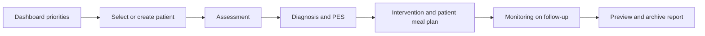
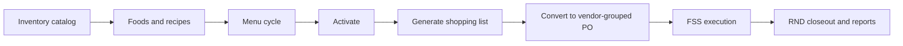
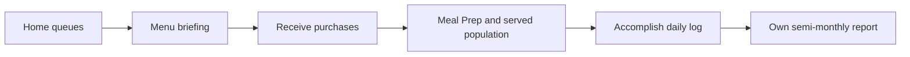
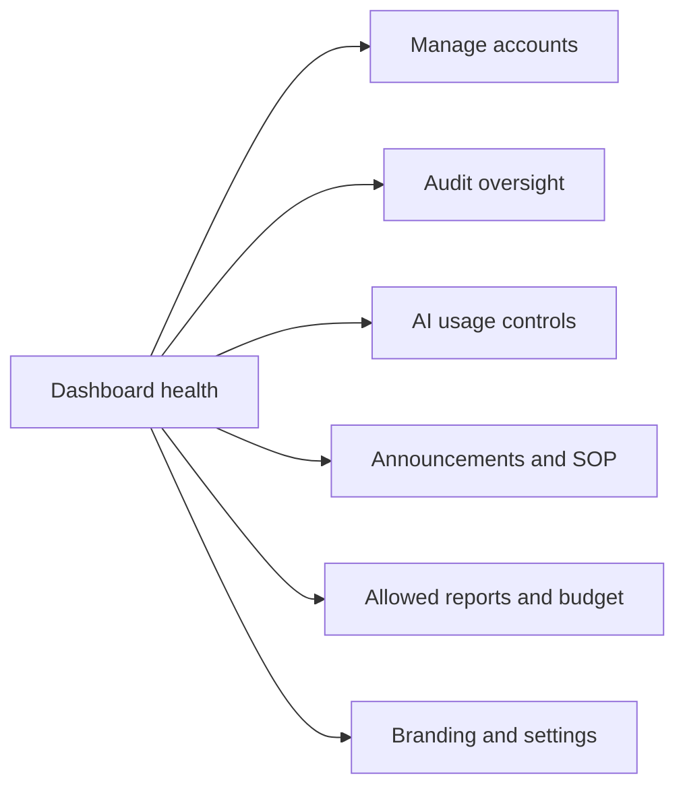
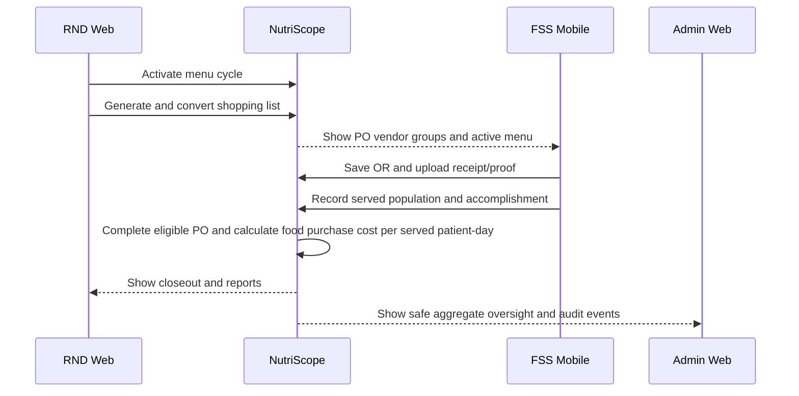

# NutriScope System Storyboard

Verified against current role navigation and food-service lifecycle on **2026-08-27**.

This is the submission-ready, no-screenshot storyboard. It explains NutriScope as a scene-by-scene user journey using text, tables, and Mermaid diagrams, so it remains complete even when visual captures are unavailable.

A software storyboard shows each actor's goal, screen, action, system response, and outcome. It is less technical than a flowchart and more concrete than a feature list.

For the sequential visual version, use the [Screenshot Storyboard Guide](modules/STORYBOARD-SCREENSHOT-GUIDE.md).

## Submission-Ready Text and Diagrams

## Storyboard 1: RND Completes a Nutrition Care Cycle

**Story goal:** turn a new patient record into a reviewed care plan, follow-up record, and filed report.

| Scene | User-visible screen | RND action | System response | Story point |
|---|---|---|---|---|
| 1. Work queue | RND Dashboard | Reviews patients, follow-ups, pending POs, announcements | Shows current clinical and operational queues | RND starts from priorities, not a blank form |
| 2. Patient entry | Nutrition Care → Patients | Creates or selects a patient | Creates/opens patient profile and NCP history | Patient becomes root context |
| 3. Assessment | Dietary → Anthropometrics → Client → Biochemical → Referral → Summary | Enters/validates baseline data and saves | Calculates clinical helpers/risk; stores cycle documents | Assessment establishes source data |
| 4. Diagnosis | Diagnosis Table and P/E/S builder | Creates PES manually or reviews AI drafts | Saves accepted diagnosis; rejects unsupervised AI automation | Clinical judgment remains with RND |
| 5. Intervention | Food/Nutrient Delivery, Education, Counseling, Goal Planning, Encounter Context | Sets goal/stage, reviews calculated prescription, builds meal plan, saves education/follow-up | Backend returns authoritative prescription; meal plan compares with targets | Plan turns findings into action |
| 6. Follow-up | Monitoring Visit Log and Progress Trends | Records outcome indicators and next visit | Compares with baseline/targets and preserves visit history | Care becomes iterative |
| 7. Filing | Reports | Opens NCP Summary/Patient Menu Plan, validates, archives | Freezes as-filed copy | Clinical work produces reproducible output |

### Alternate Scenes

- Missing Assessment: Diagnosis shows the required prior step and returns RND to Assessment.
- Edema without dry weight: save is blocked until dry weight exists.
- AI suggestion is unsuitable: RND dismisses it or edits it before saving.
- Missing prescription input: calculation warning identifies incomplete Assessment data.
- First visit only: care plan can exist without Monitoring; Monitoring is used when follow-up occurs.

## Storyboard 2: RND Plans Food Service

**Story goal:** turn catalog data and a menu into an executable purchase order.

| Scene | Screen | RND action | System response | Story point |
|---|---|---|---|---|
| 1. Reference setup | Inventory | Maintains ingredients/supplies, vendor, unit, cost, and whether an ingredient is auto-generated | Makes items available to recipes/procurement; pantry items can be purchase-when-needed | Planning starts from controlled reference data |
| 2. Food setup | Foods | Creates recipe or single-ingredient food | Calculates/profile scales ingredients and cost | Menu items become reusable |
| 3. Weekly plan | Menu Cycle | Builds Monday-Sunday meal slots or loads a template | Names the week from its date span; shows baseline profiles until procurement estimate exists | Plan becomes a dated operational week |
| 4. Release | Menu Cycle | Activates approved cycle | FSS sees active cycle read-only | Ownership transfers from planning to execution |
| 5. Requirement calculation | Procurement → Food Shopping Lists | Selects date range, enters one estimated serving count, and generates; or creates a manual food/supplies list | Aggregates included menu needs or accepts direct additions | Procurement supports planned service and one-off events |
| 6. Approval | Shopping-list detail | Keeps calculated need visible, edits purchase values/vendor, adds manual rows, or excludes rows | Shows release blockers; creates one grouped PO from included rows only | Structure freezes only when usable and funded |
| 7. Supervision | Purchase Order detail | Tracks actual values, receipt, proof, optional OR, served dates, totals, history | Completes only after explicit vendor receiving and applicable population evidence | Closeout is evidence-based |

## Storyboard 3: FSS Executes a Service Day

**Story goal:** complete today's kitchen/service tasks and produce evidence for procurement and semi-monthly accomplishment reporting.

| Scene | Mobile screen | FSS action | System response | Story point |
|---|---|---|---|---|
| 1. Daily orientation | Home | Reviews meals to log, pending POs, active cycle, today's service, announcements | Shows work queues and missing requirements | FSS knows what needs attention |
| 2. Menu briefing | Menu | Opens today's foods and recipe/item profiles | Shows servings, ingredients, and prep notes read-only | Kitchen sees RND's approved plan |
| 3. Receiving | Purchase | Reviews prefilled values, corrects decimal actual quantity/price, uploads receipt/proof, optionally records OR, and marks vendor received | Validates required evidence and updates the confirmed purchase | Evidence closes receiving explicitly |
| 4. Preparation/service | Meal Prep | Reviews the selected date's meals and records actual population | Stores the served-population record and refreshes PO served-day progress | Actual service connects to cost outcome without a redundant completion log |
| 5. Daily accomplishment | Accomplish | Enters two counts, selects five duties, or marks off duty | Stores one daily entry and refreshes its semi-monthly report | Staff work becomes reportable |
| 6. Communication | Announcement tab and header bell | Switches between Announcements and SOP; reads notifications from the bell | Preserves current procedure and alert state | Communication stays visible without crowding the header |
| 7. Personal record | Accomplish → My reports | Views or downloads a report | Shows only this FSS user's semi-monthly output | Access stays role- and owner-scoped |

### Alternate Scenes

- No active cycle: Home asks FSS to contact RND.
- Photo permission denied: upload stops and asks the user to allow camera/library access.
- Receipt exists but vendor stays pending: proof, reviewed actuals, or explicit receiving is still missing.
- Suggested food PO stays open after receiving: one or more covered dates still lack served population.
- Off duty: Accomplish stores zero meals and an X for that day.
- Completed PO: edit controls are removed/locked.

## Storyboard 4: Admin Maintains Safe Operations

**Story goal:** keep access, usage, oversight, communication, and reporting controlled without entering patient clinical care.

| Scene | Screen | Admin action | System response | Story point |
|---|---|---|---|---|
| 1. System health | Admin Dashboard | Reviews user totals, aggregate patient count, AI usage/cost, audit volume | Shows live overview, token caps, trends, recent events | Admin starts with system-level signals |
| 2. Account provisioning | Manage Users | Creates RND/FSS/Admin account with temporary password | Requires first-login password/recovery setup | Access begins with controlled onboarding |
| 3. Access correction | Manage Users | Changes role/status or resets password after verification | Revokes sessions and logs the action | Sensitive account changes are immediate and auditable |
| 4. Oversight | Audit Logs | Filters events, opens structured details/history, exports when required | Shows safe event data and retention controls | Admin investigates actions without raw clinical payloads |
| 5. Communication | Announcements/SOP | Publishes targeted post or revises approved SOP | Notifies matching users and preserves SOP versions | Policy reaches correct roles |
| 6. Operational review | Reports and Budget | Reviews allowed reports, ledger, and history | Blocks patient-specific reports; Budget remains read-only | Oversight follows least privilege |
| 7. Configuration | Settings | Updates branding, logos, per-head/day setting, preferences | Future reports/UI use current configuration | Admin maintains shared system presentation |

## Storyboard 5: Cross-Role Food-Service Handoff

**Story goal:** show how RND planning, FSS execution, system calculation, and Admin oversight connect.

| Scene | Actor | Handoff object | Action/result |
|---|---|---|---|
| 1 | RND | Active menu cycle | Approves foods and dates; reusable template may provide the structure |
| 2 | RND | Shopping list | Enters one span estimate and generates requirements, or creates a named manual list |
| 3 | RND | Purchase order | Converts to one PO with vendor groups and frozen plan snapshots |
| 4 | FSS | Vendor group | Confirms actual values, uploads receipt/proof, optionally saves OR, and marks received |
| 5 | FSS | Service date | Records actual population in Meal Prep |
| 6 | System | Completed PO/budget event | Checks vendor evidence and applicable dates, calculates food purchase cost per served patient-day, writes ledger/audit events |
| 7 | RND | Operational reports | Reviews menu, procurement, accomplishment, and budget outcomes |
| 8 | Admin | Oversight views | Reviews aggregate reports, budget history, AI/audit health without clinical-report access |

## Storyboard 6: Forgotten Password Exception

| Scene | User action | System response | Next step |
|---|---|---|---|
| 1 | Selects Forgot password | Requests verified recovery email | User enters recovery address |
| 2 | Submits address | Returns generic confirmation | Prevents account discovery |
| 3A | Valid verified recovery address | Sends reset link/token | User opens link and sets 8+ character password |
| 3B | No verified recovery address | Sends no reset link | User contacts Admin |
| 4A | Reset succeeds | Revokes sessions | User signs in with new password |
| 4B | Admin resets after identity check | Revokes sessions and audits reset | Admin shares new password securely |

## Storyboard 7: Role-Specific Help

| Scene | Actor and entry | User action | System response | Story point |
|---|---|---|---|---|
| 1A | RND → sidebar Help | Searches a clinical or food-service term and expands a question | Searches Shared and RND answers only | Clinical guidance remains in the RND workspace |
| 1B | FSS → profile menu or Settings → Help | Searches an operational term and expands a question | Searches Shared and FSS answers without adding another main tab | Daily execution navigation stays focused |
| 1C | Admin → sidebar Help | Searches an account, audit, or settings term and expands a question | Searches Shared and Admin answers only | Administrative guidance does not reveal clinical workflows |
| 2 | Any role | Clears a search with no results and browses topic groups | Restores all answers allowed for that role | Recovery is obvious and role boundaries remain fixed |

## Suggested Panel Presentation

Use this eight-part demo narrative:

1. **Identity and roles:** show correct web/mobile separation and first-login security.
2. **RND clinical story:** patient → Assessment → Diagnosis → Intervention → Monitoring → archived report.
3. **RND operational story:** Inventory/Foods → Menu Cycle → Shopping List → PO.
4. **FSS daily story:** Home → Menu → Purchase → Meal Prep → Accomplish.
5. **Cross-role proof:** show receipt and served population moving the PO toward completion.
6. **Communication:** show targeted announcement and versioned SOP.
7. **Admin safety:** show accounts, AI limits, structured audit, aggregate reports, and blocked patient-specific scope.
8. **Closeout:** show frozen reports and explain that code-enforced role gates protect ownership and privacy.
