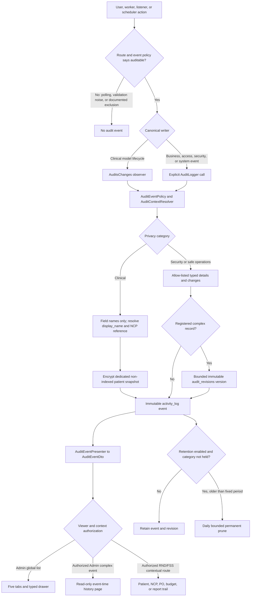

# Audit Logging Architecture and Operations Runbook

Nutriscope records security, administration, Nutrition Care, Food Service Operations, and report activity in a privacy-classified audit system. Spatie Activitylog provides the `activity_log` store, but Nutriscope owns the write policy, privacy boundary, public DTO, historical revisions, authorization, retention, and presentation.

This document describes the implementation as deployed by the July 15 redesign. The maintained action and record matrix is in `docs/architecture/audit-event-catalog.md`.

## Architectural boundaries

- `AuditLogger` is the explicit event writer. `AuditsChanges` is the approved automatic writer for patient/NCP clinical model lifecycle events.
- `AuditEventPolicy` assigns the user-facing module, retention/privacy category, internal domain, canonical writer, detail mode, reason classification, and optional revision serializer.
- `AuditSanitizer` and type-specific value allow-lists reject arbitrary request data and unsafe values.
- `AuditContextResolver` supplies safe subject, context, patient/NCP roots, public references, and actor attribution.
- `AuditEventPresenter`, `AuditValuePresenter`, and `AuditEventResource` produce the sole public `AuditEventDto` contract.
- `AuditRevisionWriter` stores immutable event-time versions only for registered safe operational types.
- `AuditQuery` is the only list/trail query path. Admin lists use offset pagination; contextual trails use newest-first cursor pagination.
- `AuditRetentionService` is the only runtime boundary permitted to delete eligible events and their revisions.

Raw Spatie `properties`, PHP model names, numeric database identifiers, request bodies, and arbitrary JSON are not public API fields. Audit rows and revision rows cannot be updated. Runtime deletion is rejected outside the reviewed retention scope.

## Event creation workflow

Required clinical and financial writes participate in the same database transaction as the business mutation. An audit failure rolls back the mutation. Security telemetry that must not alter the original response is sanitized, deduplicated, and monitored separately.

## Modules, categories, and internal domains

Modules organize the Admin interface. Categories remain the privacy and retention axis. Domains remain an internal classification and storage/query aid; they are not a normal Admin filter.

| Admin tab | Included activity |
|---|---|
| All Activity | Every canonical event; there is no stored `all` module |
| Security & Administration | Authentication, authorization, rate limiting, accounts, profile/password/recovery changes, audit oversight, retention/pruning, AI limits, announcements, SOPs, and system settings |
| Nutrition Care | Patient/NCP lifecycle, assessments, diagnoses, interventions, monitoring, patient meal plans, screening documents, RND Food Library, USDA imports, and RND recipes |
| Food Service Operations | Hospital food catalog and recipes, ingredients, suppliers, menus, population/serving records, shopping lists, POs, receiving/costing, budgets, and ledger activity |
| Reports | Generation, failure, access, download, archive, deletion, branding, and templates for all report families |

The stored categories are `security`, `clinical`, and `operations`. A safe RND Food Library change is category `operations` but module `nutrition_care`; a patient-linked report is category `clinical` but module `reports`. Legacy rows that cannot be classified are presented as `legacy_unclassified`, never silently rewritten into a current class.

## Actor and time semantics

| Actor kind | Meaning |
|---|---|
| `user` | The authenticated person who performed this action. A bounded public-ID, display-name, and role snapshot keeps attribution understandable after rename or deletion. |
| `system` | A named job, scheduler, listener, or service performed the action. There is no user causer. |
| `anonymous` | No authenticated or trusted system identity is available, such as a rejected login attempt. Supplied credentials are never treated as identity. |

Attribution fields such as `rnd_user_id`, `audit_owner_id`, report `user_id`, and `created_by` do not authorize access. Every timeline entry uses the actual action actor. Patient lists and NCP cards separately show the record creator and the last clinical action actor.

Timestamps are generated by the server in UTC and returned as ISO 8601 values. Web presentation localizes to Asia/Manila while retaining the exact instant. Application, database, queue, proxy, and monitoring hosts must use synchronized clocks.

## Clinical privacy and patient identity

Clinical audit metadata is not a second clinical record. For a patient-linked Nutrition Care or clinical-report event, Admin may receive only:

- patient `display_name` from the dedicated snapshot;
- actual RND or system actor;
- action and timestamp;
- clinical record type;
- stable pseudonymous `NCP-` reference;
- changed field names.

Patient identity and actor identity are separate DTO fields. The patient name answers which patient the event concerned; the actor answers who performed it.

The dedicated `patient_display_name_snapshot` column is encrypted by the Laravel model cast and is not indexed. It is not copied into `properties`, revisions, logs, metrics, URLs, exports, filters, sorting, or search. Backfill resolves the currently related patient when possible; unresolved historical events retain only the pseudonymous NCP reference. Encryption-key backup and rotation procedures must preserve decryptability for every retained row.

Clinical storage and output must never contain old/new clinical values, previous/new patient-name values, hospital number, date of birth, sex, address, contact details, ward, physician, diagnosis, admission data, screening/risk values, meal-plan contents, assessment/intervention/monitoring contents, files, OCR text, AI prompts or outputs, or patient-specific report parameters/content. Clinical change rows contain labels and redacted null before/after values only. Clinical events never receive an operational revision.

Privacy sentinel tests cover storage, model casts/ciphertext, DTOs, API responses, disabled export, logs, metrics, URLs, UI rendering/source, filters/search/sort, and revision rejection.

## Safe operational values and historical revisions

Simple safe events use typed details and before/after values. Supported types include text, enum, boolean, number, PHP currency, date, stable reference, field list, quantity, and redacted. The presenter exposes only fields registered for the event domain; nested arbitrary objects are ignored. Created and deleted events therefore show a safe typed state rather than raw JSON.

Complex operational records use a separate, one-to-one `audit_revisions` row. The revision records the serializer/version, subject type and public ID, action, event time, and bounded before/after snapshots. The registered serializers are:

| Serializer | Record | Maximum encoded snapshot |
|---|---|---:|
| `budget` | Fiscal-year budget and ledger context | 256 KiB |
| `food_service_recipe` | FSS recipe and ingredients | 256 KiB |
| `menu_cycle` | Weekly menu and slot structure | 512 KiB |
| `menu_cycle_template` | Menu template and slot structure | 512 KiB |
| `purchase_order` | PO lifecycle, lines, vendor groups, attachments, and totals | 1 MiB |
| `rnd_recipe` | RND recipe, nutrient totals, meals, and ingredients | 256 KiB |
| `shopping_list` | Shopping-list state and line structure | 512 KiB |

The Admin history route renders the event-time before/after version even when the current record changed or was deleted. It never substitutes the mutable current page for history. A separate current-record link appears only when the record still exists and the viewer is authorized. Revision serializers validate schema, size, type, and safe shape at write and presentation time. Revisions are immutable and are deleted only with their parent under the same retention/legal-hold transaction.

## Admin and contextual interfaces

`GET /api/admin/audit-logs` is Admin-only, read-only, offset-paginated, newest-first, and restricted to the audit log channel. Its normal interface has exactly five tabs. Filters are date range, tab-specific context, action, actor, outcome, and severity. Tab counts and action/subfilter metadata come from the backend. Actor search is paginated and uses actor public IDs. Filter state is kept in the URL.

There is no normal Domain or category filter. Retired `category` and `domain` list parameters now return validation error `422`; `event` and `causer_id` remain bounded input aliases for `action` and `actor_id`. Storage fields are retained for historical classification and retention.

The drawer displays the event sentence, patient identity when permitted, actor, subject/context, outcome, severity, reason when safe, typed details, and typed changes. It contains no raw JSON renderer. A registered complex revision links to `/admin/audit-logs/{event}/history`, which is a read-only typed page.

Contextual trails use the same DTO and `before_id` pagination:

- active RND users may open patient and NCP trails for every patient/NCP;
- active RND users may open all RND report trails, including another RND's work;
- FSS users may open authorized PO, budget, and FSS report trails;
- Admin users may open the global audit interface, safe operational history, read-only budget trails, and Admin-allowed report trails.

Opening a patient/NCP trail or the global audit list creates a deduplicated `audit_log_viewed` oversight event. The global list is never available to RND or FSS roles.

## Budget behavior

Audit presentation covers new fiscal-year setup/opening allocation, `per_head_day_limit` changes, manual ledger inputs, existing corrections, PO deductions, balances, fiscal year, actor/system actor, safe operational reference, and the existing bounded reason where supplied. Budget setup, per-head/day changes, and ledger events remain transactional.

Admin budget access is read-only. The redesign adds no approve/reject/flag action, mandatory Admin review, budget approval workflow, or budget-ledger reversal workflow. Existing ledger immutability and behavior are preserved. A future reversal design would require a separately approved linked entry rather than modifying the original.

## Authorization and shared RND access

All active RND users may view and edit every patient and NCP and may perform currently permitted deletes. Assessment, intervention, monitoring, patient meal-plan, screening-document, related report, and NCP routes use role/context authorization rather than creator ownership. Report creator/prepared-by fields remain attribution and historical snapshots.

Admin can view the global audit interface and safe operational versions but cannot use it to access clinical content or patient-report content. Admin's report routes remain type-allow-listed. FSS authorization remains limited to its existing operational/report workflows. All global audit, history, retention, and export routes enforce their policies independently of frontend visibility.

## Route coverage and compatibility

Every unsafe Laravel route has exactly one `config/audit.php` route-coverage classification: `explicit_event`, `model_event`, or `intentionally_not_audited`, with source and reason. `AuditRouteCoverageTest` fails when a route is unclassified; there is no generic request-logging fallback.

Every Next.js handler that uses the Laravel proxy must match a Laravel route method and canonical path. `ProxyRouteCompatibilityTest` enforces that contract. The global audit list, actor search, history, retention, and contextual trail proxies preserve UUID/public-reference boundaries and never place patient identity in URLs.

The manual `php artisan audit:backfill-oversight --chunk=500` command classifies eligible legacy rows and backfills encrypted patient snapshots. It is chunked, deterministic, idempotent, unscheduled, and limited to null/wrong redesign metadata. It does not rewrite event payloads or revisions. Category/domain storage remains because retention and internal compatibility depend on it.

## Retention, legal hold, and export

Fixed periods are configuration values and read-only in the UI:

| Retention category | Days |
|---|---:|
| Security | 365 |
| Clinical | 2,190 (6 years) |
| Operations | 1,095 (3 years) |
| Unclassified legacy | 90 |

One `audit_settings` row controls scheduled deletion. Before the row exists, `AUDIT_RETENTION_ENABLED` is the fallback and defaults to `false`. After the row exists, the database value wins. Enabling in Admin requires a modal that says deletion runs daily, permanently removes eligible rows, is unrecoverable, and requires privacy/compliance approval. Disabling is immediate. Every state change records the actor, old/new boolean, and timestamp as `settings_changed`.

The scheduler runs `audit:prune --force` daily only while enabled, with single-server and overlap locks. `php artisan audit:prune` is a dry run. Legal-hold configuration protects the selected category and its revisions while other eligible categories may be pruned. Pruning is indexed and chunked; application code must not directly update/delete/truncate audit rows. Back up and test restore before first production pruning and before retention-policy changes.

Audit/report export is disabled. The guarded backend/proxy compatibility endpoint remains for a separately approved future project, but the normal UI hides export capability/action. Current export serialization omits the patient-name snapshot. Do not enable export without a new Admin-only privacy and handling decision.

There is no external append-only sink, integrity export, or hash chain. The database store therefore does not independently resist a database administrator. No per-category retention editing UI exists.

## Seed and demo behavior

`DatabaseSeeder` wraps ordinary seeding in `activity()->withoutLogs()`, so base/current seeders create no anonymous audit noise. Seeders are required to be idempotent and to use current name, enum, validation, report, and business contracts. By explicit owner decision, no dedicated audit-event/demo-history seeder exists and no synthetic clinical audit values are inserted.

## Monitoring and incident operations

| Cadence/trigger | Owner | Action |
|---|---|---|
| Daily | Security/on-call | Review critical/warning security events, writer failures, denial/rate-limit spikes, prune failures, and scheduler health. |
| Weekly | Application owner | Review route-coverage changes, duplicate-event regressions, query alerts, event volume, and retention/export states. |
| Monthly | Privacy, security, database, and application owners | Review category/action counts, retained bytes, prune counts, legal holds, access, key/backup readiness, and current fixed controls without copying event payloads. |
| Before release | Release owner | Run route/proxy coverage, authorization, privacy, migrations, MySQL plans/performance, seeders, full backend/web/mobile checks, and clock checks. |

For an incident, record only a safe incident reference and time; never paste audit payloads into tickets/chat. Preserve controlled evidence, identify category/time/actor/authorization scope, apply the narrowest approved containment, and have the privacy owner place/release a legal hold through reviewed configuration. After recovery, verify writer, scheduler, query, volume, and clock health.

Temporary IP blocking is not implemented. There is no `IpBlocked`, `IpUnblocked`, feature flag, model, migration, controller, route, or UI. Existing `AccountBlocked`/`AccountUnblocked` events and Admin account deactivation remain unchanged.

## Verification commands

Run against the configured MySQL environment; do not substitute SQLite for final validation.

- Backend: `php artisan test --fail-on-skipped`, `vendor/bin/pint --test`, route/proxy coverage, redesign migration forward/rollback/re-forward, seeder idempotence, query-count, privacy, and 100,000-row performance tests.
- Frontend: `npm test`, `npx tsc --noEmit`, `npm run lint`, and `npm run build`.
- Mobile after person-name changes: Node tests, `npx tsc --noEmit`, and the affected Expo Android export/build check.
- Database: inspect all audit indexes and run `EXPLAIN` for All Activity, each module/subfilter, actor/action/date combinations, contextual trails, and public/event revision lookups.

The performance gate uses 100,000 representative MySQL audit rows, at least 30 warmed samples across default/date/context queries, intended indexes without a full audit-table scan, deterministic newest-first order, and combined p95 at or below 250 ms.
