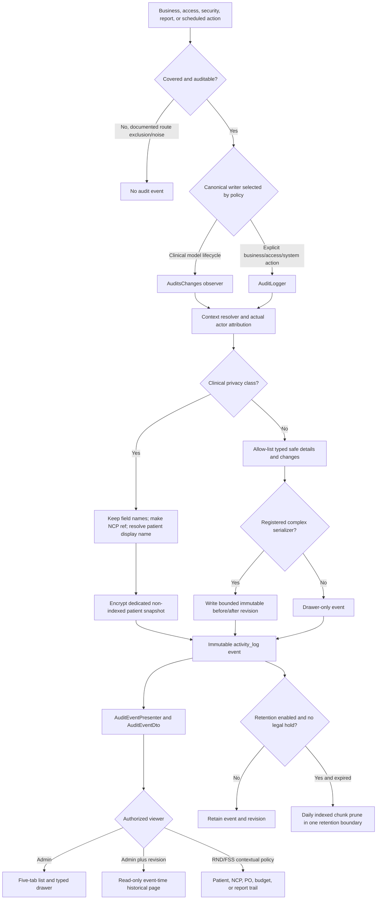

# Audit Oversight and Historical Records Implementation Report

**Authoritative design:** `docs/superpowers/specs/2026-07-15-audit-oversight-and-history-redesign.md`

**Executable plan:** `docs/superpowers/plan/2026-07-15-audit-oversight-and-history-redesign-implementation-plan.md`

**Dependent name design:** `docs/superpowers/specs/2026-07-15-first-and-last-name-migration-design.md`

**Implementation branch:** `main`

**Implementation period:** July 15-16, 2026
**Status:** Tasks 1-17 implemented and freshly verified; the documentation commit and final remote-equality record complete Wave A5.

## Executive summary

Nutriscope now organizes Admin audit oversight into five recognizable modules, presents meaningful typed changes without raw JSON, and preserves event-time versions of complex safe operational records. The redesign retains the existing explicit-route, append-only, retention, and contextual-trail foundation while correcting stale taxonomy, duplicate events, creator-based RND authorization, and clinical identity presentation.

For patient-linked events, Admin can understand which patient was concerned through one encrypted `display_name` snapshot and who acted through a separate actor snapshot. No other patient identity, demographic, clinical value, file/OCR content, AI content, or patient-specific report content is stored or returned through this exception. Safe nonpatient records show typed created/deleted state and before/after changes. Registered complex records have immutable, bounded historical pages that survive later edits and deletion.

The normal Admin interface has exactly:

1. All Activity
2. Security & Administration
3. Nutrition Care
4. Food Service Operations
5. Reports

Audit/report export and scheduled retention deletion remain disabled by default. No external append-only sink/hash chain, per-category retention editor, IP-blocking system, budget approval/rejection/flag flow, or ledger reversal workflow was added. Base seeders suppress audit logging, remain subject to current-contract tests, and intentionally do not create synthetic demo audit history.

## What changed

### Module taxonomy and event policy

- Added the four stored modules `security_administration`, `nutrition_care`, `food_service_operations`, and `reports`; All Activity is a query view, not a stored module.
- Retained category as the privacy/retention axis and domain as internal storage/classification.
- Added `AuditEventPolicy` to select module, category, domain, privacy class, canonical writer, detail mode, reason class, and revision serializer.
- Corrected RND Food Library, USDA-imported foods, and RND recipes into Nutrition Care without misclassifying them as patient-clinical data.
- Kept hospital catalog, FSS recipes, menus, procurement, receiving, budgets, and ledger activity in Food Service Operations.
- Kept all report families in Reports while retaining clinical category for patient-linked report events.

### Patient identity and privacy

- Added a dedicated encrypted, non-indexed `patient_display_name_snapshot` column to `activity_log`.
- Backfilled resolvable patient-linked events from the currently related patient; unresolved events keep only their pseudonymous NCP reference.
- Added a typed `patient: { display_name }` DTO field independent of the actual user/system actor.
- Prohibited the patient snapshot from arbitrary JSON, revisions, logs, metrics, URLs, exports, filters, sorting, and search.
- Preserved the clinical field-name-only contract at storage, API, UI, export, logs, metrics, and historical-version boundaries.

### Canonical writers and summaries

- Kept automatic `AuditsChanges` events only for patient/NCP clinical model lifecycle records.
- Used explicit `AuditLogger` calls for business lifecycle, access, security, report, food-library, FSS, budget, and system events.
- Removed duplicate primary events and retained distinct accountable side effects, such as a PO lifecycle event plus its budget-ledger effect.
- Added semantic subjects and event-specific sentences so events no longer depend on raw model classes or generic `Updated` descriptions.
- Preserved unknown safe legacy actions as labeled legacy events instead of rewriting them as current actions.

### Typed drawer and complex history

- Added allow-listed typed values for text, enum, boolean, number, PHP currency, dates, references, field lists, quantities, and redaction.
- Created safe operational before/after rows for simple changes and meaningful final state for creates/deletes.
- Added immutable, event-time revisions for budgets, FSS recipes, menu cycles, menu templates, purchase orders, RND recipes, and shopping lists.
- Added read-only Admin history pages with before/after selection and structured tables. Deleted records remain reviewable until retention removes their event/version.
- Kept current-record links separate and policy-controlled; a current mutable page is never presented as the historical version.

### Shared-RND authorization and attribution

- Removed report `user_id`, `audit_owner_id`, and NCP `rnd_user_id` as RND authorization gates.
- Confirmed every active RND can view and edit every patient/NCP and can perform every currently permitted clinical/report delete.
- Corrected demographic, patient-menu-plan, and NCP-summary browsing/rendering/archiving to use role/context authorization.
- Kept report user/owner/prepared-by and clinical creator fields as attribution only.
- Ensured every event uses the actual actor. Patient rows and NCP cards separately show creator and last clinical action actor.
- Kept Admin report access type-allow-listed and FSS report access role-scoped.

### Budget and operations

- Added complete typed presentation for fiscal-year setup/opening allocation, per-head/day changes, manual ledger entries, PO deductions, balances, fiscal year, safe reference, actor/system actor, and existing reasons.
- Added operational coverage for catalog items, FSS recipes, suppliers, population/serving records, menu cycles/templates, shopping lists, PO lifecycle, receiving, price correction, attachments, meal-service completion/reversal, and settings.
- Preserved budget and ledger calculation/transaction behavior. Admin access stays read-only.
- Added no approval/rejection/flag workflow and no ledger-reversal workflow.

### Compatibility and stale-feature cleanup

- Removed Domain/category from the normal Admin interface and list contract. Requests containing those retired list parameters now receive `422`.
- Retained stored category/domain because privacy, retention, legacy data, and internal classification require them.
- Retained bounded `event` and `causer_id` aliases for `action` and `actor_id` during compatibility.
- Hid disabled audit export capability/action from normal metadata and UI while keeping the guarded backend/proxy endpoint for a future separately approved project.
- Removed stale IP-blocking concepts without changing `AccountBlocked`, `AccountUnblocked`, or Admin account deactivation.
- Isolated old Inventory labels as legacy presentation only; no current Inventory audit module or route was restored.
- Added an unscheduled, chunked, idempotent `audit:backfill-oversight` command for legacy module/domain/patient snapshot correction.

## Exact current workflow

Required clinical/financial audit writes share the business transaction; audit persistence failure rolls back the mutation. Noncritical security telemetry preserves the original response, deduplicates repeated attacker-driven events, and reports content-free failures. All public presentation passes through the typed DTO. No UI/API returns raw Spatie properties or revision JSON.

## Admin workflow

1. Open Admin > Audit Logs.
2. Select one of the five tabs. Counts come from a conditional aggregate query.
3. Optionally choose a tab-specific Context, Action, Actor, Outcome, Severity, and Start/End date. Filter state stays in the URL.
4. Open an event to see its sentence, actual actor, permitted patient identity, safe subject/context, result, typed details, reason, and typed changes.
5. For a registered complex event, choose the event-time history link and switch between Before and After. This page is read-only.
6. Use contextual patient/NCP, PO, budget, or report trails from the relevant record page when the role policy permits.

Security contexts are Authentication, Accounts, Audit Oversight, and Settings. Nutrition Care contexts are Food Library and Patients/NCP. Food Service Operations contexts are Catalog, Menus, Procurement, and Budget. Report contexts are the current report types supplied by the backend. There is no normal Domain/category filter and no raw JSON view.

## Clinical privacy boundary

For patient-linked events Admin sees only patient display name, actual actor, action, timestamp, record type, stable pseudonymous NCP reference, and changed field names. Admin does not see old/new clinical values or patient-name values; hospital number; date of birth; sex; address/contact; ward; physician; diagnosis/admission; screening/risk values; meal-plan, assessment, intervention, or monitoring content; files/OCR; AI prompts/outputs; or patient-specific report parameters/content.

The patient name is stored only in the encrypted, non-indexed snapshot column. It is absent from `properties`, revision payloads, logs, metrics, URLs, exports, filters, sorting, and search. Export remains disabled; its future-compatible serialization omits the name. All historical serializers reject clinical/patient-linked types and unsafe content.

## Shared-RND workflow

All active RNDs share patient/NCP care. RND B can open and update RND A's assessment, intervention, monitoring, patient meal plan, and screening document where applicable; open the related patient/NCP/report context; and use every delete endpoint currently permitted by the record state. `rnd_user_id`, `audit_owner_id`, report `user_id`, `created_by`, and prepared-by snapshots only explain attribution. They never grant or deny RND access.

The patient table and NCP card show both creator and last clinical action actor. Each timeline row shows the user/system that performed that specific action. Historical prepared-by and actor snapshots are not rewritten when account names later change.

## Budget workflow

The audit system records new fiscal-year setup/opening allocation, per-head/day changes, current manual ledger inputs/corrections, PO deductions, and related balances/references. Manual ledger input retains its required bounded reason. The owner deferred new cross-domain reason enforcement, so the redesign does not claim that all deletion, price-correction, reversal, or post-approval correction routes now require a new reason field; existing reasons are displayed when present.

Admin may list/show budgets and view their audit trails but cannot mutate them. No new approval, rejection, flag, mandatory review, or ledger reversal exists. Existing immutable ledger behavior is unchanged; any future reversal would require a separately approved linked-entry design.

## Retention, export, and legal hold

| Category | Fixed period |
|---|---:|
| Security | 365 days |
| Clinical | 2,190 days (6 years) |
| Operations | 1,095 days (3 years) |
| Unclassified legacy | 90 days |

Scheduled deletion uses one DB-backed `audit_settings` flag. `AUDIT_RETENTION_ENABLED=false` is the fallback only until a DB row exists. Enabling requires an Admin modal that explains the daily, permanent, unrecoverable deletion and the need for privacy/compliance approval. Disabling requires no confirmation. Each change is audited with actor, old/new state, and timestamp. Periods/state appear read-only beside the control.

`audit:prune` is dry-run; the scheduled `audit:prune --force` runs daily only when enabled, under overlap/single-server locks. Legal holds protect both parent events and revisions. Encryption-key backup/rotation must keep retained patient snapshots decryptable.

Audit/report export remains disabled and absent from normal UI/capabilities. Future enablement is Admin-only and needs a new privacy/handling decision, including a decision on patient-name inclusion. No external append-only sink, integrity export, or hash chain exists.

## Seeder and demo behavior

`DatabaseSeeder` uses `activity()->withoutLogs()` so base/current data setup does not create anonymous audit rows. Seeders/factories use the separate first/last-name contract and are covered by idempotence, name-synchronization, enum/value, report-consumer, and no-audit-noise tests.

The owner explicitly declined a dedicated audit-event demo seeder. Therefore a seeded demo shows application records and produces truthful audit history only when a user actually exercises workflows. It does not contain synthetic five-tab audit events or fake clinical values. This is intentional, not missing work.

## Migrations and compatibility

The audit migration chain is additive:

- original Spatie activity table/event/batch migrations;
- July 11 metadata and core indexes;
- July 12 patient/NCP root, actor, public-ID, and public-reference indexes/backfills;
- `2026_07_14_000001_create_audit_settings_table.php`;
- `2026_07_15_100001_add_module_and_patient_snapshot_to_activity_log.php`;
- `2026_07_15_100002_create_audit_revisions_table.php`;
- `2026_07_15_100003_backfill_audit_modules_and_patient_snapshots.php`.

The redesign depends on the two split-name migrations that add and backfill `first_name`/`last_name` for users and patients. Legacy `name` columns remain for compatibility. The backfill deliberately sets `first_name = name`, `last_name = null`; it never guesses compound Filipino names.

Deploy application code and additive migrations together. Migration rollback requires application rollback first. Revision rows cascade with parent audit events. The manual oversight backfill is safe to rerun and does not modify existing revisions/payloads. No quantity/stock compatibility field was dropped in this redesign.

## Blast radius and mitigations

| Area | Risk | Mitigation and evidence |
|---|---|---|
| Clinical privacy | Patient identity or clinical content leaks beyond the exception | Dedicated encrypted/non-indexed field; typed DTO; no revision; storage/API/export/log/metric/UI/URL/filter/search sentinels |
| Actor correctness | Creator fields continue to masquerade as ownership/actor | Shared-RND route tests, report policy correction, actual-actor assertions, creator/last-action UI fields |
| Historical truth | Current mutable state is mistaken for an old event | One immutable revision per event; event-time before/after; deleted-record tests; current link kept separate |
| Revision growth | Operational history becomes an unbounded shadow store | Seven registered types, per-type byte caps, strict schemas, one-to-one rows, parent retention/legal hold, storage monitoring |
| Duplicate events | One intent creates vague observer and explicit events | Canonical writer policy, exact event-count/order tests, distinct PO/ledger side effects preserved |
| Migration/backfill | Wrong classification or plaintext names | Reversible isolated MySQL migration tests; ciphertext-at-rest; deterministic/idempotent chunked backfill |
| Query performance | Five tabs/counts/history cause full scans or N+1 | Composite indexes, conditional count query, eager loading, query-count tests, Boost `EXPLAIN`, 100,000-row p95 gate |
| Client compatibility | Laravel/Next/mobile consumers retain stale params/types | Proxy-route contract, frontend stale-consumer scans, typed service tests, full builds; mobile name checks |
| Seeder accuracy | Demo data creates anonymous noise or stale values | Audit suppression, idempotence and current-value contracts, no synthetic audit-event seeder |
| Retention | Scheduled permanent deletion starts unintentionally | Default false, DB row wins only after explicit Admin change, confirmation modal, audited toggles, legal hold and dry-run tests |

## Owner-authorized decisions

| Decision normally requiring approval | Exact binding owner decision used |
|---|---|
| Admin patient identity in clinical audit | Admin may see only patient `display_name` through the dedicated encrypted snapshot; all other identity/demographic/clinical content remains prohibited. |
| Patient identity versus actor | Patient name identifies the patient concerned; actor identifies who performed the action. Both must be independently labeled. |
| Information architecture | The normal Admin UI has exactly the five named tabs; module tabs replace Domain as the primary organization. |
| Shared clinical access | Every active RND can view/edit every patient/NCP; creator/owner fields are attribution, not authorization. |
| Historical operational detail | Safe simple records show typed values; complex records use immutable event-time read-only versions, including deleted records. |
| Budget powers | Admin remains read-only; no approval/rejection/flag/mandatory review or new ledger reversal workflow. Existing ledger behavior is preserved. |
| Change reasons | Existing manual-ledger reason remains required; new cross-domain reason enforcement was deferred for this implementation. |
| Retention | Fixed 365/2,190/1,095/90-day mapping; one audited DB toggle; fallback false; confirmation only when enabling. |
| Export | Audit/report export remains disabled; future enablement is Admin-only and requires a separate privacy decision. |
| Integrity hardening | No external append-only sink, hash chain, or integrity export in this implementation. |
| IP blocking | Remove only IP-blocking remnants; preserve account blocking/unblocking and account deactivation. |
| Seed/demo | Base seeders create no audit noise; owner explicitly declined a dedicated synthetic audit-event seeder. |
| Names dependency | Separate first/last fields with one display-name contract; no heuristic split; legacy names/inputs/outputs remain during compatibility. |

## Overscope and unrelated fixes

There was no intentional product overscope. Work remained within the two July 15 specifications and their verification/compatibility boundaries. In particular, the redesign did not drop `quantity_in_stock`, introduce a new budget workflow, enable export/retention, create synthetic audit history, or broaden Admin clinical access.

Fresh integration verification exposed test-contract drift rather than unrelated production defects:

- the person-name stale-consumer allow-list did not explicitly register the approved legacy `patient.name` fallback inside the oversight backfill; the test boundary was corrected, with no runtime behavior change;
- characterization/inventory tests were aligned with the intentionally retained first-name compatibility and current audit logger/route inventory; no production behavior changed.

The shared-RND report corrections were not incidental fixes: they implement the authoritative design's explicit discovery that attribution fields were incorrectly acting as authorization gates.

## Architectural trade-offs

| Choice | Advantages | Disadvantages/constraints |
|---|---|---|
| Spatie row plus Nutriscope typed contract | Reuses stable event storage while preventing raw-property/API coupling | Two layers must stay synchronized through tests and policy |
| Separate module and category | User-facing organization matches workflows while retention/privacy remains correct | Every event needs both classifications; legacy backfill is required |
| Encrypted patient-name snapshot | Admin can identify the concerned patient even after rename/delete without exposing other PHI | Search/sort/filter cannot use the field; encryption-key lifecycle is operationally critical |
| Separate immutable revision table | Truthful event-time complex views survive edits/deletes and stay typed | Additional storage and serializers; only registered record types are supported |
| Explicit route/event coverage | Prevents accidental request-body logging and forces intentional semantics | New routes/writers require inventory maintenance and focused tests |
| DB-backed retention switch | Runtime Admin control is auditable and survives deploys | A mistaken enablement is destructive, so confirmation, backups, and legal ownership remain essential |
| No synthetic audit demo seeder | Avoids fake chronology and clinical privacy mistakes | A fresh demo has no rich audit history until workflows are exercised |
| No external integrity sink/hash chain | Fits current deployment scale and keeps operations simpler | Database administrators remain a trust boundary; independent tamper evidence is future work |

## Verification evidence

Task 16 fresh integration verification completed on PHP 8.4, Laravel 13.11.2, MySQL, Sanctum 4.3.2, PHPUnit 12.5.26, Laravel Boost 2.4.8, and Pint 1.29.1.

- Full Laravel: **1,124 tests, 7,465 assertions, zero skips** under `--fail-on-skipped`.
- Audit/report/budget/operations focused set: **354 tests, 3,988 assertions**.
- Full frontend: **70 files, 226 tests**; TypeScript, ESLint, and Next.js 16.2.6 production build passed; 92 pages generated.
- Mobile: **13 Node tests**, TypeScript, and Android Expo export passed; 3,241 modules and a 6.16 MB Hermes bundle.
- Pint: full `vendor/bin/pint --test` passed.
- MySQL migrations: redesign forward, rollback, and re-forward passed; live migration registry showed all migrations applied.
- Manual backfill: two live `audit:backfill-oversight --chunk=500` runs produced identical zero-update results.
- MySQL plans: Boost inspected All Activity, each module, Nutrition Library/FSO subfilters, actor/action/date, patient/budget trails, and revision IDs. Intended ordered/actor indexes were used where selective; representative-volume tests proved log/event/actor/context plans.
- Performance: existing 100,000-row MySQL p95 and N+1/query-count gates passed.
- Privacy, authorization, duplicate-event, retention toggle/prune/legal hold/scheduler, report rendering, seed idempotence, route/proxy compatibility, and stale-consumer scans passed.
- Runtime config confirmed export false and retention environment fallback false. Scans found no external sink/hash chain, per-category editor, IP-block scaffold, or budget approval/reversal flow.

Task 17 then ran a second fresh completion gate after the documentation changes. The first Laravel run correctly failed one stale characterization assertion that still required the old phrase "four UI views only." The test was changed first to reject that phrase and require all five current tab names; its focused rerun passed 5 tests with 90 assertions and Pint. The complete gate then passed:

- Full Laravel: **1,124 tests, 7,470 assertions, zero skips**.
- Full frontend: **70 files, 226 tests**; standalone TypeScript, ESLint, and production build passed; 92 pages generated.
- Mobile: **13 tests**, TypeScript, and Android Expo export passed; 3,241 modules and a 6.16 MB Hermes bundle. Generated verification output was removed.
- Full Pint: passed.
- Documentation: required paths, all 32 action values, all seven revision serializers, stale claims, required privacy/retention/owner sections, and `git diff --check` passed.

No required check was skipped. The Next.js build emitted its existing nonblocking middleware-to-proxy convention warning, and Node emitted the existing mobile module-type performance warning; neither changed verification results.

## Commit and rollout record

The name migration compatibility wave completed first at `6cc8fdd781ddf176d79be6181928c04b26499520`. Audit redesign task commits then landed sequentially from characterization through storage, policy, typed presentation, five tabs, historical serializers, budget/library/FSO/report authorization, compatibility cleanup, and integration verification. Wave A4 completed at `c6fd4e10eb382cce3878f0e4a1f37433070deb0b`, with local and remote `main` equal before Task 17 began. Task 17 was committed as `a7ea2045dcf9f9ca14b3a364ee287e1f3cd0e42c`; `git fetch`, `git rev-parse origin/main`, and `git ls-remote origin refs/heads/main` all matched that commit after the push.

Every task used a concise Conventional Commit without AI attribution. Integration waves were pushed only after their specified gates. The final documentation/verification commit and Wave A5 remote equality are recorded in the implementation plan.

## Unresolved and future work

- Name the hospital privacy/legal-hold approver and release procedure during production handover.
- Decide any future cross-domain destructive/corrective reason project as one coordinated backend/web/mobile change.
- Decide any future immutable ledger reversal-entry design; do not modify current entries meanwhile.
- Decide audit export privacy/handling, including whether patient display name can ever be included, before enabling the guarded endpoint.
- Consider an external append-only sink/hash chain only as a separately approved hardening project.
- Populate demo audit history by exercising real workflows or approve a future bounded demo strategy; the current owner decision prohibits synthetic audit-event seeding.
- Monitor revision-table growth and query plans as real production volume increases.

None of these items blocks the approved July 15 implementation. Export and retention deletion remain safely disabled until their existing approval controls are deliberately used.
