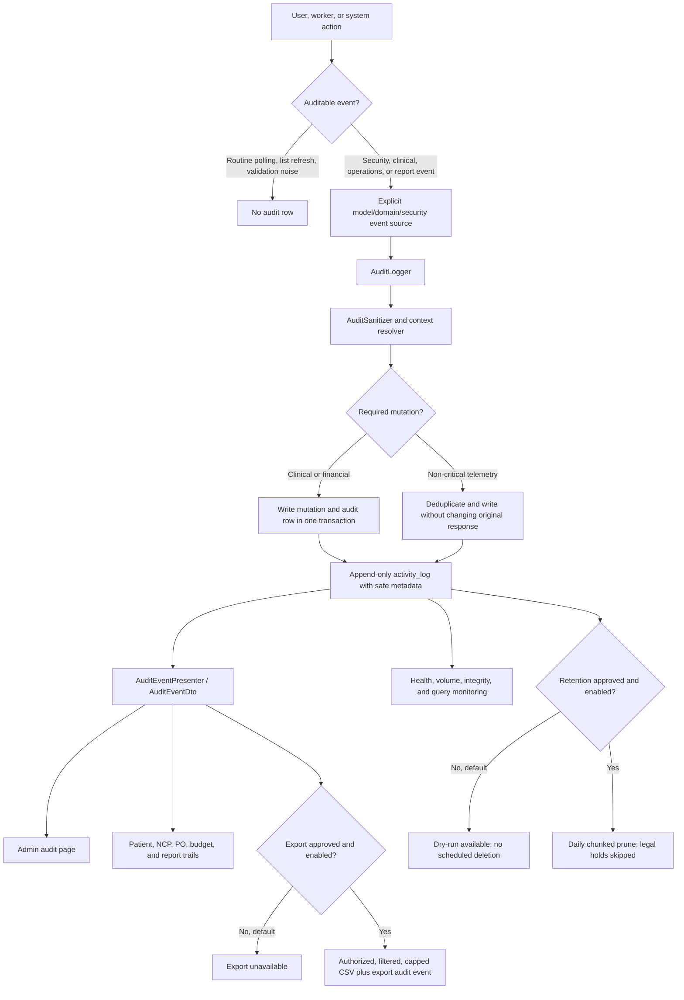

# Audit Logs and Trails Implementation Report

**Implementation plan:** `docs/superpowers/plan/2026-07-11-audit-logs-and-trails-revision.md`  
**Implementation branch:** `main`  
**Implementation period:** July 11-13, 2026  
**Status at report creation:** All fourteen plan tasks implemented and verified locally. Integration-wave commits through Task 9 were already on `origin/main`; Tasks 10-14 and the final formatting/report commits were awaiting the final push.

## Executive summary

Nutriscope now has a structured, privacy-safe audit system covering security, clinical, operations, reports, and contextual page trails. The public API and UI use a single `AuditEventDto`; raw Spatie properties, internal model classes, internal numeric IDs, arbitrary request data, and raw JSON are not exposed. Clinical events retain only safe metadata and field names, never clinical values, PHI, credentials, file/OCR contents, or AI prompts and outputs.

The implementation also replaced generic request logging with explicit route and domain coverage, added route/proxy compatibility enforcement, introduced retention and integrity monitoring, redesigned the Admin audit interface using the existing design system, unified contextual trails, and retired the obsolete stock-management surface only after its consumers were migrated and tested.

Two production capabilities remain disabled pending owner decisions:

- Scheduled retention deletion: Admin-controlled DB setting; `AUDIT_RETENTION_ENABLED=false` is only the fallback until the first setting row exists
- Audit CSV export: `AUDIT_EXPORT_ENABLED=false`

Temporary IP blocking is not shipped. Its dormant enum, configuration, environment, API-capability, and frontend scaffolding were removed; a future implementation requires a separately approved design.

## What was implemented

### 1. Structured event contract and taxonomy

- Added backed enums for category, domain, action, outcome, and severity.
- Added indexed audit metadata and safe root/context references while preserving the existing `activity_log` table.
- Added the `AuditActivity` model, audit-only query scopes, legacy presentation aliases, and one shared DTO contract.
- Kept Admin list pagination offset-based for compatibility; contextual trails use `before_id` cursor pagination.

### 2. Central privacy-safe writer

- Added `AuditLogger`, `AuditSanitizer`, and context resolution as the supported audit-write path.
- Replaced fillable-based logging with explicit allow-lists.
- Stored safe actor snapshots so renamed or deleted users remain attributable.
- Removed URL query strings/fragments, control characters, oversized metadata, secrets, tokens, clinical values, request bodies, OCR/file contents, report snapshots, and AI prompts/outputs.
- Required financial and clinical audit writes participate in the same transaction as the mutation; audit failure rolls the mutation back. Non-critical security telemetry preserves the original response and reports a sanitized failure.

### 3. Explicit coverage instead of request logging

- Removed generic audit middleware and "accessed path" events.
- Added a machine-readable coverage entry for every unsafe Laravel route.
- Added a test that fails when an unsafe route is added without an explicit event source or documented exclusion.
- Added a Laravel/Next.js compatibility test that compares every `laravelProxy` method/path with the Laravel route list.

### 4. Security auditing

- Added login success/failure, authentication failure, logout, password/recovery changes, account administration, authorization denial, and rate-limit events.
- Deduplicated repeated failures and 429 events to control attacker-driven database growth.
- Avoided headers, cookies, bearer tokens, request bodies, full credential emails, and unsafe URLs.
- Kept rate-limit telemetry and account deactivation events, while removing all temporary IP-blocking scaffolding after proxy trust could not be established safely.

### 5. Clinical trails

- Correlated patient, NCP, assessment, diagnosis, intervention, meal-plan, monitoring, screening-document, and clinical-report events to their root patient/NCP context.
- Added explicit chart-entry, protected attachment, report, AI-result approval, and meal-plan generation events.
- Added authorized patient and NCP timelines with field-name-only changes.
- Added sentinel tests proving unique PHI/clinical values do not appear in audit storage, API DTOs, exports, logs, or UI rendering.

### 6. Food-service and budget trails

- Correlated purchase-order lifecycle, vendor groups, attachments, price corrections, receiving, completion, reversal, shopping-list approval, and budget deduction to the root PO.
- Added business actions such as `approved`, `received`, `completed`, `reversed`, and `price_corrected` instead of generic updates.
- Preserved atomic PO completion, budget ledger, receiving, and audit behavior with rollback coverage.
- Added budget creator attribution and authorized Admin/FSS budget trails.

### 7. Report lifecycle auditing

- Added structured report generation, archive, view, download, export, deletion, branding, and template events.
- Kept report snapshots, patient filters, image/data URLs, and file contents out of audit rows.
- Added creator/archive metadata and contextual report timelines.
- Removed deprecated report-create/generate-all routes only after caller and route tests proved they were unused.

### 8. Inventory and stock retirement

This was an explicit plan task but is the largest non-audit behavioral change.

- Removed inventory audit history, its proxy, and unreachable inventory mutation methods.
- Replaced stock-status and `quantity_in_stock` runtime usage with catalog and immutable PO receiving/price history concepts.
- Migrated ReceivingService, costing, dashboard, reports, frontend services, seeders, factories, and tests before dropping columns.
- Added a forward-only migration that removes retired stock fields after stale-reference and food-service verification passed.

The result is that Nutriscope no longer represents receiving as a mutable on-hand inventory quantity. Receiving evidence remains in the PO/receipt history used by procurement and costing.

### 9. Admin audit UI and shared trails

- Rebuilt the Admin page around the existing font, theme tokens, responsive patterns, drawers, tables, and reusable components.
- Added four views: All Activity, Security, Clinical, and Operations.
- Added server-driven date, domain, action, actor, outcome, and severity filters, URL-persisted review links, structured detail drawer, and complete loading/empty/error/unauthorized states.
- Removed raw JSON, `<pre>` blocks, arbitrary object formatting, raw properties expanders, and hard-coded model/action filters.
- Unified Admin, patient/NCP, PO, budget, and report histories on the same DTO and audit-trail component.

### 10. Retention, monitoring, and documentation

- Added category-specific, indexed, chunked pruning with dry-run and `--force` modes.
- Added category legal holds, append-only application boundaries, writer/slow-query/volume/storage monitoring, and sanitized system events for prune outcomes.
- Added a 100,000-row MySQL performance gate and index-plan assertions.
- Added the operator runbook at `docs/architecture/audit-logging.md`.
- Corrected the retention schedule so destructive pruning is disabled until an Admin explicitly enables the DB-backed control; monitoring remains active. `AUDIT_RETENTION_ENABLED` supplies only the initial fallback when no settings row exists.

## Current workflow and features

## How to use the result

### Admin review

1. Sign in as an Admin and open the Audit Logs page.
2. Choose All Activity, Security, Clinical, or Operations.
3. Apply date, domain, action, actor, outcome, or severity filters. Filter state remains in the URL for review links.
4. Open a row to inspect the structured event summary, actor, safe subject/context, outcome, request metadata, and permitted field changes.
5. Clinical changes display "Value hidden; field changed" and never reveal the old or new clinical value.

### Contextual trails

- Every active RND can view and edit every patient/NCP and review its trail. `rnd_user_id` records the NCP-cycle creator only and is never an authorization gate; each timeline entry records its actual actor.
- PO and budget pages show their complete operational lifecycle and actor/system attribution.
- Report pages show generation, access, export, archive, and deletion history permitted for that report.
- Trails load newest-first and request older rows with `before_id` pagination.

### Operations

- Dry-run retention counts: `php artisan audit:prune`
- Force a reviewed manual prune: `php artisan audit:prune --force`
- Enable scheduled deletion from Admin > Audit Logs only after privacy/compliance approval, backup verification, and review of the fixed category periods. Enabling requires the explicit permanent-deletion confirmation; disabling is immediate.
- Enable audit export only for an approved window: `AUDIT_EXPORT_ENABLED=true`
- Temporary IP blocking has no configuration or runtime surface. Treat it only as future work requiring separate approval and design.
- Review daily/weekly/monthly ownership and incident procedures in `docs/architecture/audit-logging.md`.

### Developer workflow

1. Classify each new unsafe route in `backend/config/audit.php`.
2. Emit one explicit sanitized event or use an approved model event; do not restore generic request logging.
3. Add only allow-listed metadata and stable public references.
4. For clinical events, log field names only. Never log values, PHI, files/OCR, credentials, prompts, or outputs.
5. Keep Laravel routes and Next.js proxies compatible.
6. Run route coverage, privacy, authorization, migration, performance, backend, and frontend verification before integration.

## Owner approval gates and decisions made

The implementation initially interpreted the plan's Section 10 gates as production-enablement gates rather than implementation blockers, so the owner was not interrupted at those points. The owner has since supplied the following binding decisions; only hospital-handover ownership and future enablement events remain operational approvals:

| Gate | Implemented state | Approval status | Action required |
|---|---|---|---|
| Retention periods and legal-hold owner | Fixed periods: security 365 days, clinical 2,190 days, operations 1,095 days, legacy 90 days; legal-hold capability remains | Periods confirmed; named owner deferred to hospital handover | Periods are read-only in the app. Scheduled deletion defaults OFF and may be enabled only after privacy/compliance approval through the confirmed Admin dialog. |
| Roles allowed to review clinical metadata and export | Admin sees global audit metadata but only field names for clinical changes, never patient identity or values. Every active RND shares patient/NCP access and sees real records directly. | Confirmed | Preserve these boundaries. `rnd_user_id` is attribution only. |
| Whether exports are required | Safe, authorized CSV capability exists and is capped at 50,000 rows | Confirmed disabled | Keep disabled. If approved later, access is Admin-only and requires an approved handling process. |
| Whether temporary IP blocking is needed | No block model, migration, middleware, endpoint, capability, environment flag, or UI command exists | Confirmed removed | Future work only. A separate design requires proxy, shared-NAT, incident-response, authorization, expiry, and reversal approval. |
| Whether `quantity_in_stock` has any remaining product purpose | Runtime consumers were migrated, tests passed, fields were removed in the forward-only migration | Confirmed retired | Preserve the catalog/receiving direction. Reversal would require a new forward migration and deliberate restoration of stock semantics. |

No retention or export feature was silently enabled, and no IP-block feature remains to enable. Scheduled deletion is controlled by one audited DB-backed Admin switch; the environment value is only its initial fallback and remains false by default.

## Behavioral changes beyond displaying audit trails

These changes were in the approved plan but affect broader workflows:

- Inventory is now a catalog/receiving-history concept rather than mutable on-hand stock. There is no `quantity_in_stock` behavior.
- Archived reports are treated as immutable records; background file lifecycle work records completion/failure rather than claiming completion at queue time.
- Deprecated report-create/generate-all API routes and matching proxies were removed after no-caller proof.
- Clinical and PO attachment storage uses rollback/quarantine handling so required audit and business state remain consistent when file/database operations fail.
- PO completion, receiving, and budget deduction now have stronger transaction and uniqueness guarantees.
- Audit-row update/delete/truncate attempts are rejected outside the reviewed retention service; migrations receive a narrowly scoped exemption so legacy audit backfills can run.

These were not unrelated feature additions; each supports an explicit plan requirement for truthful, private, attributable, and atomic audit history.

## Overscope and incidental fixes

### Repository-wide Pint formatting

The final full-Pint gate found formatting debt in 246 pre-existing PHP files. After owner authorization to continue, Laravel Pint mechanically normalized those files. This produced most of the approximately 262 visible changes.

**What changed:** whitespace, braces, import/trait ordering, blank lines, operator spacing, alignment, and other formatter-owned syntax presentation.  
**What did not intentionally change:** application behavior, routes, schemas, authorization, or business rules.  
**Pros:** full Pint gate passes; consistent backend style; less future CI/style debt.  
**Cons:** large noisy diff; blame churn; higher merge-conflict risk; more review surface.  
**Mitigation:** the formatting sweep is isolated in its own Conventional Commit and was followed by the full backend suite.

### Test-fixture corrections

Full verification exposed four invalid/random fixtures. Corrections were limited to tests:

- supplied dry weight when edema validation requires it;
- pinned a non-clinical report type where randomized factory output could select a clinical type;
- assigned NCP ownership to the acting RND user in UUID route tests.

These fixes do not change production behavior. They make tests represent the authorization and validation contracts they intended to exercise.

### Compatibility cleanup

- Removed one stale Next.js `POST /fss/purchase-orders` proxy handler after the Laravel route comparison proved no matching route existed.
- Adjusted one readability-contract regex to remain compatible with the frontend JavaScript target while keeping it bounded to one CSS block.
- Added the migration-only audit mutation-boundary exemption after fresh/legacy migration tests proved the append-only runtime guard blocked an existing reviewed backfill.

These are compatibility and verification fixes required to finish Task 14, not unrelated product features.

## Verification evidence

- Backend full suite after the Pint sweep and retention safety guard: **971 passed, 1 Windows-only symlink skip, 5,851 assertions**.
- Laravel Pint: **pass**.
- Frontend tests: **47 files, 162 tests passed**.
- Frontend TypeScript check: **pass**.
- Frontend lint: **pass**.
- Frontend production build: **pass, 90 pages generated**. The sandboxed attempt could not fetch the configured Google Fonts; the approved network retry completed successfully.
- Laravel routes: **225 routes** reviewed with unsafe-route coverage.
- Laravel/Next.js proxy compatibility: **pass** after the stale proxy removal.
- Fresh migration, legacy-row forward migration, audit migration rollback/re-forward, privacy sentinels, authorization, stock stale-reference scans, and performance/index gates: **pass**.
- Task 14 spec-compliance review: **approved**.
- Task 14 code-quality review: **approved** after the bounded-regex correction.

## Commit and rollout notes

The implementation uses one concise Conventional Commit per plan task, plus isolated cleanup/report commits. No AI attribution or extra author trailers were added. Optional export and scheduled deletion remain disabled by default; temporary IP blocking is absent and reserved for separately approved future work.

The `.superpowers` directory is unrelated, untracked, unstaged, and intentionally excluded from all commits.

## Owner response checklist

- [x] Retention periods confirmed as static: security 365 days, clinical 2,190 days, operations 1,095 days, legacy 90 days.
- [ ] Name the legal-hold owner and approval/release process at hospital handover.
- [x] Clinical visibility confirmed: Admin receives field names only with no identity/values; all active RNDs share real patient/NCP access.
- [x] Audit/report export remains disabled; any future enablement is Admin-only.
- [x] Temporary IP blocking removed; any future phase requires a separate approved design.
- [x] Mutable stock and `quantity_in_stock` retirement confirmed as the intended product model.
- [x] External append-only sink, integrity export, and hash chain skipped for this deployment scale and retained only as future work.
- [x] NCP attribution confirmed: show creator and last clinical actor; every timeline entry shows its actual actor.
- [x] Admin budget access remains read-only with no approval/rejection/flag workflow.
- [x] No separate clinical re-identification workflow; RND users access real records directly.
- [ ] Confirm the ledger-correction pattern separately; no approval workflow was added. Current direction is immutable ledger plus reversal entries.
