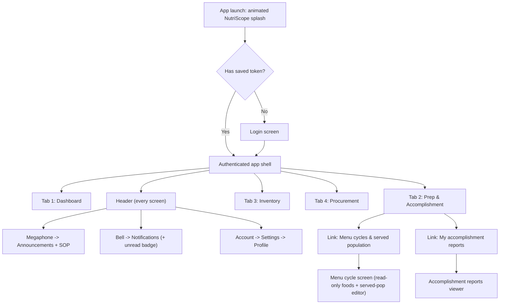
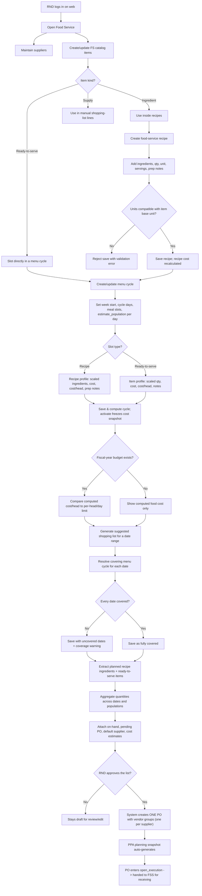
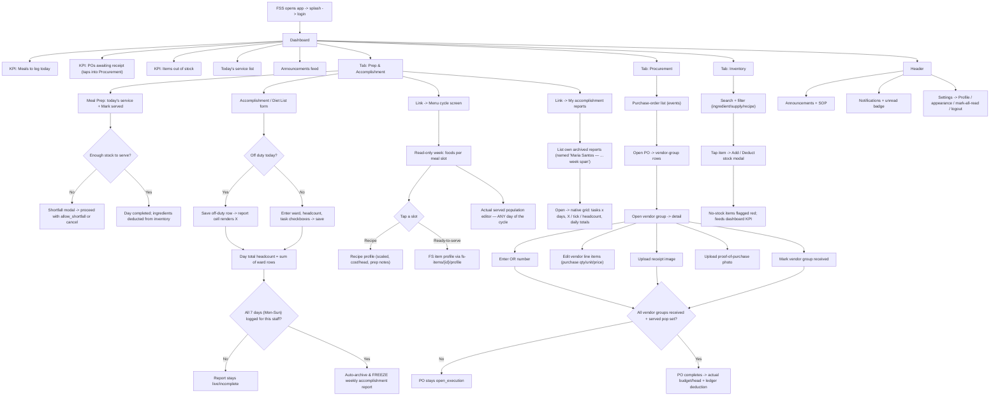
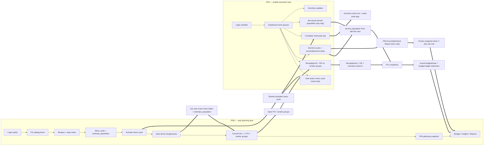
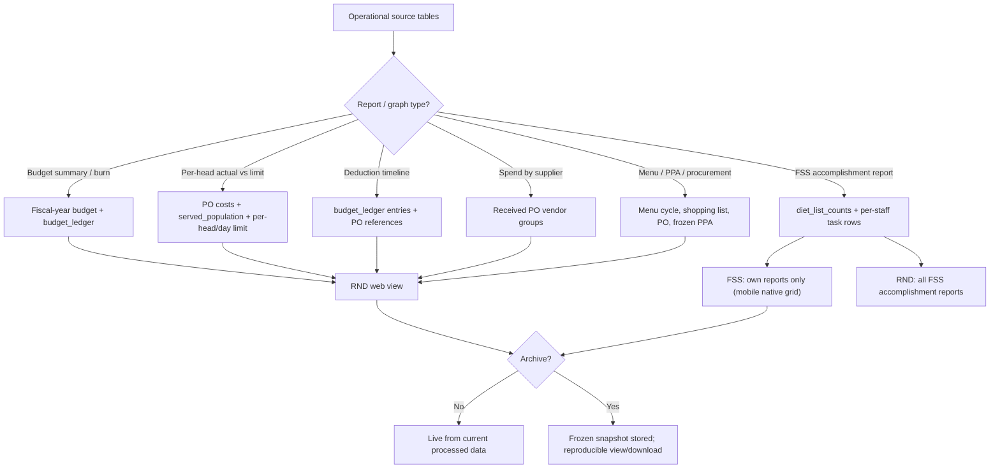

# Food Service Operation — Demo Flowcharts & Guide

This is the **demo guide and source-of-truth flowchart** for the food-service operation, covering both actors:

- **RND** (Research & Nutrition Dietitian) — works on the **web app**, owns *planning*: catalog, recipes, menu cycles, shopping lists, purchase orders, budget, insights, and all reports.
- **FSS** (Food Service Staff) — works on the **mobile app** (Expo/Android), owns *execution*: receiving deliveries, logging meal prep, recording diet-list headcounts, updating inventory, and filing the weekly accomplishment report.

The two actors **start independently**. RND begins from planning on the web; FSS begins from the today-work queue on mobile. They **only intersect through shared system artifacts**: the activated menu cycle, purchase orders & vendor groups, inventory, diet-list counts, meal-prep logs, the fiscal-year budget ledger, and the accomplishment report. Everything below reflects the **actual implemented system** (not an idealized design).

> Demo logins (seeded): RND `rnd@nutriscope.local`, FSS `fss@nutriscope.local` (Maria Santos), both password `nutriscope2024!`. The mobile build points at the production backend `https://nutriscope.live`.

---

## 1. FSS Mobile Navigation Map (read this first)

FSS mobile has **exactly four bottom tabs**. Everything else is reached from the **header** (top-right icons) or from **links inside the Prep tab** — not from the tab bar. This keeps the primary kitchen actions large and fat-finger-proof.



**Page inventory (10 screens, 4 tabs):** Dashboard, Prep & Accomplishment, Inventory, Procurement *(tabs)*; Menu cycle, Accomplishment reports *(opened from Prep)*; Announcements/SOP, Notifications, Settings, Profile *(opened from header)*. No screen is a dead-end — every input has a submit path and every produced artifact (incl. the accomplishment report) is viewable in-app.

---

## 2. RND Web Workflow — Food Service Planning



---

## 3. FSS Mobile Workflow — Execution (the demo path)



---

## 4. Two-Actor Interconnection (where RND & FSS meet)



**Report visibility:** RND sees **all** FSS accomplishment reports (index/show/download); FSS sees **only their own**. Render/archive params are forced to the authenticated FSS user's ID.

---

## 5. Reports & Data Flow



---

## 6. FSS Scope Guardrails (enforced server-side)

```mermaid
flowchart TD
    A["FSS mobile action"] --> B{"Action type?"}
    B -->|View menu cycle| C["Allowed: read-only active/saved menu"]
    B -->|Record diet list / accomplishment| D["Allowed: diet_list_counts + served basis"]
    B -->|Complete meal prep| E["Allowed: meal-prep log + inventory stock-out"]
    B -->|Set served population (any day)| E2["Allowed: upserts log for that cycle date"]
    B -->|Upload receipt/proof/OR| F["Allowed on existing vendor group"]
    B -->|Inventory add/deduct/restock| G["Allowed within inventory scope"]
    B -->|View own accomplishment report| R["Allowed: own reports only"]
    B -->|Create/edit menu, recipe, list, PO, supplier, budget, insights, PPA| H["BLOCKED 403 — RND-owned"]
    B -->|View another staff's report| H2["BLOCKED — owner-scoped"]
```

---

## 7. Step-by-Step Demo Script

**Part A — RND plans (web, `rnd@nutriscope.local`):**
1. Log in on web, open **Food Service**. The seed already contains 4 weekly cycles (3 past + current active) plus a draft next-week cycle.
2. Open the **active menu cycle**; click any slotted recipe/food to confirm scaled quantity, ingredients, total cost, cost/head, and prep notes.
3. **Generate a suggested shopping list** for a date range; observe coverage resolution and uncovered-date flagging.
4. **Approve/convert** the list → one PO with **vendor groups** (one per supplier) + an auto PPA planning snapshot. The PO enters `open_execution`.

**Part B — FSS executes (mobile, `fss@nutriscope.local` / Maria Santos):**
5. Launch the app → **animated NutriScope splash** → login. Land on **Dashboard** (today's service, meals-to-log, POs awaiting receipt, no-stock, announcements).
6. Tap the **POs awaiting receipt** KPI → jumps into the **Procurement** tab. Open a PO → a **vendor group** → enter the **OR number**, adjust line items, **upload a receipt image and a proof photo**, then **Mark received**.
7. Open **Prep & Accomplishment**:
   - **Mark served** for today (handles the shortfall modal if stock is short → deducts inventory).
   - Fill the **Accomplishment / Diet List** form: ward + headcount + task checkboxes, or flip **Off duty** to file an X day. The running total sums all ward rows for the day.
8. From Prep, tap **Menu cycles & served population** → read-only week; tap a recipe and a ready-to-serve food to confirm both open their profile; set **actual served population for any day** of the cycle.
9. From Prep, tap **My accomplishment reports** → open a seeded archived report ("Maria Santos — Accomplishment Report …week span"); confirm the native grid (tasks × days, ✓ / X / headcount, daily totals).
10. Open **Inventory**; add/deduct stock on an item; confirm no-stock items show red and the dashboard KPI reflects it.
11. Header: open **Announcements/SOP**, **Notifications** (unread badge), and **Settings → Profile**.

**Part C — the loop closes:**
12. Once **all vendor groups are received** and **served population exists** for the PO's dates, the PO **completes** → actual budget-per-head computes and a **budget-ledger deduction** posts.
13. Once **all 7 days (Mon–Sun)** have a diet-list row for the FSS staff, the **weekly accomplishment report auto-archives and freezes** — later diet-list edits never change the frozen snapshot.
14. RND opens **Budget / Insights / Reports** to see graphs and the FSS accomplishment reports (RND sees all; FSS sees only their own).

**Seeded state for the demo:** 3 frozen accomplishment reports for Maria Santos (one per completed past week, named by staff + week span, each with a generated PDF), 12 vendor groups across the four weeks, a fiscal-year budget with a 13-row ledger, completed meal-prep logs, and diet-list counts — so every report, KPI, and the actual budget-per-head render real figures on first launch.
