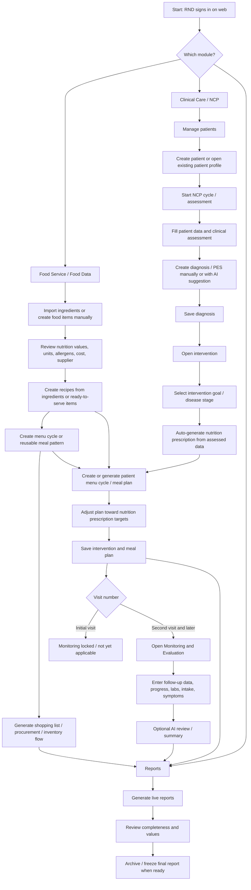
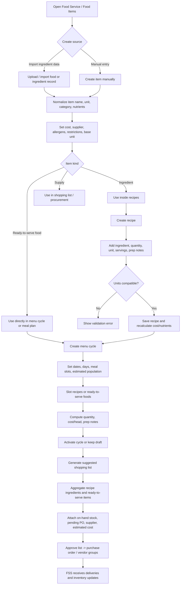
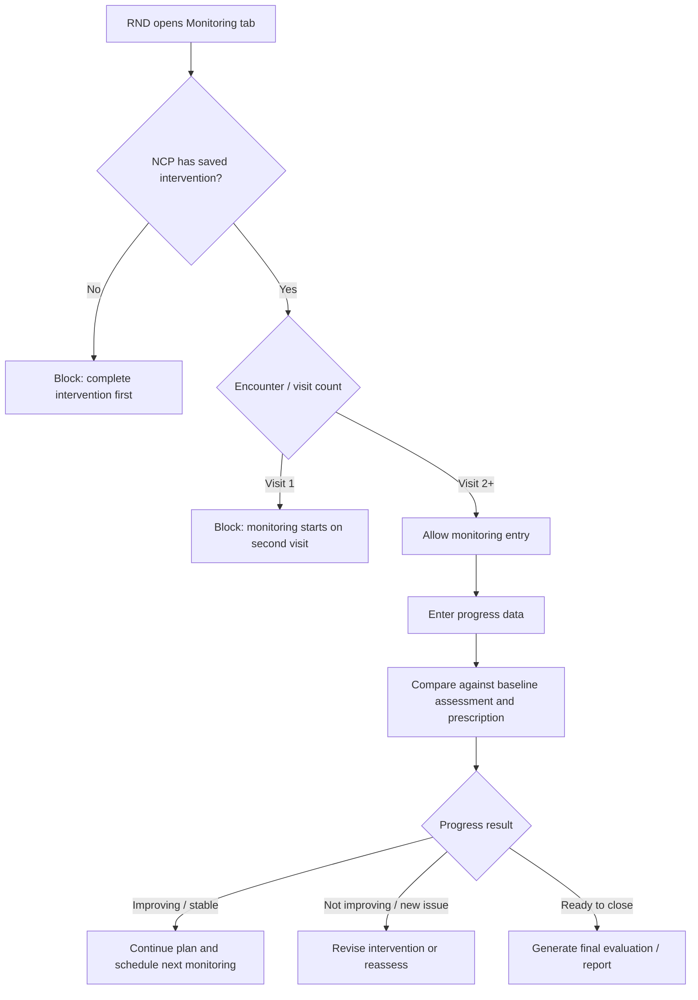
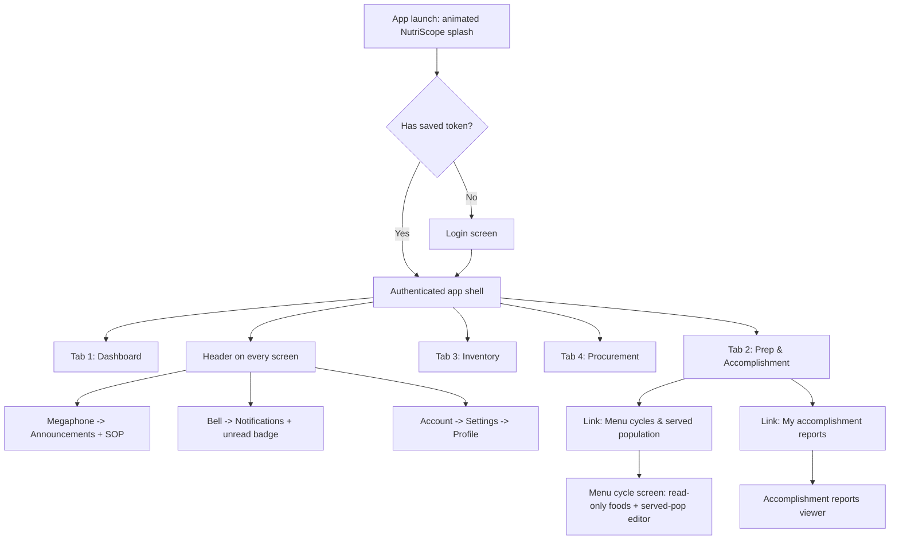
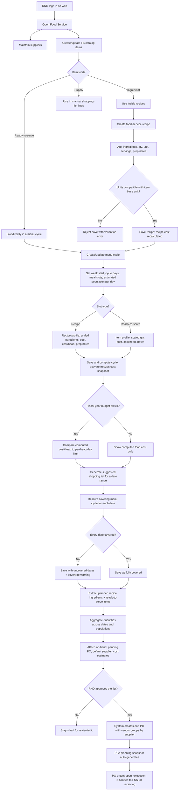
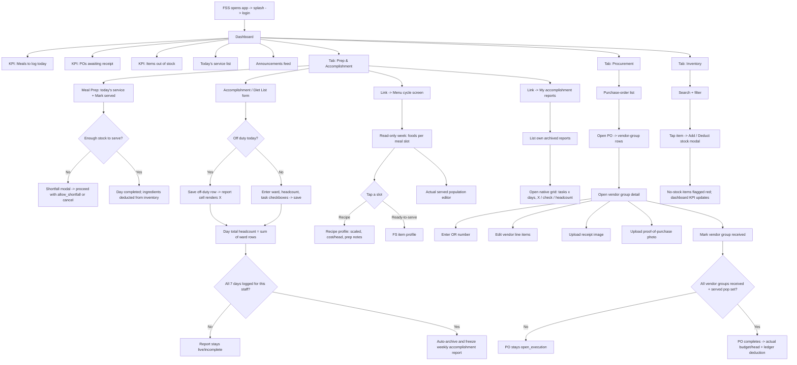
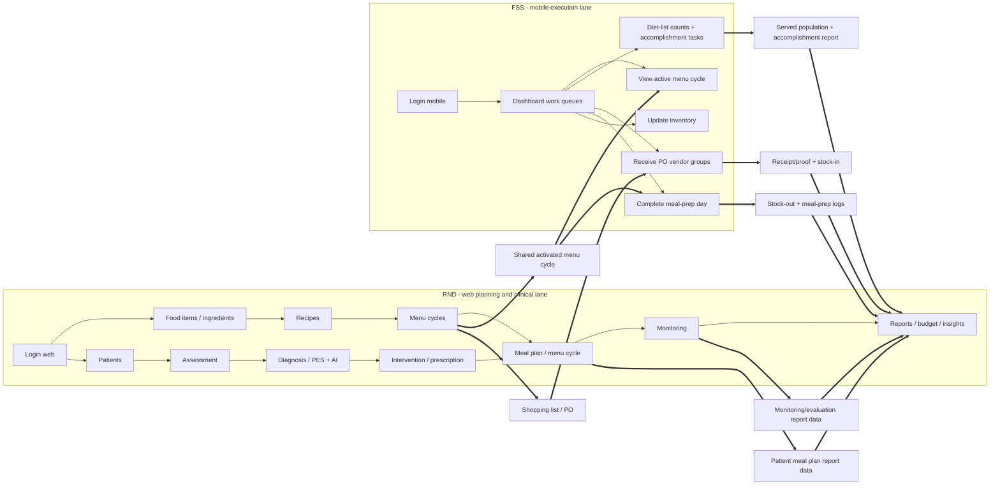
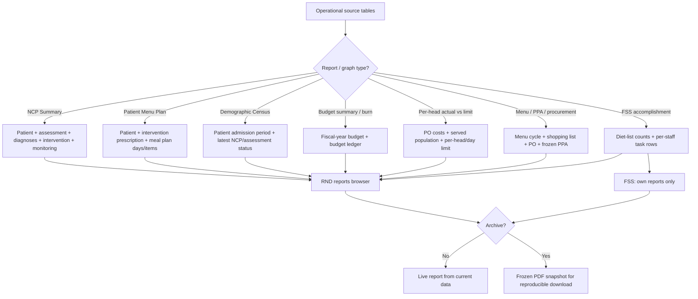
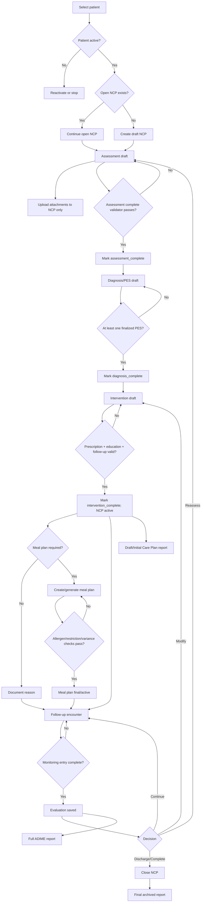

# Module food service operation Workflow Flowchart

This is the demo guide and source-of-truth workflow map for the NutriScope modules that feed clinical care, food service planning, execution, monitoring, and report generation.

Primary actors:

- **RND** works in the web app and owns food data setup, recipes, menu cycles, patients, NCP/ADIME care plans, meal plans, monitoring, reports, budget, and insights.
- **FSS** works in the mobile app and owns food-service execution: receiving deliveries, logging meal prep, recording diet-list headcounts, updating inventory, and filing weekly accomplishment reports.

The modules share data through food items, recipes, menu cycles, patient records, NCP records, prescriptions, meal plans, inventory, purchase orders, monitoring entries, and archived reports.

Demo logins: RND `rnd@nutriscope.local`, FSS `fss@nutriscope.local` (Maria Santos), both password `nutriscope2024!`. The mobile build points at `https://nutriscope.live`.

---

## 1. Module-Level Workflow

---

## 2. Food Data, Ingredients, Recipes, and Menu Cycles

Food data is the base used by both food service and clinical meal planning. RND can import ingredient records or manually create them, then use those records in recipes, menu cycles, shopping lists, and patient meal plans.

---

## 3. Clinical Care / NCP Workflow

Clinical Care follows the NCP/ADIME path: Assessment, Diagnosis, Intervention, Monitoring, Evaluation. The first visit creates the assessment, diagnoses, prescription, intervention, and meal plan. Monitoring starts only on the second visit and later because it requires follow-up data to compare against the baseline intervention.

```mermaid
flowchart TD
    A["Open Clinical Care / NCP Patients"] --> B{"Patient exists?"}
    B -->|"No"| C["Create patient"]
    B -->|"Yes"| D["Open patient profile"]

    C --> C1["Enter patient data: name, DOB, sex, admission date"]
    C1 --> C2["Optional: ward, physician, diagnosis, religion, contact, screening type"]
    C2 --> E["Start NCP cycle"]
    D --> E

    E --> F["Assessment tab"]
    F --> F1["Fill assessment: diet history, anthropometrics, labs, history, allergies, medications"]
    F1 --> F2["Upload supporting documents if needed"]
    F2 --> F3["Save assessment"]

    F3 --> G["Diagnosis tab"]
    G --> G1{"Diagnosis path"}
    G1 -->|"Manual PES"| G2["Choose domain NI / NC / NB"]
    G2 --> G3["Enter Problem, Etiology, Signs/Symptoms"]
    G1 -->|"AI-assisted"| G4["Request AI diagnosis suggestions from assessment context"]
    G4 --> G5["Review suggested domain, problem, etiology, signs"]
    G5 --> G6{"Approve suggestion?"}
    G6 -->|"No"| G
    G6 -->|"Yes"| G7["Convert suggestion into diagnosis"]
    G3 --> G8["Backend builds PES statement"]
    G7 --> G8
    G8 --> G9["Save one or more diagnoses"]

    G9 --> H["Intervention tab"]
    H --> H1["Select intervention goal and disease stage"]
    H1 --> H2["Autofill nutrition prescription from assessment data"]
    H2 --> H3{"Enough assessed data?"}
    H3 -->|"Yes"| H4["System computes energy, macro, fluid, micronutrient targets"]
    H3 -->|"No"| H5["RND enters targets manually or completes missing assessment data"]
    H4 --> H6["Add education, counseling, barriers, strategy, next follow-up"]
    H5 --> H6
    H6 --> H7["Save intervention"]

    H7 --> I["Meal Plan / Menu Cycle tab"]
    I --> I1{"Planning path"}
    I1 -->|"Manual"| I2["Create days and meal slots manually"]
    I1 -->|"Auto-generate"| I3["Generate menu cycle close to nutrition prescription"]
    I1 -->|"Template"| I4["Use saved template"]
    I2 --> I5["Add recipes, food items, or direct USDA items"]
    I3 --> I6["System scores foods/recipes against targets, allergens, restrictions"]
    I4 --> I5
    I6 --> I7["Review generated calories, macros, micronutrients, variance flags"]
    I5 --> I7
    I7 --> I8["Adjust portions/items until close to prescription"]
    I8 --> I9["Save meal plan"]

    I9 --> J{"Visit number"}
    J -->|"Initial visit"| K["Monitoring tab locked / show reason: follow-up visit required"]
    J -->|"Second visit and later"| L["Monitoring and Evaluation tab"]
    L --> L1["Enter follow-up weight, BMI, labs, intake notes, symptoms, goal achievement"]
    L1 --> L2["Compare progress against assessment baseline and intervention targets"]
    L2 --> L3["Optional AI review / monitoring summary"]
    L3 --> L4["Save monitoring entry"]

    H7 --> M["Reports tab"]
    I9 --> M
    L4 --> M
    M --> M1["Generate NCP Summary / Patient Menu Plan / Census"]
    M1 --> M2["Preview live report"]
    M2 --> M3["Archive final PDF snapshot when ready"]
```

### Clinical Care Tab Traversal

1. **Patients** - create or select a patient, then start or continue an NCP cycle.
2. **Assessment** - enter baseline patient and clinical data. This is the source used by diagnosis, AI suggestions, prescription autofill, meal planning, monitoring, and reports.
3. **Diagnosis / PES** - create one or more diagnoses manually or review AI-generated suggestions. AI is assistive only; RND reviews and saves the accepted diagnosis.
4. **Intervention / Prescription** - select the intervention goal and disease stage. The system can auto-prescribe energy, macros, fluid, and micronutrient targets when assessment data is complete enough.
5. **Meal Plan / Menu Cycle** - create a manual plan, use a template, or auto-generate a menu cycle that tries to match the nutrition prescription while avoiding known allergens and restrictions.
6. **Monitoring and Evaluation** - available on the second visit and later. It records follow-up findings and compares progress against the initial assessment and saved intervention.
7. **Reports** - generate live reports, review values, then archive final PDFs when the clinical record is ready.

---

## 4. Monitoring Gate

Monitoring is not part of the first-visit baseline. It should be opened only after an intervention exists and the patient has a second visit or later follow-up encounter.

---

## 5. FSS Mobile Navigation Map

FSS mobile has exactly four bottom tabs. Everything else is reached from the header or from links inside the Prep tab.

Page inventory: Dashboard, Prep & Accomplishment, Inventory, Procurement, Menu cycle, Accomplishment reports, Announcements/SOP, Notifications, Settings, Profile.

---

## 6. RND Food Service Planning Workflow

---

## 7. FSS Mobile Execution Workflow

---

## 8. Two-Actor Interconnection

---

## 9. Reports and Data Flow

---

## 10. Step-by-Step Demo Script

### Part A - RND prepares food data and food-service plan

1. Log in on web as `rnd@nutriscope.local`.
2. Open Food Service.
3. Import ingredients or manually create food items with units, nutrients, costs, suppliers, allergens, and restrictions.
4. Create recipes from ingredients and confirm recipe cost/nutrition recalculation.
5. Create or open a menu cycle; slot recipes and ready-to-serve foods.
6. Generate a shopping list from the active menu cycle.
7. Approve/convert the list to one purchase order with supplier vendor groups.

### Part B - RND runs Clinical Care / NCP

1. Open Clinical Care / NCP Patients.
2. Create a patient or open an existing patient profile.
3. Start an NCP cycle and fill the Assessment tab with patient data, diet history, anthropometrics, labs, allergies, medications, and clinical summary.
4. Go to Diagnosis / PES.
5. Create a diagnosis manually or request AI suggestions from the assessment context.
6. Review the AI suggestion, approve only the clinically correct one, and save the diagnosis.
7. Go to Intervention.
8. Select intervention goal and disease stage.
9. Use prescription autofill when assessment data is complete; otherwise complete missing data or enter targets manually.
10. Add education, counseling, barriers, strategy, and next follow-up.
11. Create a manual meal plan, use a template, or auto-generate a menu cycle close to the nutrition prescription.
12. Review calorie/macro/micronutrient variance and adjust foods or portions.
13. Save the intervention and meal plan.
14. On the initial visit, Monitoring stays unavailable because there is no follow-up comparison yet.
15. On the second visit or later, open Monitoring and Evaluation, enter follow-up findings, compare progress, optionally request AI review, and save.
16. Generate NCP Summary, Patient Menu Plan, or other clinical reports.
17. Preview the live PDF and archive the final report when ready.

### Part C - FSS executes food-service work on mobile

1. Launch mobile app and log in as `fss@nutriscope.local`.
2. Open Dashboard for today's service list, meals-to-log KPI, POs awaiting receipt, no-stock items, and announcements.
3. Open Procurement, receive vendor groups, enter OR number, upload receipt/proof, and mark received.
4. Open Prep & Accomplishment, mark served, and record diet-list/accomplishment rows.
5. Open Menu cycles & served population to review active menu foods and set actual served population.
6. Open Inventory to add or deduct stock.
7. Open My accomplishment reports to review archived weekly reports.

### Part D - Reports close the loop

1. PO receipt and served-population data update actual budget/head and budget ledger.
2. Diet-list rows and accomplishment tasks generate FSS weekly reports.
3. Patient assessment, diagnosis, intervention, meal plan, and monitoring data generate clinical reports.
4. RND reviews live reports and archives final PDFs when the data is ready.

# Clinical Care/NCP Module Workflow

### Patient Selection

RND selects an active patient or creates one. If a patient is discharged/transferred, the system requires reactivation with reason before a new NCP can start. If an open NCP already exists, RND must continue it or close it before starting another.

### NCP Creation

System creates one draft NCP cycle. Status starts at `draft_assessment`. The cycle cannot become active until Assessment, Diagnosis, and Intervention are explicitly finalized.

### Assessment

RND may save drafts freely. Attachments are linked to the NCP but do not complete assessment. To finalize Assessment, required fields must pass a clinical validator. The validator records `assessment_completed_at` and `assessment_completed_by`.

### Diagnosis and PES

Diagnosis is unlocked only after assessment completion. RND enters structured P/E/S and may optionally override the rendered PES statement. At least one PES must be finalized. Deleting or changing a finalized diagnosis after intervention requires reopening downstream sections.

### Intervention and Prescription

Intervention is unlocked only after finalized PES. Goal/stage, prescription targets, education/counseling plan, and follow-up plan are required. Autofill is preferred when weight/height/DOB/sex exist; otherwise RND must enter targets manually or document why not applicable. Completing intervention promotes the NCP to `active`.

### Meal Planning

Meal plans are optional for non-oral/clinical-only cases but required when the intervention type includes oral diet planning. Manual and generated plans run the same validation: allergens hard-blocked, restrictions flagged, prescription variance calculated, and unresolved critical flags prevent active/final plan status.

### Monitoring and Evaluation

Monitoring starts after active intervention and a follow-up encounter. RND logs visit date, tracked indicators, intake/tolerance, symptoms, and goal evaluation. At least one meaningful indicator or exception reason is required. NCP moves to `active_monitoring`. Completion requires a final evaluation/discharge/reassessment decision.

### Clinical Reports

Reports are separated into:

- Draft preview: available anytime, watermarked incomplete.
- Final NCP Summary: available only when required sections are finalized.
- Initial Care Plan report: allowed after A/D/I, labeled "No monitoring visit yet."
- Full ADIME cycle report: requires at least one monitoring/evaluation entry.

## 11. TO-BE Workflow Diagram

