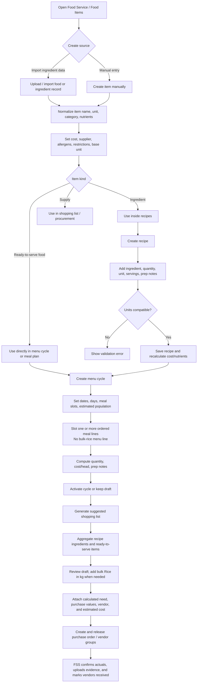
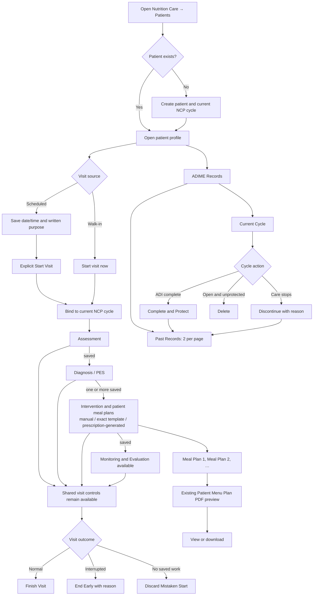
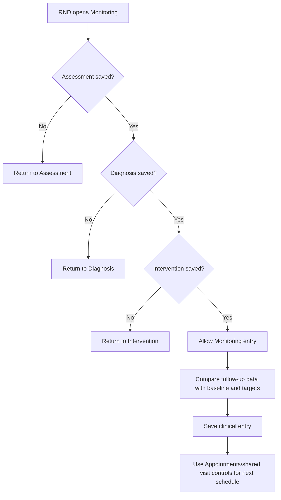
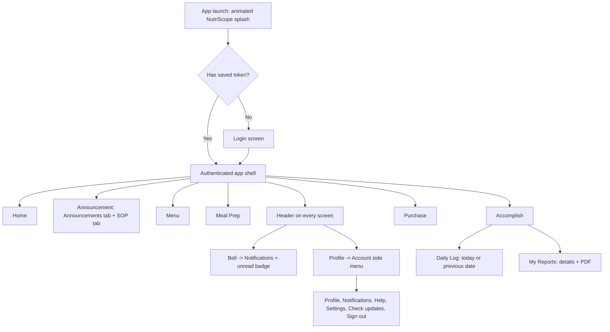
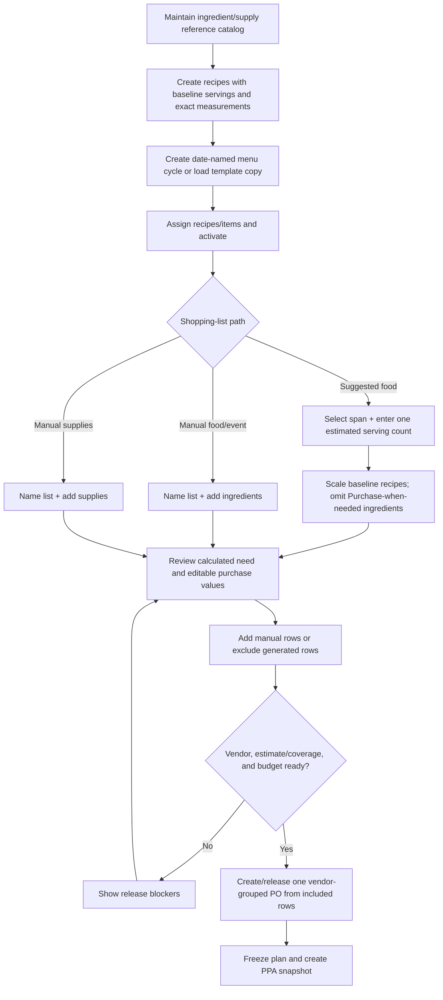
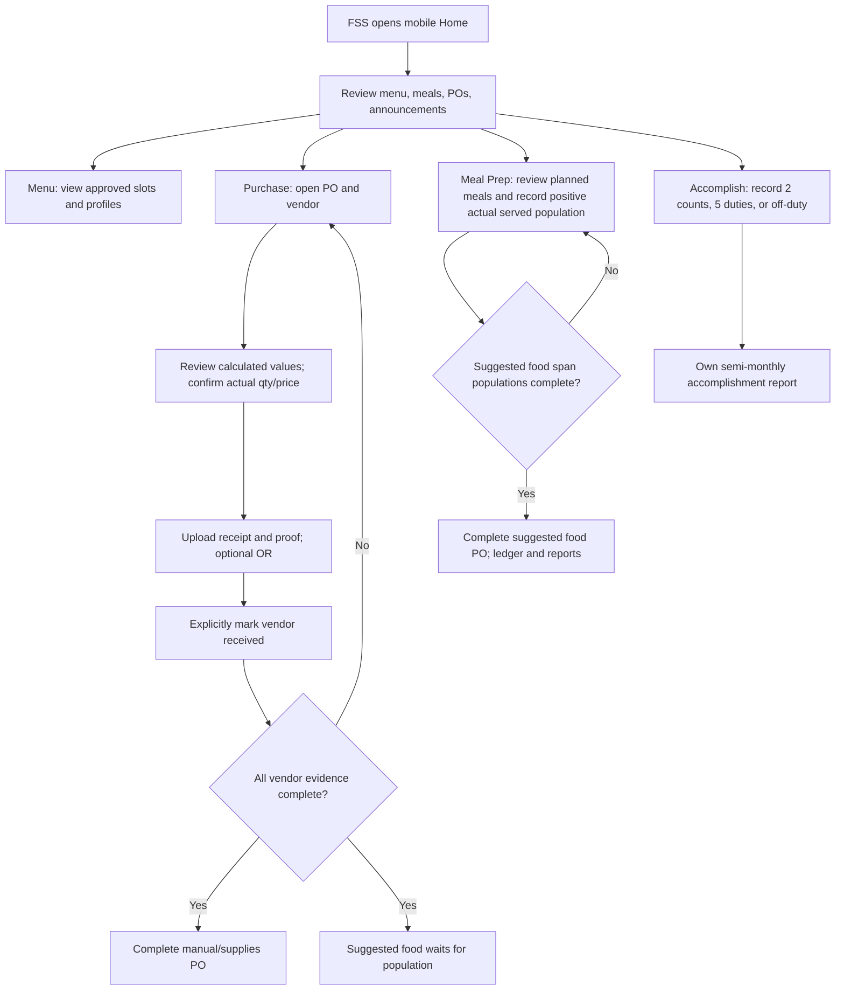
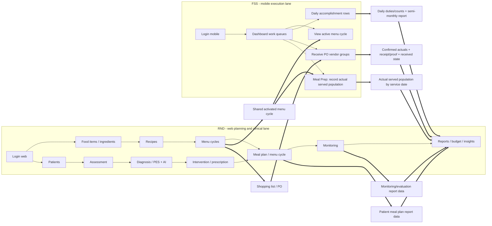
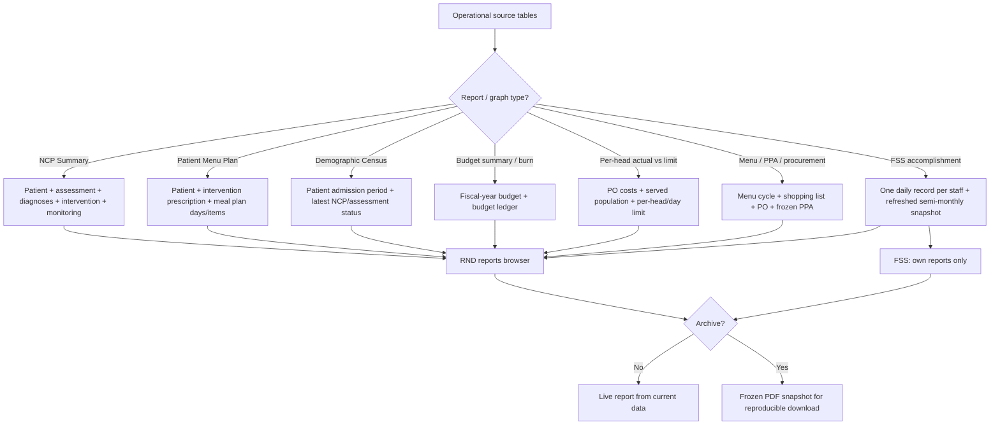
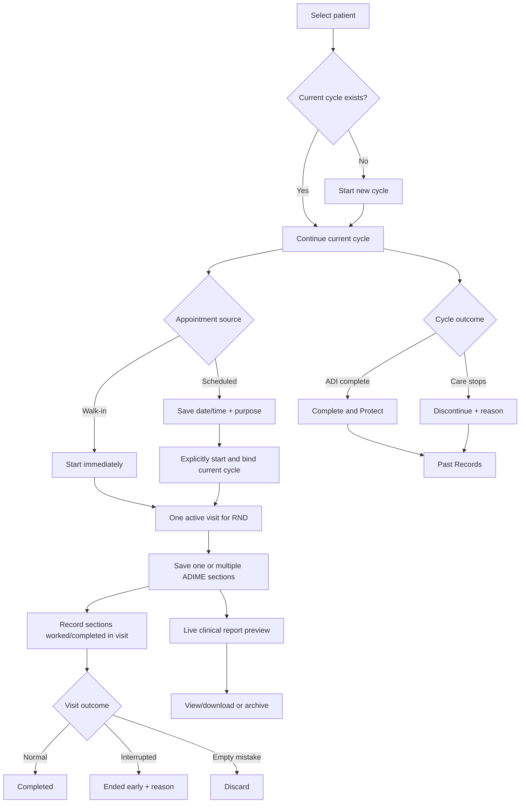

# NutriScope Module Workflow Flowchart

Verified against current RND web, FSS native mobile, and Laravel workflow boundaries on **2026-08-27**.

This is the demo guide and source-of-truth workflow map for the NutriScope modules that feed clinical care, food service planning, execution, monitoring, and report generation.

Primary actors:

- **RND** works in the web app and owns food data setup, recipes, menu cycles, patients, NCP/ADIME care plans, meal plans, monitoring, reports, budget, and insights.
- **FSS** works in the native mobile app and owns food-service execution: reviewing approved menus, receiving deliveries with evidence, recording actual served population, filing daily accomplishments, and opening their own semi-monthly reports.

The modules share data through food items, recipes, menu cycles, patient records, NCP records, prescriptions, meal plans, inventory, purchase orders, monitoring entries, and archived reports.

Demo logins: RND `rnd@nutriscope.local`, FSS `fss@nutriscope.local` (Maria Santos), both password `nutriscope2024!`. The mobile build points at `https://nutriscope.live`.

## 2. Food Data, Ingredients, Recipes, and Menu Cycles

Food data is the base used by both food service and clinical meal planning. RND can import ingredient records or manually create them, then use those records in recipes, menu cycles, shopping lists, and patient meal plans.

---

## 3. Clinical Care / NCP Workflow

Clinical care separates the ADIME record from the appointment that carries a visit. A scheduled appointment is patient-level until the RND explicitly starts it; start binds it to the patient's single current cycle. One visit may cover one or several ADIME steps.

### Clinical Care Tab Traversal

1. **Patients** - create/select a patient and review Overview, ADIME Records, Appointments, or Attachments.
2. **Appointments** - schedule with date/time and purpose, start a walk-in, or resolve a schedule as rescheduled, no-show, or cancelled.
3. **Assessment** - enter baseline data and save; the active visit records Assessment work when one exists.
4. **Diagnosis / PES** - requires Assessment and at least one saved diagnosis before Intervention unlocks.
5. **Intervention / Prescription** - review calculated targets, care actions, and numbered patient meal plans.
6. **Monitoring and Evaluation** - requires saved Assessment, Diagnosis, and Intervention; it records clinical follow-up, not appointment attendance.
7. **Reports** - open live report preview and download/archive through the existing report workflow.

---

## 4. Monitoring Gate

Monitoring is gated by saved clinical prerequisites, not by a predicted appointment purpose or a separate encounter count.

---

## 5. FSS Mobile Navigation Map

FSS uses the native Android app. Daily destinations stay in bottom navigation; account utilities stay in the header and profile side menu.

Page inventory: Home, Announcement, Menu, Meal Prep, Accomplish, Purchase, food profile, report detail, Notifications, Help, Settings, and Profile. Announcement contains separate Announcements and SOP tabs.

---

## 6. RND Food Service Planning Workflow

---

## 7. FSS Mobile Execution Workflow

---

## 8. Two-Actor Interconnection

---

## 9. Reports and Data Flow

---

## 10. Step-by-Step Demo Script

### Part A - RND prepares food data and food-service plan

1. Log in on web as `rnd@nutriscope.local`.
2. Open Food Service.
3. Import ingredients or manually create food items with units, nutrients, costs, suppliers, allergens, and restrictions.
4. Create recipes from ingredients and confirm recipe cost/nutrition recalculation.
5. Create or open a menu cycle; slot recipes and ready-to-serve foods.
6. Generate a shopping list from the active menu cycle.
7. Approve/convert the list to one purchase order with supplier vendor groups.

### Part B - RND runs Clinical Care / NCP

1. Open Clinical Care / NCP Patients.
2. Create a patient or open an existing patient profile.
3. In Appointments, schedule a visit with date/time and purpose, or start a walk-in for the current cycle.
4. Explicitly start the scheduled visit. If navigation changes, use the persistent Resume banner.
5. Fill and save Assessment, then create/review and save a Diagnosis/PES.
6. In Intervention, review prescription targets and save education, counseling, goals, and any patient meal plan.
7. Continue into Monitoring when Assessment, Diagnosis, and Intervention exist; save follow-up clinical data when relevant.
8. Finish or end the visit from the shared controls on any ADIME step. Use Discard only for an empty mistaken start.
9. Resolve unattended schedules as No-show, Cancelled, or Rescheduled; confirm history and administering RND in Appointments.
10. In ADIME Records, complete/protect or discontinue the current cycle when clinically appropriate and review it in Past Records.
11. Select a numbered meal plan to open the existing Patient Menu Plan PDF preview, then view/download it.
12. Generate other clinical reports and archive a final report only when an as-filed copy is needed.

### Part C - FSS executes food-service work on mobile

1. Launch mobile app and log in as `fss@nutriscope.local`.
2. Open Home for today's service list, meals-to-log KPI, POs awaiting receipt, active menu, and announcements.
3. Open Purchase, confirm actual values, optionally enter an OR number, upload receipt/proof, and explicitly mark each vendor received.
4. Open Meal Prep to review the selected day's menu and record actual served population.
5. Open Accomplish to record diet-list/accomplishment rows for today or a missed previous date.
6. Open Menu to review weekly menu slots and open each read-only food profile.
7. Open My Reports inside Accomplish to view and download personal semi-monthly reports.

### Part D - Reports close the loop

1. PO receipt and served-population data update actual budget/head and budget ledger.
2. One Daily Log per staff/date refreshes the matching semi-monthly FSS report.
3. Patient assessment, diagnosis, intervention, meal plan, and monitoring data generate clinical reports.
4. RND reviews live reports and archives final PDFs when the data is ready.

# Clinical Care/NCP Module Workflow

### Patient Selection

RND selects or creates a patient. The profile separates the current NCP cycle, paginated Past Records, appointments, and attachments. A new cycle cannot start while another current cycle is open.

### NCP Creation

The system creates one draft/current NCP cycle. Completing and protecting the cycle requires clinically complete Assessment, Diagnosis, and Intervention. Discontinuing requires a reason. Both terminal outcomes move the cycle to Past Records without changing older cycles.

### Assessment

RND saves the required Assessment fields. Attachments remain supporting files linked to the NCP and do not auto-fill or complete Assessment.

### Diagnosis and PES

Diagnosis is unlocked after Assessment is saved. RND enters structured P/E/S or reviews an assistive draft, then saves at least one diagnosis to unlock Intervention.

### Intervention and Prescription

Intervention is unlocked after Assessment and at least one Diagnosis. It contains goal/stage, backend-calculated prescription targets, food guidance, education, counseling, goals, and patient meal plans. Appointment purpose and next scheduling live in the shared visit workflow, not an Intervention-only encounter form.

### Meal Planning

Patient meal plans may be manual, generated, or template-based. Exact loaded templates can be quantity-scaled in the common editor without item substitution. Auto-generation already follows the saved prescription and can exclude snacks by redistributing targets across main meals, except when the selected liver-disease goal requires frequent intake. In ADIME history plans are numbered within the cycle and open the existing Patient Menu Plan PDF preview with prescription context and view/download actions.

### Monitoring and Evaluation

Monitoring unlocks after Assessment, Diagnosis, and Intervention exist. RND logs follow-up clinical data and compares it with baseline/targets. Appointment status, purpose, and next scheduling remain in Appointments/shared visit controls.

### Clinical Reports

The Reports page prepares current report data for preview. The same Patient Menu Plan report can be opened from a numbered meal plan in ADIME Records. View/download uses the existing PDF routes; archive freezes an as-filed copy.

## 11. Current NCP and Visit Workflow Diagram

