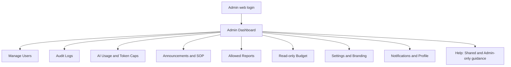
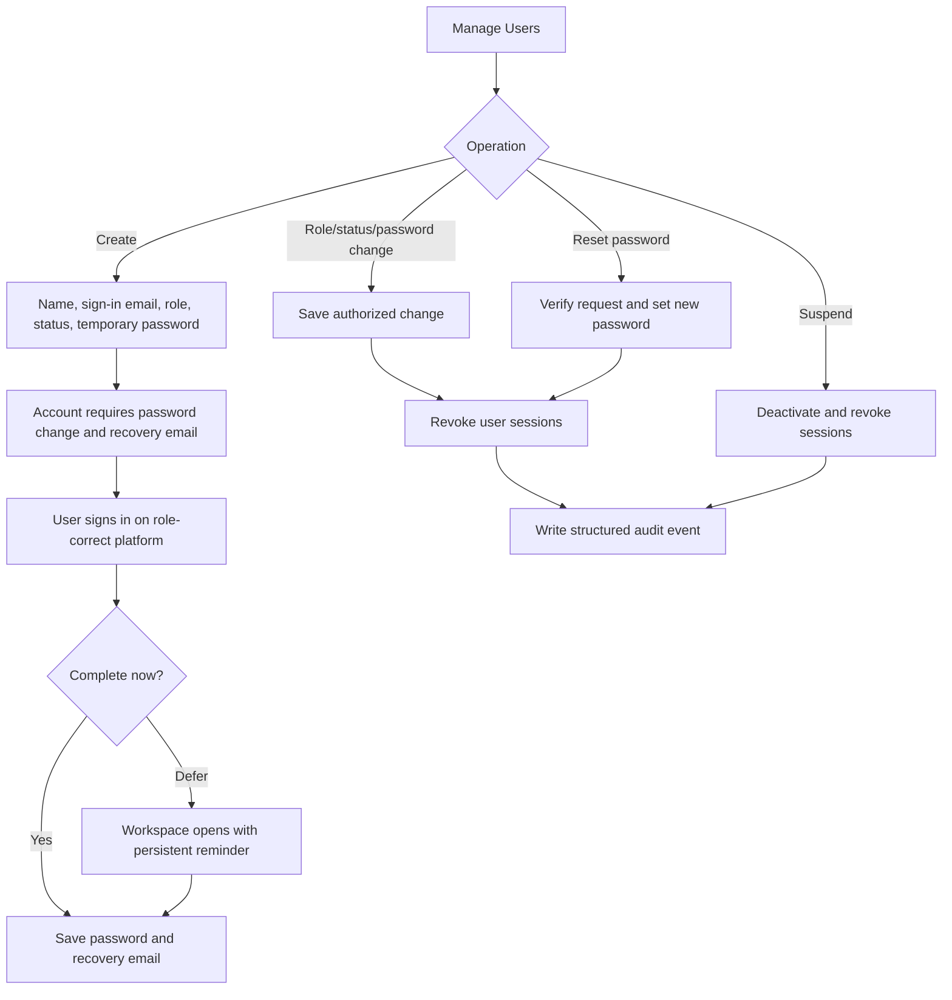
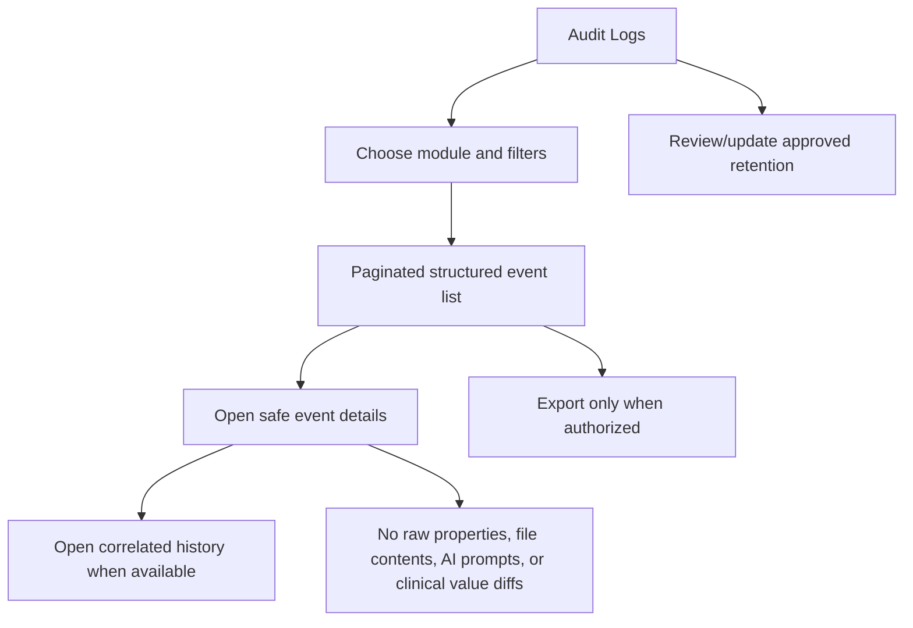
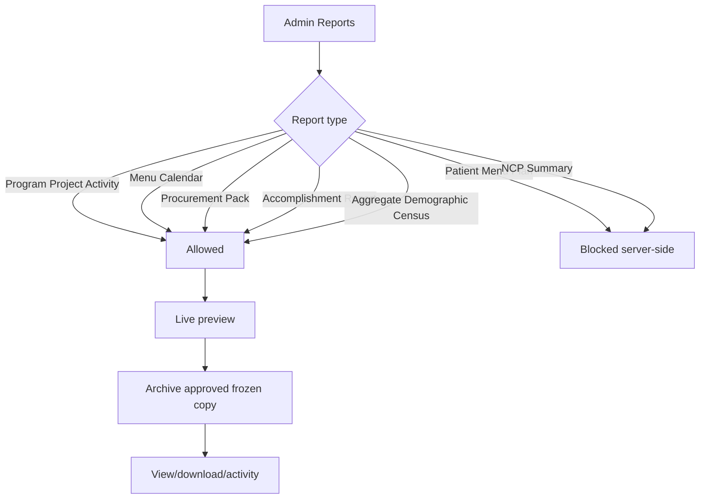
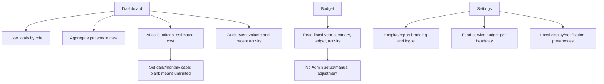

# Admin — Current Operations Flow

Verified against current Admin web pages and Laravel Admin/report guards on **2026-07-20**.

## Admin Navigation and Responsibilities

## Account Lifecycle

## Audit Oversight

## Reports and Clinical Boundary

## Dashboard, AI, Budget, and Settings

## Explicit Safety Boundary

Admin performs system oversight, not clinical care. No Admin patient/NCP navigation exists. Aggregate patient counts and aggregate Demographic Census do not grant access to patient-specific Assessment, Diagnosis, Intervention, Monitoring, Patient Menu Plan, or NCP Summary.

## Related Documents

- [Admin Module](../admin.md)
- [FAQ](../../FAQ.md)
- [Role How-To](../../ROLE-HOW-TO.md)
- [Storyboards](../../STORYBOARD.md)
