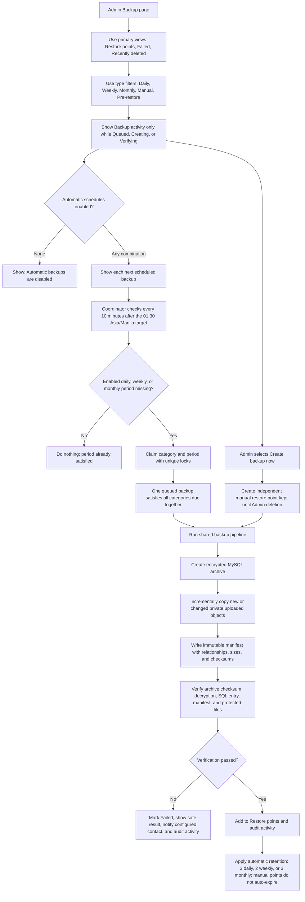
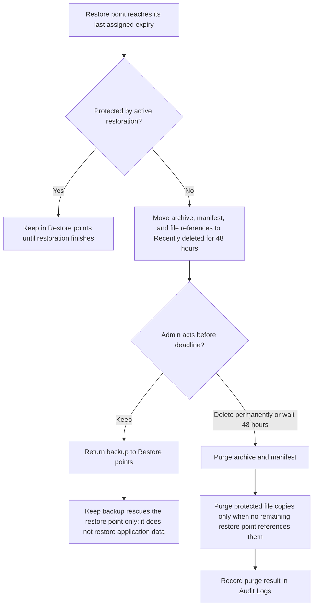
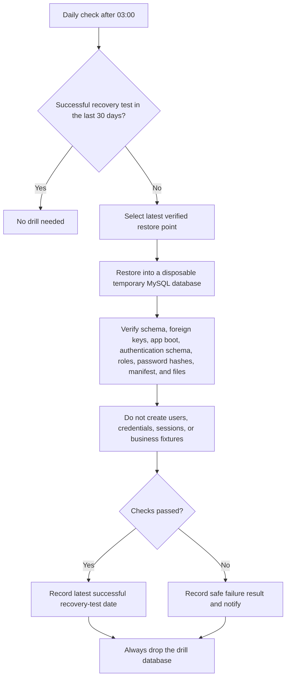
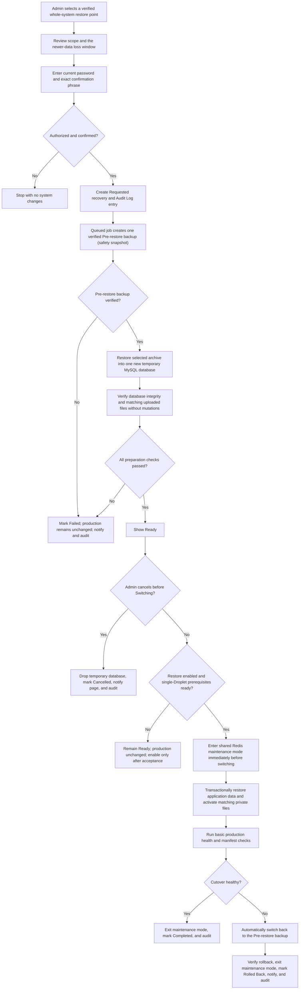

# Backup and Recovery

This is the maintained administrator reference for the Phase 1.5 backup foundation and the Phase 2 DigitalOcean single-Droplet whole-system recovery workflow. Automatic schedules are disabled by default in demo deployments.

## Automatic and Manual Restore Points

Disabling a schedule stops future periods only. It does not delete or reclassify existing restore points. A manual backup never satisfies an automatic period.

## Retention and Recently deleted

## Periodic Recovery Validation

## Admin Whole-System Restoration

Each attempt creates its own Pre-restore backup, even if the later restoration step fails. After Completed, Failed, Rolled Back, or Cancelled, that backup remains protected for 48 hours. If restoration or rollback is still active at 48 hours, protection continues until the process reaches a terminal status, then the 48-hour window begins. Newer records are not merged or placed in a review database; after a successful older restore they exist only in this access-controlled recovery safety snapshot.

## Recovery Boundaries

- Only Admin can change schedules or initiate/cancel recovery.
- Raw database archives, object keys, passwords, and provider credentials never enter the browser.
- Production is never the first restoration target.
- Recovery is whole-system only. There is no Technical Operator website role, separate review database, individual-record merge, or universal Record Trash.
- Preview/download of saved reports are read-only and reproducible report-cache PDFs are excluded from backup manifests.
- The DigitalOcean single-Droplet switcher preserves current backup metadata, recovery history, schedules, migrations, Audit Logs, and audit revisions while restoring application data and matching protected uploads. It is available only when production readiness passes and restoration is explicitly enabled.

## Related Documents

- [Admin Module](../admin.md)
- [Platform Requirements](../../operations/platform-requirements.md)
- [Backup and Recovery Guide](../../operations/backup-recovery.md)
- [Phase 2 Platform Handoff](../../operations/phase-2-platform-handoff.md)
