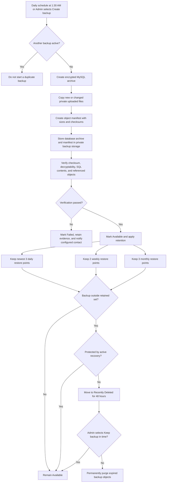
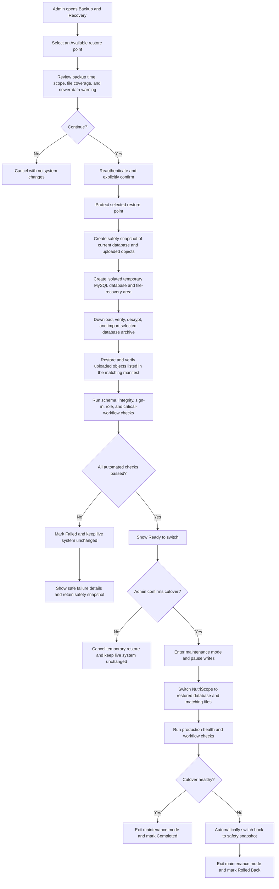
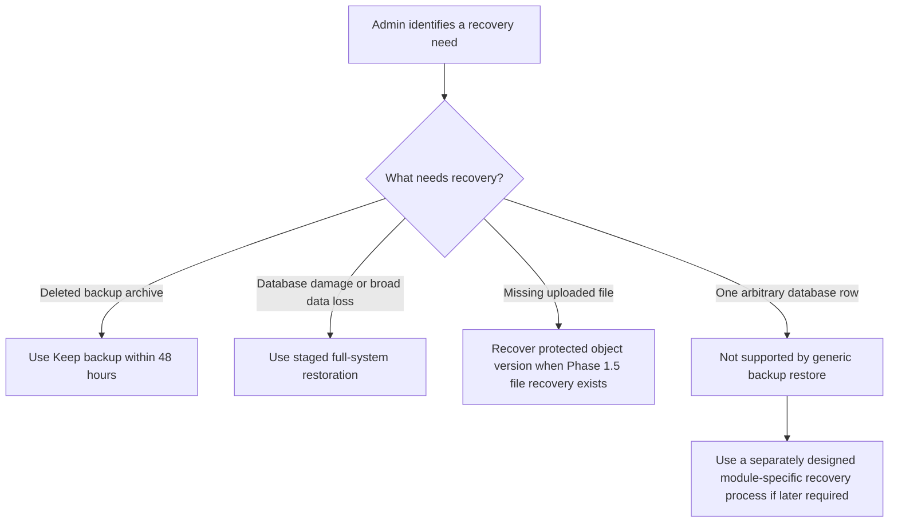

# Backup and Recovery — Phase 1.5 Planned Flow

This flow extends the implemented Phase 1 database-backup foundation. The staged restoration and uploaded-file recovery steps are planned for Phase 1.5 and are not current production behavior.

## Automatic Backup and Retention

## Admin Full-System Restoration

## Recovery Scope

Backup restoration operates on a complete restore point. It does not provide a generic tool for copying arbitrary database rows into the live system.

## Safety Boundaries

- Only an authenticated Admin may initiate restoration.
- Raw database archives, object-storage credentials, and encryption secrets never enter the browser.
- Restoration always prepares and checks an isolated environment before production cutover.
- The live system remains unchanged when preparation or validation fails.
- A safety snapshot and automatic rollback protect the current state during cutover.
- Phase 2 provider selection must support the temporary database, workers, scheduler, maintenance mode, health checks, private object storage, and safe cutover required by this flow.

## Related Documents

- [Admin Module](../admin.md)
- [Platform Requirements](../../operations/platform-requirements.md)
- [Backup and Recovery Guide](../../operations/backup-recovery.md)
- [Phase 2 Platform Handoff](../../operations/phase-2-platform-handoff.md)
