# Clinical Care — Nutrition Care Process (NCP / ADIME) Workflow

End-to-end RND workflow for a single patient's nutrition care cycle. Backend-enforced
gates are shown as decision diamonds; an empty record never advances the workflow.

```mermaid
flowchart TD
    A[RND Login] --> B[Patient Directory\nsearch / filter by status\nAdmit or select a patient]
    B --> C{Start NCP Cycle?\nGuards:\n- patient not Discharged/Transferred\n- no existing open draft/active cycle}
    C -- Blocked --> C1[Show reason\ne.g. open cycle exists\nor patient discharged]
    C1 --> B
    C -- Allowed --> D[NCP Cycle created\nstatus = draft\ntype = new]

    %% ── ASSESSMENT (A) ──────────────────────────────────────────────
    D --> AS[Step 1 — Nutrition Assessment\nAnthropometrics: weight, height auto-BMI, usual wt, %IBW, MUAC, waist/hip\nDietary: intake recall, appetite, restrictions, present diet\nClinical: medical/social history, meds, allergies, dislikes\nEngine inputs: activity level, stress, edema, pregnancy/lactation\nBiochemical/Labs tab: 17 lab values flagged LOW/HIGH by sex-specific ranges\nUpload lab sheets / screening forms BELOW the lab entries\nReferral / Screening form -> risk score auto-computed]
    AS --> ASG{Assessment complete?\nweight AND height present}
    ASG -- No --> AS
    ASG -- Yes --> ASOK[Assessment saved\nrisk score + nutritional status stored\nUploads stored against the cycle\nUploading a file does NOT satisfy this gate]

    %% ── DIAGNOSIS (D) ───────────────────────────────────────────────
    ASOK --> DX[Step 2 — Nutrition Diagnosis\nBuild PES per domain NI / NC / NB\nProblem -> Etiology -> Signs/Symptoms via checkbox builder + notes\nOptional: AI Suggest draws on assessment + abnormal labs\n   to propose 1-3 PES statements RND approves/edits\nManual PES override is persisted as-is]
    DX --> DXG{At least one VALID PES?\nproblem + etiology + signs\nno placeholder text}
    DXG -- No --> DX
    DXG -- Yes --> DXOK[Diagnosis saved\nEdit re-hydrates prior checkbox selections\nLast PES cannot be deleted once cycle is active]

    %% ── INTERVENTION (I) ────────────────────────────────────────────
    DXOK --> IV[Step 3 — Nutrition Intervention]
    IV --> GOAL[Set Intervention Goal + disease stage\ne.g. diabetic_control / renal_diet / malnutrition ...]
    GOAL --> RX[Nutrition Prescription auto-fills from the engine\nEnergy/Protein/Carbs/Fat/Fluid from goal+stage+patient metrics\nRequired micronutrients for the goal auto-display + limits\nChanging goal RESETS prescription + micros to the new goal\nRND may override any value; relevant micros editable]
    RX --> TABS[Supporting tabs\nFood Recommendations Recommend/Avoid by goal\nEducation auto-template per goal\nCounseling: goals, barriers, strategies\nGoal Planning: macro + micro targets compiled\nEncounter Context: session type, next follow-up]

    TABS --> MPG{Generate Meal Plan?\nGate: prescription complete\ngoal + energy + full macros}
    MPG -- Blocked --> MPG1[Block with missing fields\ncomplete the prescription first]
    MPG1 --> RX
    MPG -- Allowed --> MP[Auto-generate 7-day x 5-slot plan\nScores recipes to prescription macro ratios\nExcludes patient allergens\n±10% per-day variance check + reconciliation\nManual edits: allergen items HARD-BLOCKED\n   dislikes/restrictions warn; nutrient snapshot computed server-side]

    IV --> IVG{Initial ADI complete?\nAssessment + valid PES + full prescription}
    MP --> IVG
    IVG -- No --> IV
    IVG -- Yes --> ACT[NCP auto-activated\nstatus draft -> active\n'Initial ADI' established]

    %% ── MONITORING / EVALUATION (M/E) ───────────────────────────────
    ACT --> MON[Step 4 — Monitoring & Evaluation\nLog follow-up visits: weight, BMI, labs, intake, symptoms, goal achievement\nMacro/micro intake optional record-keeping only\nMonitoring Plan compiles patient-specific indicators:\n   abnormal labs + goal labs + PES-implied labs\n   anthropometrics weight/BMI/%IBW\n   intake vs prescription\nTrend charts run Visit 1 baseline -> follow-ups\nOptional AI monitoring narrative]
    MON --> MEG{Meaningful M/E entry?\nat least one measured/observed value}
    MEG -- No --> MON
    MEG -- Yes --> FULL[Full ADIME achieved\ncycle ready for final reporting]

    %% ── REPORTS ─────────────────────────────────────────────────────
    ACT --> R1[NCP Summary Report\nRND-only PHI\nDRAFT watermark + missing-items list if initial ADI incomplete\nLabels completion stage Initial ADI vs Full ADIME\nIncludes assessment, PES, prescription, all monitoring entries\nReferences the cycle's meal plan\nAppendix embeds uploaded lab/screening photos]
    MP --> R2[Patient Menu Plan Report\nRND selects the EXACT meal plan to print\nMon-Sun x meals grid\nUSDA, library, and recipe items all shown]
    FULL --> R1
    FULL --> R2

    subgraph SEC [Access & Integrity — enforced throughout]
        S1[Clinical reports + uploaded documents are RND-only\nFSS/Admin blocked from PHI]
        S2[Meal-plan routes scoped: cycle -> intervention -> plan -> day -> item]
        S3[Nutrient snapshots computed server-side only\nclient cannot falsify report totals]
    end
```

---

**Notes for demo**

- Each ADIME step is gated on *clinically meaningful* content — empty rows never advance the
  cycle or appear in a final report.
- "Initial ADI" (Assessment + Diagnosis + Intervention) activates the cycle; "Full ADIME" adds
  Monitoring/Evaluation and is required before a final, un-watermarked NCP Summary.
- The prescription engine (PHP `NutritionPrescriptionService`, mirrored in the frontend) derives
  all targets from `goal_type` + `disease_stage` + patient metrics; see
  [intervention-goals.md](../../logic/intervention-goals.md).
