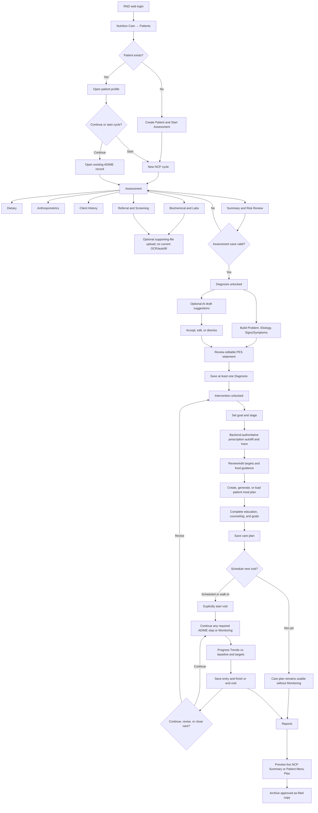
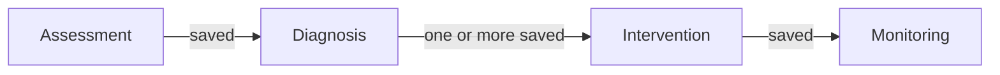
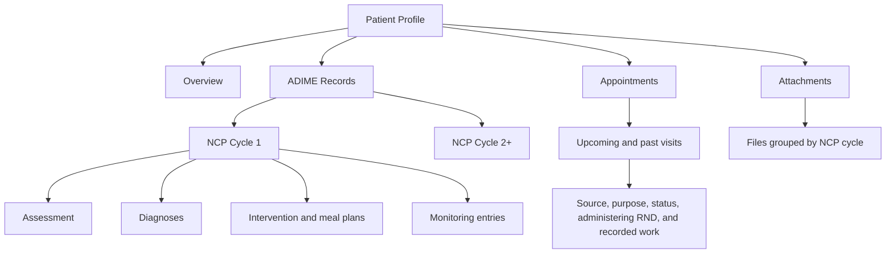

# Clinical Care — Current NCP/ADIME Flow

Verified against current RND pages, appointment workflow, and Laravel controllers on **2026-09-08**.

## End-to-End Flow

## Implemented Navigation Gates

- Diagnosis block reason: save Assessment first.
- Intervention block reason: save Assessment and at least one Diagnosis.
- Monitoring block reason: save Assessment, Diagnosis, and care plan first.
- Appointment status does not control ADIME step gates. Shared visit controls work on every NCP step and one visit may cover multiple sections.
- Completing a visit and completing/protecting an NCP cycle are separate actions.

## Patient Record Structure

## Important Current Rules

- Edema present requires dry weight before Assessment save.
- Generated Assessment Summary is an editable draft; stale-source warning supports regenerate/undo.
- AI Diagnosis output is never accepted without RND action.
- Prescription calculation authority is Laravel backend; frontend trace explains the result.
- A cycle becomes deletion-protected once Assessment, Diagnosis, and Intervention all exist.
- Reports have live preview and frozen archived-copy states.

## Related Documents

- [RND Module](../rnd.md)
- [FAQ](../../FAQ.md)
- [Role How-To](../../ROLE-HOW-TO.md)
- [Storyboards](../../STORYBOARD.md)
