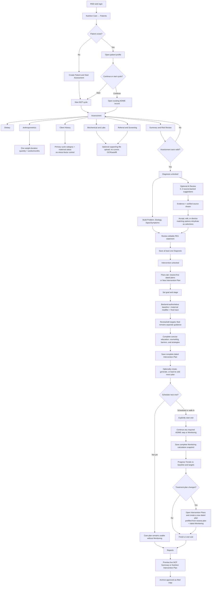
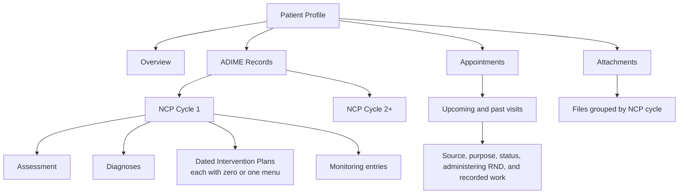

# Clinical Care — Current NCP/ADIME Flow

Verified against current RND pages, appointment workflow, Laravel controllers, and rendered reports on **2026-09-29**.

## End-to-End Flow

```mermaid
flowchart TD
    A["RND web login"] --> B["Nutrition Care → Patients"]
    B --> C{"Patient exists?"}
    C -->|"No"| D["Create Patient and Start Assessment"]
    C -->|"Yes"| E["Open patient profile"]
    D --> F["New NCP cycle"]
    E --> G{"Continue or start cycle?"}
    G -->|"Continue"| H["Open existing ADIME record"]
    G -->|"Start"| F

    F --> I["Assessment"]
    H --> I
    I --> I1["Dietary"]
    I --> I2["Anthropometrics"]
    I --> I3["Client History"]
    I --> I4["Biochemical and Labs"]
    I --> I5["Referral and Screening"]
    I --> I6["Summary and Risk Review"]
    I2 --> I2A["One weight-duration quantity + weeks/months"]
    I3 --> I3A["Primary cycle category + maternal status<br/>no stress-factor control"]
    I4 --> I7["Optional supporting-file upload; no current OCR/autofill"]
    I5 --> I7
    I6 --> J{"Assessment save valid?"}
    J -->|"No"| I
    J -->|"Yes"| K["Diagnosis unlocked"]

    K --> L["Build Problem, Etiology, Signs/Symptoms"]
    L --> M["Review editable PES statement"]
    K --> N["Optional AI Review<br/>0..3 source-backed suggestions"]
    N --> N1["Evidence + verified source shown"]
    N1 --> O["Accept, edit, or dismiss<br/>matching options rehydrate as selections"]
    O --> M
    M --> P["Save at least one Diagnosis"]

    P --> Q["Intervention unlocked"]
    Q --> Q0["Plans tab: newest-first dated plans<br/>or New Intervention Plan"]
    Q0 --> Q1["Set goal and stage"]
    Q1 --> Q2["Backend-authoritative baseline + maternal modifier + final trace"]
    Q2 --> Q3["Review/edit targets; fluid remains separate guidance"]
    Q3 --> Q4["Complete concise education, counseling, barriers, and strategies"]
    Q4 --> R["Save complete dated Intervention Plan"]
    R --> R1["Optionally create, generate, or load its sole menu plan"]

    R1 --> S{"Schedule next visit?"}
    S -->|"Not yet"| T["Care plan remains usable without Monitoring"]
    S -->|"Scheduled or walk-in"| U0["Explicitly start visit"]
    U0 --> U["Continue any required ADIME step or Monitoring"]
    U --> V["Save complete Monitoring calculation snapshot"]
    V --> W["Progress Trends vs baseline and targets"]
    W --> W1{"Treatment plan changes?"}
    W1 -->|"No"| X["Finish or end visit"]
    W1 -->|"Yes"| W2["Open Intervention Plans and create a new dated plan<br/>prefilled from newest plan + latest Monitoring"]
    W2 --> X

    T --> Y["Reports"]
    X --> Y
    Y --> Z["Preview live NCP Summary or Nutrition Intervention Plan"]
    Z --> AA["Archive approved as-filed copy"]
```

## Implemented Navigation Gates

```mermaid
flowchart LR
    A["Assessment"] -->|"saved"| B["Diagnosis"]
    B -->|"one or more saved"| C["Intervention"]
    C -->|"saved"| D["Monitoring"]
```

- Diagnosis block reason: save Assessment first.
- Intervention block reason: save Assessment and at least one Diagnosis.
- Monitoring block reason: save Assessment, Diagnosis, and care plan first.
- Appointment status does not control ADIME step gates. Shared visit controls work on every NCP step and one visit may cover multiple sections.
- Completing a visit and completing/protecting an NCP cycle are separate actions.

## Patient Record Structure

```mermaid
flowchart TD
    P["Patient Profile"] --> O["Overview"]
    P --> A["ADIME Records"]
    P --> V0["Appointments"]
    P --> F["Attachments"]
    A --> C1["NCP Cycle 1"]
    A --> C2["NCP Cycle 2+"]
    C1 --> S1["Assessment"]
    C1 --> S2["Diagnoses"]
    C1 --> S3["Dated Intervention Plans<br/>each with zero or one menu"]
    C1 --> S4["Monitoring entries"]
    V0 --> V1["Upcoming and past visits"]
    V1 --> V2["Source, purpose, status, administering RND, and recorded work"]
    F --> F1["Files grouped by NCP cycle"]
```

## Important Current Rules

- Edema present requires dry weight before Assessment save.
- Weight-change duration is one quantity plus weeks/months; category and maternal status are explicit cycle inputs; stress factor is absent from the workflow.
- Generated Assessment Summary is an editable draft; stale-source warning supports regenerate/undo.
- PES drafts are source-gated and de-identified. Edit rehydrates matching Problem/Etiology/Signs options as selections and keeps only unmatched detail in notes; manual entry remains available.
- Prescription calculation authority is Laravel backend; frontend trace explains baseline, maternal modifier, and final values. Fluid guidance is excluded from meal matching/scaling.
- Monitoring stores complete calculation inputs and visit outcomes only. It has no Intervention creation or revision controls.
- Dated complete Intervention Plans are newest first, prior plans are read-only, and each may own zero or one menu plan.
- A cycle becomes deletion-protected once Assessment, Diagnosis, and Intervention all exist.
- NCP Summary shows the newest saved plan only. Each saved plan with a menu has its own long-bond Nutrition Intervention Plan; archived PDF bytes stay frozen.

## Related Documents

- [RND Module](../rnd.md)
- [FAQ](../../FAQ.md)
- [Role How-To](../../ROLE-HOW-TO.md)
- [Storyboards](../../STORYBOARD.md)
