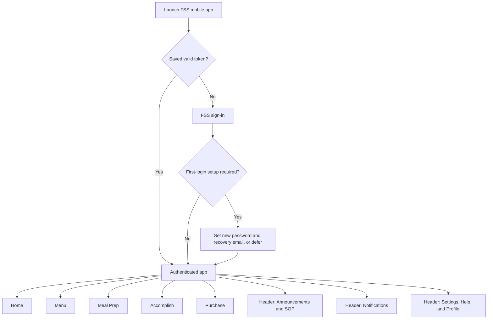
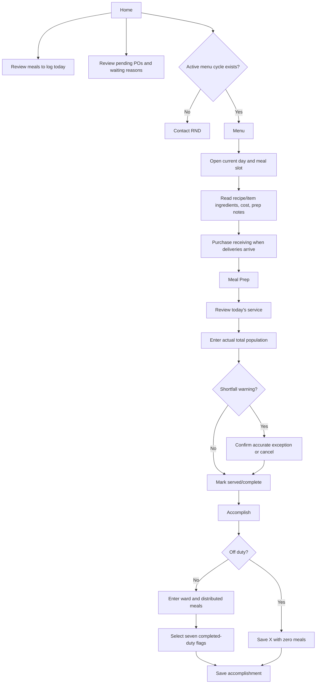
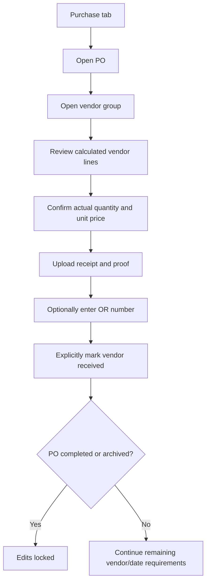
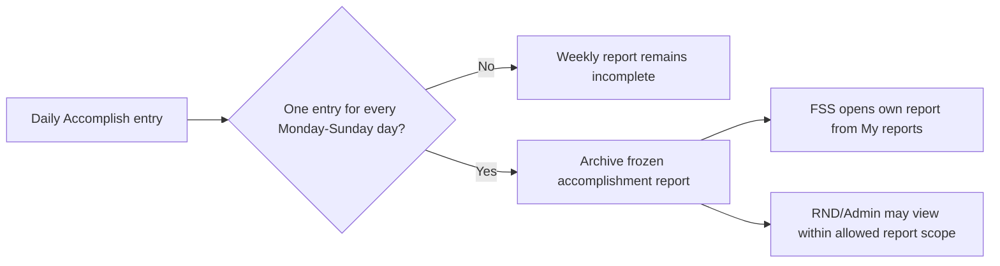
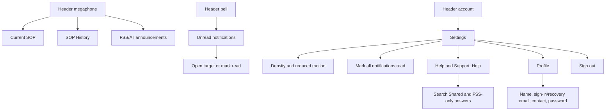

# FSS Mobile — Current Execution Flow

Verified against current Expo Router screens on **2026-07-20**.

## Access and Navigation

Bottom navigation is exactly five tabs: Home, Menu, Meal Prep, Accomplish, Purchase.

## Daily Execution

## Purchase Receiving

FSS can correct actual quantities and prices while open, but cannot change planned structure or supplier. Receipt and proof do not change status until **Mark vendor received** is used. OR number is optional.

## Accomplishment Report Lifecycle

Off-duty entries count and render as X. FSS report reads are owner-scoped.

## Communication and Account

## Current Corrections to Older Flow

- Added separate Accomplish tab.
- Removed Inventory tab and all stock add/deduct actions.
- Menu is a first-class bottom tab, not only a Prep link.
- Purchase label is current bottom-tab label; screen title remains Procurement.
- Accomplishment entry is rendered on Accomplish, not Meal Prep.
- Actual values, receipt, proof, and an explicit receiving action are required; OR is optional.
- Help is reached from Settings and does not add a sixth bottom tab.

## Related Documents

- [FSS Module](../fss.md)
- [Food Service Flow](Food%20Service%20Operations.md)
- [FAQ](../../FAQ.md)
- [Role How-To](../../ROLE-HOW-TO.md)
- [Storyboards](../../STORYBOARD.md)
