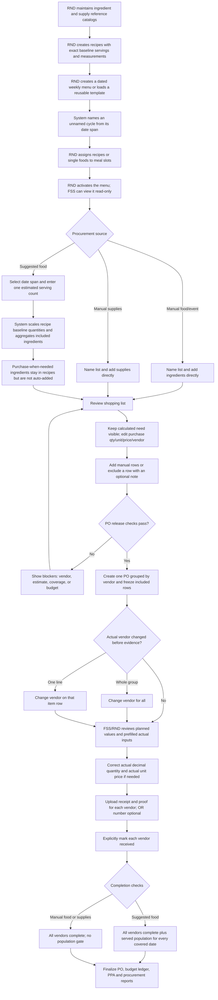

# Food Service Operations — Current End-to-End Flow

Verified against the implemented RND web, FSS web/mobile surfaces, Laravel services, reports, and demo seeders on **2026-08-19**.

## Operational Story

## Core Rules and UX

| Area | Current rule | Conflict avoided |
|---|---|---|
| Catalog | Inventory is a reference catalog, not stock management | No inferred on-hand balance or extra inventory workflow |
| Pantry/seasoning items | Ingredient-level **Include in generated shopping lists** switch; off means **Purchase when needed** | Recipes retain exact measurements while bulk items are manually added only when purchase is needed |
| Recipe scaling | `scaled quantity = recipe quantity × selected-span estimate ÷ recipe baseline servings` | A 50-serving recipe scales uniformly from the one estimate entered at generation |
| Before an estimate | Slot profile shows baseline recipe and **Purchase estimate: Not set** | It does not invent a scaled requirement |
| Menu naming | Blank weekly menu names use the date span; custom names remain allowed | Automatic identity without losing useful descriptions |
| Templates | Loading copies structure into a new dated cycle; editing the copy does not edit the template | Templates stay reusable |
| Manual lists | Food/event and supplies lists use purpose names and direct catalog additions | Mixed events can use two named lists without forcing menu slotting |
| Suggested rows | Calculated need is read-only; purchase qty/unit/price/vendor are editable | Planning math stays explainable while market packaging stays practical |
| Removing cost | Generated rows are excluded, not deleted; manual rows may be deleted | Optional costs can be cut without destroying the calculation trail |
| Decimal receiving | Actual quantity supports three decimals; unit price supports two | Variable-weight purchases are accurate |
| Receipt total | For a single-line vendor group, receipt total can derive quantity or price from the other known value | Real receipts work without another inventory system |
| Catalog price | Confirmed receiving updates the item price reference | Future planning starts from the latest confirmed market value |
| PO release | Requires included rows, vendors, applicable estimate/coverage, and sufficient FY budget | Prevents a frozen but unusable PO |
| Vendor correction | Before evidence or receiving, **Change vendor for all** moves a group and row-level **Change vendor** moves one item; an existing destination group is reused | Actual purchase vendor can be corrected without reopening shopping-list calculations |
| Receiving comparison | Planned purchase stays visible; editable actuals are prefilled; calculated/planned/actual details expand on request | Correct rows need no retyping and the screen avoids showing three dense value sets at once |
| Vendor completion | Requires reviewed actuals, receipt, proof, assigned vendor, and explicit **Mark vendor received** | Upload alone never silently completes receiving |
| OR number | Optional; shown as **Not provided** when absent | Vendors without an OR can complete with evidence |
| Food completion | Suggested food also needs served population per covered date; manual food does not | Menu-derived reports keep their denominator without blocking one-off events |
| Reporting | Procurement packs include every frozen PO row, including generated-list manual additions and fully manual lists; draft packs are visibly incomplete and finals use actuals | Planned, manual, and actual purchases are not omitted or misrepresented |

## Role Ownership

| Operation | RND | FSS |
|---|---:|---:|
| Catalogs, recipes, cycles, templates | Create/edit | View approved menu |
| Estimated servings | Enter once at suggested-list generation | View |
| Shopping lists and PO release | Create/review/release | No |
| Correct open vendor assignment before evidence | Yes | Yes |
| Actual receiving values | Yes while open | Yes while open |
| Receipt/proof and optional OR | Yes | Yes |
| Explicit vendor received action | Yes | Yes |
| Actual population served | Yes | Yes |
| Budget and operational reports | Full operational access | Own allowed reports |

## Deliberately Out of Scope

No live stock balance, leftover calculation, warehouse catalog, temperature log, sanitation workflow, batch/expiry tracking, or automatic pantry depletion was added. The flow reuses existing catalogs, recipes, lists, POs, evidence, population logs, budget, and reports.

## Related Documents

- [RND Module](../rnd.md)
- [FSS Module](../fss.md)
- [Developer Maintenance Guide](../../developer/food-service-operations-maintenance.md)
- [Storyboards](../../STORYBOARD.md)
