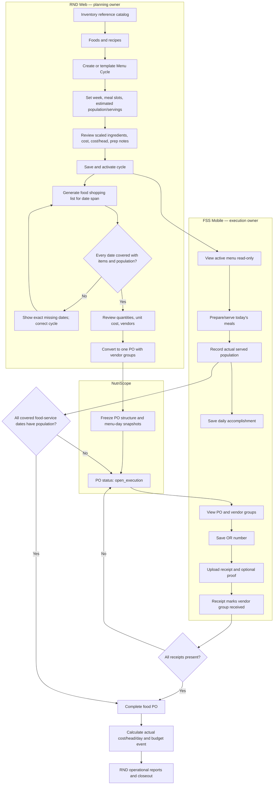
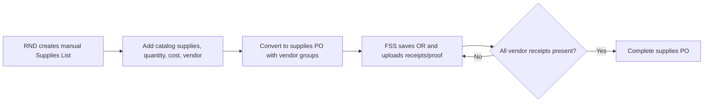
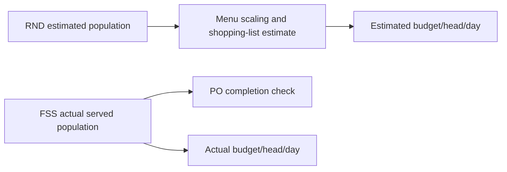

# Food Service — Current Cross-Role Operations

Verified against current RND web, FSS mobile, and Laravel food-service routes on **2026-07-19**.

## Food Planning and Execution

## Supplies Procurement

Supplies completion does not require served population.

## Menu and Population Data

## Ownership Matrix

| Operation | RND | FSS | Admin |
|---|---:|---:|---:|
| Maintain reference Inventory | Edit | No mobile surface | No |
| Maintain food-service Foods/recipes | Edit | View through menu profile | No |
| Create/activate Menu Cycle | Yes | View only | No |
| Record actual served population | Yes | Yes | No |
| Generate/edit shopping list | Yes | No | No |
| Convert to PO | Yes | No | No |
| Save vendor OR number | Yes | Yes | No |
| Upload receipt/proof | Yes | Yes | No |
| Edit PO price/structure | Authorized RND only while open | No | No |
| Budget setup/manual adjustment | Yes | No | Read-only oversight |
| Budget-per-head/day setting | Yes | No | Yes |
| Operational reports | Full RND catalog | Own accomplishment only | Allowed aggregate/operational catalog |

## Current Corrections to Older Diagrams

- Inventory is a reference catalog, not live stock quantity.
- FSS has no Inventory tab or stock add/deduct workflow.
- FSS does not edit vendor line items or manually mark vendor received.
- Receipt upload is the receiving event.
- Food and supplies use separate lists/PO tracks.
- Food list generation blocks the whole request when any date is incomplete.
- `/food-service/foods` is implemented.

## Related Documents

- [RND Module](../rnd.md)
- [FSS Module](../fss.md)
- [FAQ](../../FAQ.md)
- [Role How-To](../../ROLE-HOW-TO.md)
- [Storyboards](../../STORYBOARD.md)
