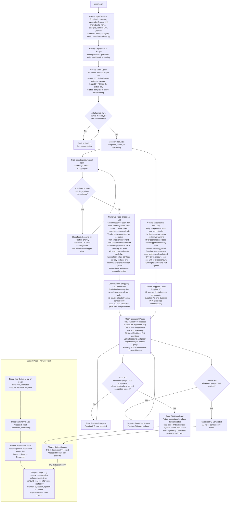

```mermaid
flowchart TD
    A[User Login] --> B[Create Ingredients or Supplies in Inventory\nbackend reference only\nIngredients: name, category, vendor, unit, unit/cost\nSupplies: name, category, vendor, cost/unit only no qty]
    B --> C[Create Single Item or Recipe\nset ingredients, quantities, units, and baseline serving]
    C --> D[Create Menu Cycle\nRND slots food items per cell\nServed population labeled on top of each day\nlogged by FSS on the actual day\nStates: completed, active, or upcoming]
    D --> E{All planned days\nhave a menu cycle\nand menu items?}
    E -- No --> F[Block activation\nlist missing dates]
    F --> E
    E -- Yes --> G[Menu Cycle Exists\ncompleted, active, or upcoming]

    G --> H[RND selects procurement span\ndate range for food shopping list]
    H --> I{Any dates in span\nmissing cycle or\nmenu items?}
    I -- Yes --> J[Block food shopping list creation entirely\nNotify RND of exact missing dates\nand what is missing per date]
    J --> H
    I -- No --> K[Generate Food Shopping List\nSystem resolves each date to its covering menu cycle\nExtracts all required ingredients automatically\nVendor auto-suggested per ingredient\nfrom latest procurement, auto-updates unless locked\nEstimated population set at shopping list level\nAll quantities and costs scale live\nEstimated budget per head per day updates live\nRunning total shown in cart-style UI\nUnit follows recipe and cannot be edited]
    K --> KPO[Convert Food Shopping List to Food PO\nScaled values snapshot saved to menu cycle day cells\nAll structural data freezes permanently\nFood PO and Food PPA generated independently]

    G --> SL[Create Supplies List Manually\nFully independent from food shopping list\nNo date span, no menu cycle involvement\nRND searches and adds each supply item one by one\nVendor auto-suggested from latest procurement\nauto-updates unless locked\nOnly qty to procure, cost per unit, total cost shown\nRunning total in same cart-style UI]
    SL --> SPO[Convert Supplies List to Supplies PO\nAll structural data freezes permanently\nSupplies PO and Supplies PPA generated independently]

    KPO --> EXEC[Open Execution Phase\nRND can correct unit cost or price per ingredient only\nCorrections logged with user and timestamp\nRND and FSS input OR numbers\nupload receipts and proof of purchase per vendor group\nPending PO card shown on both dashboards]
    SPO --> EXEC

    EXEC --> FO{Food PO\nAll vendor groups have receipts AND\nall span dates have served population logged?}
    FO -- No --> FP[Food PO remains open\nPending PO card updated]
    FP --> EXEC
    FO -- Yes --> FC[Food PO Completed\nActual budget per head per day calculated\nfinal food PO total divided by total served population\nMenu cycle day cell values permanently locked]

    EXEC --> SO{Supplies PO\nAll vendor groups have receipts?}
    SO -- No --> SP[Supplies PO remains open\nPending PO card updated]
    SP --> EXEC
    SO -- Yes --> SC[Supplies PO Completed\nAll fields permanently locked]

    FC --> LEDGER[Shared Budget Ledger\nPO deduction entry logged\nAllocated budget auto-deducts]
    SC --> LEDGER

    subgraph BUDGET [Budget Page - Parallel Track]
        BA[Fiscal Year Setup at top of page\nfiscal year, allocated amount, per head day limit] --> BB[Three Summary Cards\nAllocated, Total Deductions, Remaining]
        BB --> BC[Manual Adjustment Form\nType dropdown: Addition or Deduction\nAmount, Reason, Reference]
        BC --> BD[Budget Ledger Log\nreverse chronological\ncolumns: date, type, amount, reason, reference, created by\nfilterable by reason, system or manual\nno procurement span column]
        LEDGER -- PO deduction entry --> BD
    end
```

---