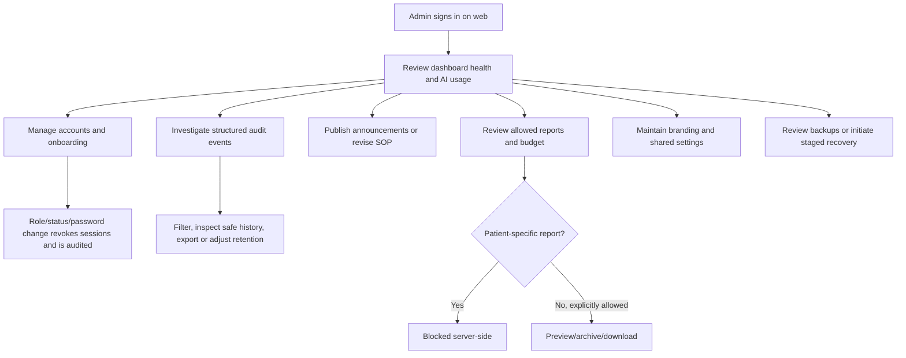

# Admin Module — Current Role and Workflow

Verified against current Admin web pages, shared components, and Laravel role/report guards on **2026-08-29**. This replaces older text saying the Admin frontend still needed rebuilding; the current light-theme Admin console is live.

## Role Purpose

Admin owns system administration and operational oversight:

- account creation, RBAC, activation/suspension, password reset;
- audit browsing, safe history, export, and retention control;
- AI usage/cost oversight and daily/monthly token caps;
- announcements and versioned SOP;
- allowed operational/aggregate reports;
- read-only budget oversight;
- report/hospital branding and shared food-service budget setting;
- automatic backup schedules, restore-point retention, and staged whole-system recovery initiation;
- Admin notifications, profile, and local preferences.

Admin has no standing patient NCP workflow and no patient-specific clinical-report access.

## Platform and Role Gate

Admin uses the web console. The Admin layout redirects non-Admin users to the RND dashboard, and Laravel protects `/api/admin/*` with authenticated active-user and Admin-role middleware.

## Current Navigation

| Navigation | Current purpose |
|---|---|
| Admin Dashboard | System KPIs, AI usage/cost/caps, quick actions, recent activity |
| Announcements | Admin announcement board and current/versioned SOP |
| Manage Users | Account CRUD, role/status, password reset, onboarding creation |
| Reports | Allowed operational and aggregate reports |
| Budget | Read-only fiscal-year summary, ledger, activity |
| Audit Logs | Structured event browser, filters, history, export, retention |
| Backups | Automatic schedules, manual restore points, Recently Deleted, and staged recovery |
| Help | Searchable Shared and Admin-only account, oversight, audit, settings, and report guidance |
| Settings | Branding, logos, budget-per-head/day, local preferences |

Notifications and Profile are reached from the top bar.

## Dashboard

Current dashboard shows:

- total users and counts by Admin/RND/FSS;
- aggregate patients in care;
- monthly AI calls, tokens, and estimated cost;
- total audit events and recent volume;
- daily/monthly token use versus limits;
- configurable token caps and USD cost per one million tokens;
- AI Usage Explorer;
- quick links to accounts, audit, and announcements;
- latest five structured system events.

Patient count is an aggregate KPI. It is not a path into patient clinical content.

## Account Management and Onboarding

Admin can search/filter users and:

- create an account with first/last name, sign-in email, role, active status, and temporary password;
- edit identity, role, status, and optional password;
- activate/suspend accounts;
- reset a password;
- delete an account when appropriate.

New Admin-created accounts set both onboarding requirements:

- change temporary password;
- add recovery email.

Users complete setup on first login or defer it and finish in Profile. Role/status/password changes revoke existing tokens. Admin password reset also revokes tokens and creates an audit event.

The current UI blocks Admin self-deactivation and self-deletion.

## Audit Oversight

Admin Audit Logs provide:

- module selection;
- action/actor/date and other structured filters;
- server pagination;
- safe event detail;
- correlated historical record view;
- export;
- retention display/update;
- clear states for unauthenticated, unauthorized, unavailable, and empty results.

Audit UI consumes the structured audit DTO. It does not expose raw properties, file contents, AI prompts/outputs, or clinical old/new values. Safe actor and subject labels remain understandable after record deletion.

Opening sensitive clinical audit trails is itself auditable. Audit access is oversight, not permission to browse the underlying patient care record.

## Announcements and SOP

Admin can create/edit/delete announcement posts with category, visibility, pinning, text, and images. Audience-specific notifications are produced for matching users.

The current SOP is pinned at the top. Admin and RND can revise it. Every save creates a new version; History displays timestamp, author, role, title, body, and current marker.

## Reports and Clinical Privacy Boundary

Admin's server-allowed report types are:

- Program Project Activity
- Menu Calendar
- Procurement Pack
- Accomplishment Report
- aggregate Demographic Census

Admin is blocked from:

- Patient Menu Plan
- NCP Summary

This is enforced in the report controller/model, not only hidden in the UI. Admin may browse live instances, preview, archive, view/download frozen copies, delete authorized archives, and inspect report activity for allowed types.

## Budget Oversight

Admin Budget uses the shared budget shell in read-only mode. Admin can select a fiscal year and inspect:

- allocation/summary;
- ledger entries;
- budget activity.

Admin cannot create a fiscal-year budget or make a manual ledger adjustment from this page. Those are RND operations.

## Settings

Admin can configure:

- hospital name;
- service name;
- address;
- accreditation;
- province;
- LGU;
- left/right report logos;
- food-service budget per head/day;
- local display density and reduced motion;
- local announcement/follow-up notification preferences.

The budget-per-head/day value is a shared backend setting used by food-service cost comparisons.

## Backup and Recovery

Admin can view restore points, create a manual backup, and independently enable Daily, Weekly, or Monthly automatic schedules after readiness checks pass. All schedules are disabled by default. Existing backups retain their assigned retention when a schedule is disabled, and disabling the final active schedule requires confirmation.

Backup records are paginated. Completed backups may be moved to Recently Deleted for 48 hours and kept during that window. Whole-system recovery requires fresh authentication and explicit confirmation, then runs through protected queued work rather than inside the browser request. It creates a safety snapshot, restores one temporary MySQL database, and verifies matching private uploads. Without the Phase 2 environment switcher, recovery stops safely at Ready; after that provider-specific switcher is configured, it switches only after checks pass and rolls back automatically on failure. Backup archives, credentials, and raw secrets are never exposed to the browser.

## Help, Notifications, and Profile

- Help shows Shared and Admin guidance only; it has no role switch and does not expose RND clinical answers.
- Notifications show Admin/All announcements and system alerts, with open/read/all-read behavior.
- Profile supports name, sign-in email, contact, validated profile photo, recovery email, and password.
- Role/designation is read-only in self-service Profile.

## Admin Workflow

## Explicit Boundaries

Admin does not:

- enter Assessment, Diagnosis, Intervention, Monitoring, or patient meal plans;
- access Patient Menu Plan or NCP Summary;
- modify RND fiscal-year allocation/ledger adjustments from Admin Budget;
- use FSS mobile execution tools;
- treat audit events as a substitute for underlying clinical authorization;
- expose raw audit JSON or clinical value diffs.
- view raw backup archives, storage credentials, or environment secrets.

## Removed or Superseded Notes

- The old statement that Admin frontend must be rebuilt is obsolete.
- Old dark-console/theme mismatch notes are historical, not current behavior.
- Calendar is not in current Admin sidebar and is not part of the documented workflow.
- Admin clinical-report parity with RND is intentionally false; patient-specific types remain blocked.

## Related User Documents

- [FAQ](../FAQ.md)
- [Role How-To Guide](../ROLE-HOW-TO.md)
- [Storyboards](../STORYBOARD.md)
- [Admin Flowchart](Flowcharts/Admin%20Operations.md)

## Current Code Evidence

- `frontend/components/layout/Sidebar.tsx`
- `frontend/app/admin/layout.tsx`
- `frontend/app/admin/dashboard/page.tsx`
- `frontend/app/admin/help/page.tsx`
- `frontend/components/help/**`
- `frontend/lib/helpContent.ts`
- `frontend/app/admin/users/page.tsx`
- `frontend/app/admin/audit-logs/**`
- `frontend/app/admin/announcements/page.tsx`
- `frontend/app/admin/reports/page.tsx`
- `frontend/app/admin/budget/page.tsx`
- `frontend/app/admin/settings/page.tsx`
- `frontend/components/reports/ReportsBrowser.tsx`
- `backend/app/Http/Controllers/Admin/**`
- `backend/app/Http/Controllers/ReportController.php`
- `backend/app/Models/Report.php`
- `backend/routes/api.php`
