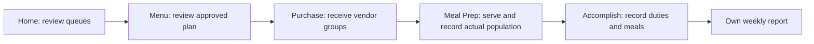

# FSS Module — Current Role and Workflow

Verified against current Expo navigation, rendered screens, and Laravel role gates on **2026-08-21**.

## Role Purpose

FSS executes daily food-service work prepared by RND:

- view active/saved menu cycles and food profiles;
- confirm actual purchase values and receive PO vendor groups with receipt/proof evidence; OR number is optional;
- record actual served population for planned service dates;
- log daily ward meals and seven accomplishment duties;
- view own archived accomplishment reports;
- read announcements, notifications, current SOP, and SOP history.

FSS does not author menus, shopping lists, POs, suppliers, budgets, food catalogs, recipes, or clinical/NCP records.

## Platform Gate

FSS signs in through the mobile app. Laravel rejects FSS web login. It also rejects RND/Admin login from the FSS app. An active account with role `FSS` is required.

## Current Mobile Navigation

There are **six** bottom tabs, in this order:

1. **Home**
2. **Announcement** — separate Announcements and SOP views
3. **Menu**
4. **Meal Prep**
5. **Accomplish**
6. **Purchase**

The header has only the notification bell with unread count and the profile/menu icon. The profile icon opens a side menu containing Profile, Notifications, Help, Settings, Check for updates, and Sign out. Announcements and SOP are not header shortcuts; they live under the **Announcement** bottom tab.

## Recommended Daily Sequence

## Home

Current content:

- meals to log today;
- pending PO count linking to Purchase;
- active menu-cycle card linking to Menu;
- per-PO waiting labels such as **Needs receipts** and **Needs served population**;
- today's service rows;
- role-visible announcement feed.

If no active cycle exists, Home tells FSS to contact RND.

## Menu

FSS can browse cycles and open meal slots. Recipe/item profiles show scaled ingredients, quantities, cost, cost/head, and preparation notes. Planning fields remain read-only.

Menu does not contain operational controls. Food profiles open on a dedicated read-only page with normal back navigation. Actual population is recorded in Meal Prep.

## Meal Prep

Meal Prep defaults to today and allows an earlier planned date within the active cycle:

- planned service rows and food profiles;
- existing actual population, if recorded;
- one record/update action for actual population served.

There is no separate prep-completion or service-log action. The actual served record remains the input used by suggested-food PO completion and cost-per-served-patient calculations.

## Accomplish

FSS records:

- service date (today by default, or any previous date);
- ward;
- meals distributed/population;
- off-duty/absent state;
- seven duty flags:
  1. helped prepare food;
  2. stored food supplies properly;
  3. collected ward diet lists;
  4. apportioned and distributed meals;
  5. cleaned and returned utensils/equipment;
  6. worked as assistant cook;
  7. checked kitchen/cold-storage cleanliness.

The Daily Log view shows existing rows and the total for the selected date. A visible **Today** action returns from backfill to the default current date. Future dates are blocked. Multiple working rows may be saved for separate wards; their meals are summed and completed duties combined. Off duty cannot coexist with working rows and renders as **X**.

**My Reports** is the second view inside Accomplish. It is paginated, owner-scoped, opens frozen details, and can prepare then open/save the authenticated PDF.

### Weekly Accomplishment Archive

- Week is Monday through Sunday.
- The current FSS user needs an entry for each of the seven days.
- Off-duty entries count as daily completion.
- The archived report is frozen against later source edits.
- FSS sees only their own archived accomplishment reports.
- RND/Admin may view accomplishment reports within their allowed report scope.

## Purchase

FSS sees existing POs and vendor groups. For an open PO, FSS can:

- review planned values, with calculated/planned/actual details available on request;
- confirm or correct actual quantity (including decimals) and actual unit price;
- change the vendor for the whole group or one item before evidence is uploaded;
- optionally save `or_number`;
- upload receipt images;
- upload proof-of-purchase images;
- add captions;
- view or delete attachments while unlocked;
- explicitly mark the vendor received once requirements are complete.

Receipt upload alone does not change status. A vendor can be marked received only after supplier assignment, reviewed actual values, at least one receipt, and at least one proof-of-purchase image. OR number is not required.

FSS cannot change:

- planned vendor items and calculated values;
- lifecycle status.

Vendor correction is unavailable after receipt/proof evidence is attached or the group is received. Remove mistaken evidence first, then correct the vendor. A whole-group change is outside the item list; a single-item change is on that item's row.

Completed/archived POs lock execution edits.

### PO Completion

- Suggested food PO: every vendor must be explicitly received with actuals, receipt, and proof; every covered service date also needs actual served population.
- Manual food and supplies PO: every vendor must meet the same receiving evidence; served population is not required.

## Announcements and SOP

The **Announcement** bottom tab separates content into two internal tabs:

- current SOP;
- paginated SOP version history;
- FSS/All announcements;
- announcement details and images.

FSS is read-only. RND/Admin revise SOP and publish announcements.

## Notifications

FSS notifications support pagination, unread badge/count, mark-read/open behavior, mark-all-read, and navigation to supported targets such as announcements or procurement.

## Reports

FSS report access is limited server-side to `accomplishment_report`. The mobile report viewer lists only the signed-in FSS user's reports and renders frozen weekly accomplishment data.

## Settings and Profile

Settings supports:

- comfortable/compact display density;
- reduced motion;
- mark all notifications read;
- Help link under Help & Support;
- Profile link;
- sign out.

The profile side menu provides direct access to these account actions and manual update checking. The app also checks periodically for a newer APK and opens the stable download page when the user accepts an update.

Profile supports first/last name, sign-in email, contact number, recovery email setup/change/verification, and password change. Role and status are read-only.

First-login accounts must replace the temporary password and add a recovery email. Setup can be deferred, but the header reminder remains until complete.

## Data Scope and Safety

- FSS diet-list/accomplishment reads are scoped to the signed-in FSS user.
- FSS report access is own accomplishment reports only.
- FSS has no patient/NCP clinical route.
- Server role middleware enforces write restrictions even if a client is modified.
- Purchase-order activity uses structured audit data, not raw properties or file contents.

## Removed or Not Current

- Inventory bottom tab
- stock add/deduct controls
- Suppliers tab
- Budget tab
- analytics/Insights tab
- shopping-list or PO authoring
- editing planned PO structure
- FSS web console login
- PWA/home-screen web app and offline shell
- Menu served-population editor
- prep-completion and reverse-service controls

## Related User Documents

- [FAQ](../FAQ.md)
- [Role How-To Guide](../ROLE-HOW-TO.md)
- [Storyboards](../STORYBOARD.md)
- [FSS Mobile Flowchart](Flowcharts/FSS%20Mobile%20Execution%20Flow.md)
- [Food Service Flowchart](Flowcharts/Food%20Service%20Operations.md)

## Current Code Evidence

- `mobile/app/(tabs)/_layout.tsx`
- `mobile/app/(tabs)/index.tsx`
- `mobile/app/(tabs)/menu.tsx`
- `mobile/app/(tabs)/prep.tsx`
- `mobile/app/(tabs)/accomplishments.tsx`
- `mobile/app/(tabs)/procurement.tsx`
- `mobile/components/AppHeader.tsx`
- `mobile/app/help.tsx`
- `mobile/components/help/**`
- `mobile/lib/helpContent.ts`
- `mobile/app/(tabs)/announcements.tsx`
- `mobile/components/ReportsScreen.tsx`
- `backend/routes/api.php`
