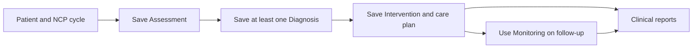

# RND Module — Current Role and Workflow

Verified against current frontend navigation, Laravel routes/controllers, and shared services on **2026-08-15**. Code is authoritative; older plans describe history only.

## Role Purpose

RND owns two work lanes:

1. **Clinical nutrition care:** patients, NCP/ADIME, clinical food data, patient meal plans, monitoring, and clinical reports.
2. **Food-service planning and supervision:** reference catalog, food-service recipes/items, menu cycles, procurement planning, budget, execution follow-up, and operational reports.

RND does not perform Admin account/audit administration and does not use the FSS mobile app as its working platform.

## Platform and Navigation

RND signs in through the web console. The current sidebar is:

| Navigation | Current purpose |
|---|---|
| Dashboard | Follow-ups, active-patient snapshot, pending POs, announcements |
| Announcements | RND announcement board plus current/versioned SOP |
| Food Library | Clinical foods and recipes; USDA import |
| Nutrition Care → Patients | Patient directory and NCP-cycle entry |
| Nutrition Care → Assessment | Baseline NCP data for selected cycle |
| Nutrition Care → Diagnosis | Structured P/E/S and PES workflow |
| Nutrition Care → Intervention | Prescription, meal plan, education, counseling, goals, encounter context |
| Nutrition Care → Monitoring | Follow-up visit log and progress trends |
| Food Service → Inventory | Ingredient/supply reference catalog |
| Food Service → Menu Cycle | Weekly operational menu planning |
| Food Service → Budget | Fiscal-year budget and ledger management |
| Food Service → Procurement | Food/supplies lists, POs, vendors, execution follow-up |
| Food Service → Foods | Food-service recipes and single-item foods |
| Reports | Live report browser, archives, templates/branding |
| Notifications | Announcements and follow-up reminders |
| Help | Searchable Shared and RND-only account, clinical, food-service, communication, and report guidance |
| Settings | Local preferences and budget-per-head/day setting |

Profile is reached from the top bar.

## Dashboard

Current dashboard content:

- active patient count;
- scheduled follow-up directory;
- pending open-execution POs and their missing requirements;
- patient snapshot and links into NCP;
- announcement feed with RND authoring/editing for authorized posts.

It does not present the old inventory-stock KPI workflow.

## Nutrition Care Process

### Patient Directory and Profile

RND can create/search/filter patients and start Assessment immediately. Patient profile contains:

- **Overview:** demographics, diagnosis, risk, latest-cycle snapshot, follow-up;
- **ADIME Records:** all cycles with Assessment/Diagnosis/Intervention/Monitoring summaries, meal plans, and activity;
- **Attachments:** supporting files grouped by NCP cycle.

A new cycle is started from ADIME Records. A cycle can be deleted only until it contains Assessment, at least one Diagnosis, and Intervention. A patient containing any such protected cycle cannot be deleted through the normal UI.

### Implemented Step Gates

- Assessment is always the first available step.
- Diagnosis requires a saved Assessment.
- Intervention requires Assessment plus at least one Diagnosis.
- Monitoring requires Assessment, Diagnosis, and Intervention.
- Monitoring is described as follow-up/second-visit work, but current code does not separately enforce an encounter-count field; the saved prior steps are the implemented gate.

### Assessment

Current tabs:

1. Dietary
2. Anthropometrics
3. Client History
4. Biochemical/Labs
5. Referral/Screening
6. Summary

Current behavior includes calculated anthropometrics, nutritional-risk scoring with optional manual override, editable generated summary, stale-summary warning/undo, clinical calculation helpers, and supporting-document upload. When edema is present, dry weight is required.

Important correction: lab/referral uploads are stored as supporting files only. They do **not** run OCR or auto-populate Assessment fields in the current page.

### Diagnosis and PES

RND can:

- manage saved diagnoses and filter NI/NC/NB domains;
- build Problem, Etiology, and Signs/Symptoms;
- review/edit the generated PES statement;
- create/update/delete diagnoses;
- request AI draft suggestions and accept, edit, or dismiss each.

AI is assistive. The RND remains the saving/approval actor.

### Intervention and Patient Meal Plan

Current tabs:

1. Food/Nutrient Delivery
2. Education
3. Counseling
4. Goal Planning
5. Encounter Context

Food/Nutrient Delivery includes goal/stage selection, backend-authoritative prescription autofill, a visible calculation trace, editable macro/fluid/micronutrient targets, food recommendations, and patient meal planning. Patient plans may be manual, generated, or template-based. Unsaved-change guards warn before leaving.

### Monitoring and Evaluation

Current tabs:

- **Visit Log:** follow-up entries and history.
- **Progress Trends:** monitoring summary, goal progress, and trends against baseline/prescription.

The screen also shows encounter context, next follow-up, and saved prescription targets.

## Food Library

Food Library is the **clinical** food/recipe reference used by nutrition-care planning. It supports:

- local food CRUD;
- USDA FoodData Central search/import;
- macro/micronutrient and allergen review;
- clinical recipe CRUD and calculated nutrients;
- search, category filters, and pagination.

It is distinct from the food-service Inventory and Foods modules.

## Food-Service Planning

### Inventory

Current Inventory is a reference catalog, not stock control. RND maintains:

- ingredients: name, category, vendor, base unit, purchase cost, and whether it is included in generated shopping lists;
- supplies: name, category, vendor, cost per unit;
- search and pagination;
- menu pickers search five matching recipes and single items instead of loading whole catalogs;
- safe create/edit/delete.

Ingredients such as bulk pantry or seasoning items may be marked **Purchase when needed**. They remain exact recipe ingredients but are manually added only when a purchase is necessary. There is no quantity-on-hand, leftover, restock, or FSS stock-adjustment flow.

### Foods

The `/food-service/foods` route is now implemented and uses the food-service recipe list. It supports food-service recipes and single-ingredient items used in menu-cycle cells, with ingredient/cost/preparation profiles.

This resolves the old module note claiming the Foods route was not wired.

### Menu Cycles

RND can create, edit, delete, save, activate, template, and instantiate Monday-anchored weekly cycles. A blank cycle name is generated from its date span. Loading a template copies its structure without changing the template. A cell may contain a recipe or a single food-service item. Before procurement generation its profile shows baseline recipe values and no purchase estimate.

FSS sees active/saved cycles read-only but may record actual served population.

### Procurement

Four current tabs:

1. Food Shopping Lists
2. Supplies Lists
3. Purchase Orders
4. Suppliers

Suggested food generation is date-span based and all-or-nothing. RND enters one estimated serving count for the span; the system scales each recipe from its baseline and returns exact missing dates when menu coverage is incomplete. RND may also create named manual food/event lists or supplies lists and add catalog items directly.

The review keeps calculated requirements read-only while purchase quantity, unit, price, and vendor remain editable. Manual rows may be added. Generated rows may be excluded with a note instead of deleted. Release is blocked until included rows are usable, vendors are assigned, applicable estimate/coverage is present, and the fiscal-year budget is sufficient.

Food and supplies remain separate procurement tracks, but related event lists can share the same purpose name. Conversion freezes included quantities, units, calculations, and relevant menu snapshots. Before a vendor group has evidence or is received, RND/FSS may use **Change vendor for all** outside the item table or row-level **Change vendor** for one item. This corrects the actual vendor without reopening the shopping list. RND then follows optional OR numbers, receipt/proof attachments, actual decimal quantities/prices, served-day progress, totals, corrections, and activity.

Each vendor requires reviewed actual values, receipt, proof, and explicit receiving; OR number is optional. Suggested-food completion additionally requires served population for all covered dates. Manual food and supplies do not require population.

Procurement packs read all frozen PO rows, so manual additions to a suggested list and items from a fully manual list remain included in the vendor documents and totals.

### Budget and Settings

RND Budget is editable: fiscal-year setup, summary, ledger, manual adjustments, and activity. The shared budget-per-head/day limit belongs in Settings. Estimated and actual cost-per-head/day values are distinct.

## Announcements and SOP

RND can create announcements with category, visibility, pinning, body, and images, and can edit/delete authorized posts. The current SOP is pinned above the feed. RND/Admin can revise it; every save creates a new preserved version. FSS reads both current SOP and history.

## Reports

RND report catalog:

- Program Project Activity
- Menu Calendar
- Procurement Pack
- Accomplishment Report
- Demographic Census
- Patient Menu Plan
- NCP Summary

Browse renders current/live data. Archive freezes an as-filed copy. RND can view/download archived copies, inspect lifecycle activity, and edit shared report branding/signatory templates.

## Help, Notifications, Settings, and Profile

- Help: searchable Shared and RND guidance only; the page has no role switch and exposes no Admin-only answers.
- Notifications: announcements and follow-up reminders; open/mark-read/mark-all-read.
- Settings: density, reduced motion, announcement/follow-up preferences, budget-per-head/day.
- Profile: first/last name, sign-in email, contact, one validated profile photo, recovery email verification, password change.
- First login: temporary password replacement and recovery email, with optional deferral reminder.

## Explicit Boundaries

RND does not:

- manage Admin audit-retention or user RBAC;
- use the FSS mobile execution tab set;
- treat AI output as an automatically accepted clinical decision;
- rely on uploaded Assessment documents for current OCR/autofill;
- treat Inventory as live stock quantity.

## Related User Documents

- [FAQ](../FAQ.md)
- [Role How-To Guide](../ROLE-HOW-TO.md)
- [Storyboards](../STORYBOARD.md)
- [Clinical Care Flowchart](Flowcharts/Clinical%20Care%20%28NCP%29%20Operations.md)
- [Food Service Flowchart](Flowcharts/Food%20Service%20Operations.md)

## Current Code Evidence

- `frontend/components/layout/Sidebar.tsx`
- `frontend/app/(rnd)/help/page.tsx`
- `frontend/components/help/**`
- `frontend/lib/helpContent.ts`
- `frontend/app/(rnd)/ncp/**`
- `frontend/lib/ncpWorkflow.ts`
- `frontend/app/(rnd)/food-library/**`
- `frontend/app/(rnd)/food-service/**`
- `frontend/components/reports/ReportsBrowser.tsx`
- `frontend/components/announcements/**`
- `backend/routes/api.php`
