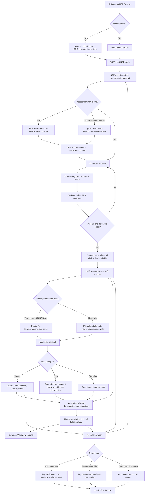
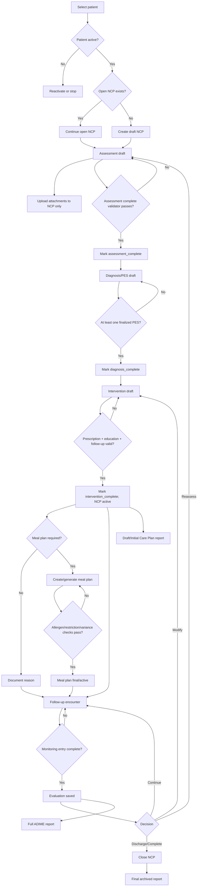

# Clinical Care NCP Workflow Audit

Date: 2026-06-25  
Scope: RND Clinical Care module only. Food Service was reviewed only where it feeds clinical meal planning, food items, recipes, or reports.  
Expected workflow source: `docs/modules/rnd.md`.

## 1. Executive Summary

The implemented Clinical Care module roughly follows ADIME in the UI: Patient selection -> Assessment -> Diagnosis/PES -> Intervention/Prescription -> Meal Plan -> Monitoring/Evaluation -> Reports. The backend enforces only a thin version of that order:

- Diagnosis creation requires an assessment row.
- Intervention creation requires at least one diagnosis row.
- Monitoring creation requires an intervention row.
- NCP status auto-promotes from `draft` to `active` when an intervention is first created after assessment and diagnosis.

The clinical workflow is therefore enforceable only at the "row exists" level, not at the "clinically complete" level. An empty assessment row and an empty intervention row are enough to activate an NCP. Meal planning and monitoring are not required for active status, and no endpoint currently transitions an NCP to `completed`.

Highest-risk findings:

1. Attachment upload creates a blank assessment via `firstOrCreate()`, which can accidentally satisfy the Assessment prerequisite.
2. Assessment and Intervention validation allows empty clinical records.
3. NCP Summary reports are browsable/renderable for any NCP record, including draft records with missing ADIME sections.
4. Patients with `Discharged` or `Transferred` status can still receive new NCP cycles.
5. Multiple active NCP cycles per patient are allowed.
6. Meal plan nested routes do not consistently verify that the meal plan/day/item belongs to the NCP in the URL.
7. Manual meal planning can ignore allergies, restrictions, recommendations, and prescription targets.
8. Patient Menu Plan reports can omit direct USDA-only meal plan items because the report reads only `foodItem` or `recipe` names, not the item snapshot.

Actual minimum path to reach `active`:

1. `POST /api/rnd/patients/{patient}/ncp-records`
2. `POST /api/rnd/ncp-records/{ncp}/assessment` with `{}` or upload any attachment, which creates an assessment row
3. `POST /api/rnd/ncp-records/{ncp}/diagnoses` with required P/E/S text
4. `POST /api/rnd/ncp-records/{ncp}/intervention` with `{}`

Actual minimum path to have one full ADIME row set including Monitoring:

1. Same four calls above
2. `POST /api/rnd/ncp-records/{ncp}/monitorings` with `{}`

Meal planning, nutrition prescription targets, recommendations, attachments, and reports are not required to mark the NCP active.

## 2. Current Workflow Narrative

### 2.1 Patient Selection

What the RND does:

- Opens the NCP Patients portal.
- Searches/filter patients by name, physician, ward, and status.
- Can create a new patient and immediately start an assessment.
- Can open a patient profile and view all NCP cycles.

Data entered:

- New patient requires `name`, `dob`, `sex`, and `admission_date`.
- Optional data includes religion, address, contact, physician, medical diagnosis, ward, screening type, hospital number, and age group.
- Status can be `Active`, `Discharged`, or `Transferred`.

Records created or modified:

- `patients` row on create or update.
- No NCP row is required just to create a patient.

Dependencies:

- None besides authentication and RND role.

Validation rules:

- Patient store requires `name`, `dob`, `sex`, and `admission_date`.
- Status enum is validated, but no clinical behavior changes based on status.

What can happen next:

- Start a new NCP cycle.
- View previous NCP cycles.
- Delete patient if no cycle has Assessment + Diagnosis + Intervention.

Enforced or bypassable:

- Patient status does not block starting a cycle. Discharged/transferred patients can still receive new NCP records.
- There is no backend rule preventing multiple active cycles for the same patient.

Evidence:

- `PatientController::startNcpCycle()` always creates `type = new`, `status = draft`.
- `StorePatientRequest` and `UpdatePatientRequest` validate status, but do not enforce workflow behavior.

### 2.2 NCP Creation

What the RND does:

- Clicks "Create Patient & Start Assessment" or "Start New Cycle".
- The app creates an NCP record and routes to the assessment page.

Data entered:

- None at NCP creation time.

Records created or modified:

- `ncp_records`: `patient_id`, `rnd_user_id`, `type = new`, `status = draft`.

Dependencies:

- Existing patient.
- RND role.

Validation rules:

- No patient status check.
- No "one open active/draft cycle" check.
- No admission/discharge date check.

What can happen next:

- Assessment page.
- Attachment upload.
- Direct API call to diagnosis will fail until an assessment row exists.

Enforced or bypassable:

- NCP creation is not clinically gated.
- A user can create unlimited draft cycles.
- A user can create cycles for discharged/transferred patients.

### 2.3 Assessment

What the RND does:

- Enters dietary history, anthropometrics, client history, labs, referral/screening data, and RND summary.
- Can upload lab/referral/screening documents as supporting attachments.
- Saves one assessment per NCP cycle.

Data entered:

- Dietary: intake, appetite, restrictions, supplements, present diet, intake method.
- Anthropometrics: weight, height, usual weight, weight loss %, IBW %, MUAC, waist/hip, calf circumference.
- Client history: medical/social/lifestyle, allergies, dislikes, medications, religion.
- Labs: albumin, hemoglobin, hematocrit, glucose, HbA1c, BUN, creatinine, electrolytes, lipids, URR, BP, ABG, others.
- Referral/screening fields are manually entered and may also update patient demographics.
- Attachments: PDF/JPG/PNG, optional type.

Records created or modified:

- `assessments`.
- `biochemical_data`.
- `screening_documents` for attachments.
- `ncp_records.risk_score`.
- `assessments.nutritional_status` is recalculated from risk score.

Dependencies:

- Existing NCP record.

Validation rules:

- Almost every clinical field is nullable.
- Weight and height can be omitted.
- Store allows `physical_activity_level` as any nullable string; update restricts it to canonical values.
- Attachment upload validates file type/size.

What can happen next:

- Diagnosis/PES.
- Nutrition prescription autofill if weight, height, DOB, and sex exist.
- Attachments can be listed per cycle.

Enforced or bypassable:

- Assessment "completion" means the row exists.
- `POST assessment {}` can create an empty assessment.
- Uploading an attachment creates a blank assessment via `firstOrCreate()`, which satisfies the diagnosis prerequisite.
- Assessment can be edited after diagnosis/intervention without invalidating downstream clinical decisions.

### 2.4 Diagnosis

What the RND does:

- Creates one or more diagnoses using the G-NCP/PES builder or AI suggestions.
- Chooses domain `NI`, `NC`, or `NB`.
- Enters Problem, Etiology, Signs/Symptoms.

Data entered:

- `domain`, `problem`, `etiology`, `signs_symptoms`, optional notes.
- AI approve accepts `domain`, `label`, `etiology`, `signs`, and optional priority.

Records created or modified:

- `diagnoses`.
- `pes_statement` is generated server-side as: `{problem} related to {etiology} as evidenced by {signs_symptoms}`.

Dependencies:

- Backend requires an assessment row for manual create and AI approve.
- AI suggest itself can run without an assessment, but approval is gated.

Validation rules:

- `domain` must be `NI`, `NC`, or `NB`.
- Problem is required and max 255 for manual creation.
- Etiology and signs/symptoms are required strings.

What can happen next:

- Add more diagnoses.
- Edit/delete diagnosis.
- Start intervention after at least one diagnosis exists.

Enforced or bypassable:

- Diagnosis cannot be created until assessment row exists.
- The row can be clinically unrelated to the assessment.
- The UI's editable PES override is not submitted as `pes_statement`; backend rebuilds from stored P/E/S, so free-text PES override is effectively not authoritative.
- Deleting all diagnoses after intervention does not downgrade or block the already-active NCP.

### 2.5 PES Statements

What the RND does:

- Builds P/E/S through wizard tabs or accepts AI-generated candidates.
- Reviews the generated statement before save.

Data entered:

- Same diagnosis fields.

Records created or modified:

- `diagnoses.pes_statement`.

Dependencies:

- Assessment row.
- For AI suggestions, patient diagnosis and existing assessment are used when available.

Validation rules:

- Same as Diagnosis.

What can happen next:

- Intervention.

Enforced or bypassable:

- PES format is enforced syntactically by the backend builder.
- Clinical validity of P/E/S is not enforced.
- Duplicate/conflicting PES statements are allowed.
- No priority sequencing is stored for manual diagnoses.

### 2.6 Intervention

What the RND does:

- Opens intervention after assessment and diagnosis.
- Sets intervention goal and disease stage.
- Uses prescription autofill or enters targets manually.
- Adds education, counseling, barriers, strategies, session type, and next follow-up date.
- Can view recommendations/avoid/limits based on goal.
- Can create or generate meal plans.

Data entered:

- `goal_type`, `disease_stage`, displayed nutrients.
- Energy, protein, carbs, fat, fluid.
- Micronutrient limits.
- Education/counseling text.
- Session type, next follow-up date.

Records created or modified:

- `interventions`.
- `ncp_records.status` may move `draft -> active`.

Dependencies:

- Backend creation requires at least one diagnosis.
- Autofill requires assessment weight/height and patient DOB/sex.
- Recommendations require intervention row and goal type mapping.

Validation rules:

- All intervention clinical fields are nullable.
- Numeric targets only require numeric/min 0 when supplied.
- No required goal, prescription target, education, counseling, or follow-up date.

What can happen next:

- Meal plan creation/generation.
- Monitoring once an intervention row exists.
- Clinical reports.

Enforced or bypassable:

- Empty intervention `{}` is valid after any diagnosis.
- Empty intervention activates the NCP if assessment and diagnosis exist.
- Autofill can fail, but manual empty/partial intervention can still persist.
- No status downgrade when diagnosis/assessment later becomes incomplete.

### 2.7 Nutrition Prescription

What the RND does:

- Selects goal/stage.
- Backend `NutritionPrescriptionService` computes authoritative values when possible.
- Frontend also calculates a preview.
- RND can manually edit prescription values.

Data entered:

- Goal type/stage plus prescription target fields.

Records created or modified:

- `interventions` target fields and micronutrient limits.

Dependencies:

- Assessment with weight and height for backend autofill.
- Patient DOB/sex.
- Goal type.

Validation rules:

- `autofill` requires goal type, assessment with weight/height, patient DOB/sex.
- Persisted intervention does not require any of these values.

What can happen next:

- Recommendations.
- Meal plan.
- Monitoring intake comparison.

Enforced or bypassable:

- Prescription generation is optional.
- A goal can be persisted without complete prescription targets.
- Monitoring can exist with no prescription targets, producing weak/no intake comparisons.

### 2.8 Meal Planning

What the RND does:

- Creates a manual meal plan or auto-generates one.
- Adds food items, direct USDA foods, or recipes into 7 days x 5 meal slots.
- Can save/use templates.

Data entered:

- Week start date.
- Generation type/manual/auto.
- Meal plan item source: one of food item, FDC ID, or recipe.
- Quantity/unit.

Records created or modified:

- `meal_plans`.
- `meal_plan_days`.
- `meal_plan_items`.
- `meal_plan_templates` and `meal_plan_template_days`.

Dependencies:

- Intervention row required.
- Auto-generation needs at least five matching recipes after allergen filtering.
- Generated plans use intervention targets, but default to fallback targets if missing.

Validation rules:

- Meal plan requires week start date.
- Meal item requires exactly one source and positive quantity.
- Source IDs only require existence.

What can happen next:

- Activate/complete meal plan status manually.
- Generate Patient Menu Plan report.
- Use meal plan as template.

Enforced or bypassable:

- Manual plan can be empty.
- Manual items are not checked against allergies, dislikes, goal-specific restrictions, micronutrient limits, or prescription targets.
- Auto-generation filters allergens but ignores `conditions` input in `MealPlanService`.
- `cannot_validate` micronutrient gaps do not flag a day.
- Nested meal plan routes lack consistent parent-child scoping checks.
- Template ownership is not consistently enforced.

### 2.9 Monitoring and Evaluation

What the RND does:

- Logs follow-up visits.
- Enters weight, BMI, labs, intake notes, symptoms, goal achievement, clinical summary, next monitoring date.
- Views progress indicators, trends, and rule-based summary.
- May request AI review.

Data entered:

- Monitoring payload fields; all nullable.

Records created or modified:

- `monitorings`.
- Optional `ai_review` and `ai_review_key` on the latest monitoring.

Dependencies:

- Backend creation requires an intervention row.
- Frontend also checks assessment and diagnosis, but backend only checks intervention.
- Monitoring plan derives indicators from assessment, diagnoses, intervention, and visits.

Validation rules:

- Weight/BMI numeric min 0 if supplied.
- Lab values and goal achievement arrays if supplied.
- No required clinical summary, labs, weight, or follow-up date.

What can happen next:

- More follow-up visits.
- Rule-based summary compares last two visits.
- AI review if at least one follow-up visit exists.
- NCP Summary report includes monitoring entries.

Enforced or bypassable:

- Empty monitoring `{}` is valid once intervention exists.
- Monitoring can be deleted after reports/archives unless already archived PDF is frozen.
- No explicit follow-up encounter type or visit date field beyond `created_at`.
- No NCP status transition to `completed`, `discharged`, or `reassessment`.

### 2.10 Clinical Reports

What the RND does:

- Opens Reports browser.
- Selects Clinical report type.
- Views live PDF.
- Archives a frozen copy when formally filed.

Data entered:

- Report instance params, such as `ncp_record_id`, `patient_id`, `meal_plan_id`, or period.

Records created or modified:

- On live render: none.
- On archive: `reports` row, PDF file, snapshot metadata.

Dependencies:

- `ncp_summary`: any `ncp_records` row.
- `patient_menu_plan`: any patient with at least one meal plan.
- `demographic_census`: patients by admission period.

Validation rules:

- Report type role guards exist.
- `hasData()` checks only existence of source record, not clinical completeness.

What can happen next:

- Download/preview live PDF.
- Archive frozen PDF.

Enforced or bypassable:

- Incomplete NCP Summary reports render with blank sections and "No diagnosis recorded"/"No monitoring entries yet."
- Patient Menu Plan can render empty slots and does not validate prescription fit.
- Archived incomplete reports remain frozen.

## 3. AS-IS Workflow Diagram

## 4. Clinical Findings

### C1. Empty assessment satisfies ADIME Assessment prerequisite

Severity: Critical

Description: Assessment creation accepts no required clinical fields. `POST /assessment {}` creates a row, calculates null BMI, and sets risk/status from sparse data. Attachment upload can also create a blank assessment.

Root cause: `StoreAssessmentRequest` makes all assessment fields nullable; `AssessmentController::uploadAttachment()` calls `firstOrCreate()`.

Recommended fix: Add an explicit assessment completeness state. Require minimum fields before allowing diagnosis: at least weight/height or clinical reason not available, dietary intake/status, allergies reviewed, medical diagnosis/history, and RND summary. Do not let attachment upload create assessment completion; attach to NCP directly or create a draft support record that does not satisfy ADIME.

### C2. Diagnosis only checks assessment row existence, not assessment completeness

Severity: High

Description: Diagnosis can be created after an empty assessment or attachment-created assessment.

Root cause: `DiagnosisController::store()` checks only `$ncpRecord->assessment()->exists()`.

Recommended fix: Replace `exists()` with `assessment_completed_at` or a domain validator. Diagnosis should require clinically meaningful assessment data and abnormal/observed evidence for selected signs where possible.

### C3. PES override in UI is not authoritative

Severity: Medium

Description: The UI allows editing a PES statement, but the payload stores only problem/etiology/signs. Backend rebuilds `pes_statement` from those values, ignoring any user-edited full PES statement.

Root cause: `StoreDiagnosisPayload` has no `pes_statement`; `DiagnosisController` always calls `Diagnosis::buildPes()`.

Recommended fix: Either remove editable PES override or persist it with validation that it contains P/E/S components. Prefer storing structured P/E/S plus optional `pes_statement_override`.

### C4. Intervention can be empty and still activates the NCP

Severity: Critical

Description: After any diagnosis exists, `POST /intervention {}` succeeds. For a new draft NCP with assessment and diagnosis rows, this auto-promotes the NCP to active.

Root cause: `StoreInterventionRequest` makes all clinical fields nullable; `InterventionController::store()` treats intervention row existence as care-plan completion.

Recommended fix: Define minimum intervention completion fields: goal type, prescription targets or documented reason not applicable, education/counseling plan, monitoring/follow-up plan. Promote to active only when A/D/I completeness validators pass.

### C5. Monitoring can be empty

Severity: High

Description: Once an intervention row exists, a monitoring record can be created with no weight, labs, intake, symptoms, goal achievement, summary, or follow-up date.

Root cause: `StoreMonitoringRequest` fields are all nullable.

Recommended fix: Require visit date plus at least one tracked indicator or a structured "unable to assess" reason. Require clinical summary or goal evaluation before marking a monitoring visit complete.

### C6. ADIME sequence can be invalidated after activation

Severity: High

Description: A user can delete all diagnoses after an intervention exists. NCP remains active and monitoring/reporting can continue with no PES statements.

Root cause: Delete/update endpoints do not re-evaluate NCP completeness or status.

Recommended fix: Add a state machine or recompute derived status after deleting/updating A/D/I records. Prevent deleting last diagnosis from active NCP unless NCP is explicitly reopened to draft with an audit reason.

### C7. Monitoring is not tied to a follow-up encounter

Severity: Medium

Description: Monitoring is intended for second visit onward, but backend only checks intervention existence. No encounter number, visit date, or relation to scheduled follow-up is required.

Root cause: `monitorings` uses `created_at` as implicit visit date; no encounter model/state.

Recommended fix: Add `visit_date`, `visit_type`, and `encounter_number`. Require first monitoring date to be after initial intervention date or require override reason.

### C8. NCP status lifecycle is incomplete

Severity: High

Description: NCP status can auto-promote to active, but there is no implemented transition to completed/discharged/reassessment and no validation around active status.

Root cause: Status is a simple enum field with one auto-promotion in `InterventionController::store()`.

Recommended fix: Implement explicit transitions: draft -> ready_for_intervention -> active -> monitoring -> completed/discharged/reassessment. Guard transitions with validation.

### C9. Archived/transferred patients can receive new cycles

Severity: High

Description: Patient status does not affect NCP creation.

Root cause: `PatientController::startNcpCycle()` does not inspect `patient.status`.

Recommended fix: Block new cycles for `Discharged` and `Transferred`, or require a reactivation/return-to-care workflow with audit reason.

### C10. Multiple active/draft cycles per patient are allowed

Severity: High

Description: A patient can have unlimited open cycles, each independently draft/active.

Root cause: No database uniqueness or controller check for active/open NCP by patient.

Recommended fix: Allow only one open cycle per patient unless the prior cycle is completed/discharged/reassessment-closed. Add a partial unique constraint where supported or enforce transactionally.

## 5. Data Integrity Findings

### D1. Meal plan nested route scoping is incomplete

Severity: Critical

Description: Meal plan `show`, `update`, `destroy`, `saveTemplate`, and meal-plan item endpoints accept `NcpRecord`, `MealPlan`, `MealPlanDay`, and `MealPlanItem` independently without verifying parent-child relationships.

Root cause: No checks that meal plan belongs to the NCP's intervention, day belongs to meal plan, or item belongs to day.

Recommended fix: Use scoped route model binding or explicit guards on every nested resource. Tests should prove cross-NCP IDs return 404.

### D2. Template ownership is partially missing

Severity: High

Description: Template listing is owner-scoped, but `showTemplate`, `destroyTemplate`, and `fromTemplate` can load a template by ID without owner check.

Root cause: Direct model binding/find without `rnd_user_id = auth()->id()`.

Recommended fix: Scope all template reads/writes to authenticated RND. Add policy or route scoped binding.

### D3. Manual meal plan items do not enforce clinical restrictions

Severity: High

Description: Manual add accepts food/USDA/recipe source and quantity, but does not check allergies, food dislikes, micronutrient limits, recommended/avoid rules, or diet goal.

Root cause: `StoreMealPlanItemRequest` only validates source existence and quantity.

Recommended fix: Add warnings/blockers on manual item add: hard-block allergens, warn for dislikes, flag goal-rule conflicts, recompute day variance after each mutation.

### D4. Auto meal-plan `conditions` input is unused

Severity: Medium

Description: `GenerateMealPlanRequest` accepts `conditions`, and controller passes it, but `MealPlanService::generate()` does not use conditions for candidate filtering/scoring.

Root cause: Service only uses allergens and nutrient targets.

Recommended fix: Map conditions/goal/stage to recipe tags or clinical rules and include them in candidate eligibility/scoring.

### D5. Micronutrient `cannot_validate` does not flag the day

Severity: Medium

Description: If a prescribed micronutrient is missing from all recipe snapshots, variance is `cannot_validate`, but the day is not marked flagged.

Root cause: `isFlagged()` ignores non-numeric variance entries.

Recommended fix: Treat `cannot_validate` as a warning or blocker depending on nutrient criticality. Surface prominently in UI and report.

### D6. Food/recipe name snapshot is not used in Patient Menu Plan report

Severity: Medium

Description: Meal plan items store `nutrient_snapshot`, including name, but Patient Menu Plan report displays current related food/recipe names. Direct USDA-only items have no relation and can be omitted.

Root cause: `PatientMenuPlanGenerator` uses `$item->foodItem?->name ?? $item->recipe?->name`, not `nutrient_snapshot.name`.

Recommended fix: Report should prefer snapshot name, then relation name. Include source/FDC ID for direct USDA items.

### D7. Recipe totals do not auto-update after ingredient food values change

Severity: Medium

Description: Recipes recalculate totals on recipe create/update, but if a `FoodItem` nutrient value changes later, dependent recipes keep stale totals until command/manual recalculation.

Root cause: No observer/job on food item update.

Recommended fix: Dispatch recalculation for dependent recipes when a FoodItem nutrient field changes. Mark recipe totals with `calculated_at`.

### D8. Food/recipe delete operations can hit FK failures

Severity: Medium

Description: Food items and recipes referenced by recipes or meal plans use constrained FKs without graceful handling. Deleting referenced catalog items can fail with database errors.

Root cause: Destroy controllers call `delete()` directly.

Recommended fix: Prevent deletion with a user-facing message when referenced, or archive/deactivate catalog items instead of hard delete.

### D9. Assessment `physical_activity_level` validation differs between store and update

Severity: Low

Description: Store accepts any string, update restricts to canonical keys.

Root cause: Different rules in `StoreAssessmentRequest` and `UpdateAssessmentRequest`.

Recommended fix: Use the same enum or normalizer in both requests.

## 6. Reporting Findings

### R1. NCP Summary can render incomplete ADIME records

Severity: Critical

Description: Browser lists every NCP record. Render only checks that the NCP exists. PDF renders missing sections instead of blocking or watermarking as incomplete.

Root cause: `ReportBrowser` source for `ncp_summary` is `NcpRecord::query()`, and `EntityInstanceSource::hasData()` only checks key existence.

Recommended fix: For final/filing mode, require A/D/I completeness and either monitoring completion or a clear "initial care plan, no follow-up yet" type. Watermark draft/incomplete reports.

### R2. Patient Menu Plan can render empty or clinically invalid plans

Severity: High

Description: Any patient with a meal plan is renderable. Manual plans can have zero items or major variance. Report does not show target adherence/flags.

Root cause: `patient_menu_plan` instance source checks only `patients.id in meal_plans.patient_id`.

Recommended fix: Require selected meal plan with at least one item per required slot or mark incomplete. Include prescription targets, day variance, and warnings.

### R3. Demographic Census mixes clinical status loosely

Severity: Medium

Description: Census includes all admitted patients in period. Nutritional status comes from latest assessment if any; risk level uses `screening_type`, not NCP risk score/band.

Root cause: `DemographicCensusGenerator` aggregates patients and maps `risk_level` from patient screening type.

Recommended fix: Rename field if it is screening type, or use latest NCP risk score/risk band.

### R4. Live reports can differ from archived reports without visible completeness status

Severity: Medium

Description: Live render uses current data; archive freezes bytes. If data is incomplete or later fixed, both can coexist with no visible clinical completeness marker.

Root cause: Report snapshot captures branding/signatories/params, not clinical completeness checks.

Recommended fix: Include report state: `draft`, `incomplete`, `final`, and validation errors in snapshot metadata and visible report header.

## 7. Failure and Edge Case Findings

### E1. Missing Assessment

Result: Manual diagnosis and AI approve are blocked with 422. Intervention page UI blocks. Monitoring page UI blocks. Reports can still list/render a draft NCP with no assessment.

Severity: High

Fix: Exclude incomplete NCPs from final report instances or mark them draft/incomplete.

### E2. Attachment before Assessment

Result: Attachment upload creates an assessment row and can unlock Diagnosis even though clinical assessment is empty.

Severity: Critical

Fix: Attach documents to NCP record directly or create `assessment_draft` that does not satisfy diagnosis gate.

### E3. Missing Diagnosis

Result: Intervention create is blocked if no diagnosis exists. But if intervention already exists and diagnoses are deleted later, the NCP remains active.

Severity: High

Fix: Prevent deleting last diagnosis on active NCP or recalculate status.

### E4. Missing PES Statements

Result: No diagnosis means no PES. If diagnoses are deleted after intervention, reports render "No diagnosis recorded" while active NCP remains.

Severity: High

Fix: Require at least one active PES for active/reportable NCP.

### E5. Missing Intervention

Result: Meal plans and monitoring are blocked server-side because intervention `firstOrFail()` or explicit check fails. NCP Summary still renders blanks.

Severity: High

Fix: Report completeness gate.

### E6. Missing Monitoring/Evaluation

Result: Active NCP can exist without monitoring. NCP Summary renders "No monitoring entries yet."

Severity: Medium

Fix: Distinguish "initial ADI care plan" from "full ADIME cycle." Require monitoring for completed cycle.

### E7. Archived/transferred patients

Result: New NCP cycles can be created for non-active patients.

Severity: High

Fix: Status guard and reactivation workflow.

### E8. Multiple active NCP cycles

Result: Allowed. Reports list each NCP; patient profile treats latest cycle as current.

Severity: High

Fix: One open NCP per patient unless prior cycle is completed/discharged.

### E9. Modified meal plans

Result: Manual item changes can make plan diverge from prescription without enforced validation. Existing variance is generated-only unless manually recomputed elsewhere.

Severity: High

Fix: Recompute plan/day variance on every item add/update/delete and block active/completed plan if unresolved critical flags.

### E10. Modified recipes

Result: Existing meal-plan nutrient snapshots remain stable, but report names may reflect current recipe names. New generated plans use updated recipe totals.

Severity: Medium

Fix: Use snapshots in reports and add explicit "snapshot date/source" metadata.

### E11. Deleted foods or ingredients

Result: Hard deletes may fail through FK constraints. Direct USDA items have no local relation, so they depend fully on snapshot; Patient Menu Plan can omit them.

Severity: Medium

Fix: Soft-delete/archive catalog items. Use snapshots in reports.

### E12. Incomplete ADIME documentation

Result: Empty assessment + minimal diagnosis + empty intervention + empty monitoring can satisfy the row-level path.

Severity: Critical

Fix: Add stage-specific completeness validators.

### E13. Report generation from incomplete records

Result: Allowed for NCP Summary and Patient Menu Plan.

Severity: Critical

Fix: Add report-level completeness policy and visible draft watermark.

## 8. Risk Matrix

| ID | Area | Severity | Likelihood | Impact | Priority |
| --- | --- | --- | --- | --- | --- |
| C1 | Assessment gate | Critical | High | Invalid ADIME sequence | P0 |
| C4 | Empty intervention activates NCP | Critical | High | False active care plan | P0 |
| R1 | Incomplete NCP Summary | Critical | High | Filed inaccurate clinical record | P0 |
| D1 | Meal plan scoping | Critical | Medium | Cross-record data corruption | P0 |
| C9 | Discharged patient new cycle | High | Medium | Inaccurate active census/care | P1 |
| C10 | Multiple active cycles | High | High | Conflicting care plans | P1 |
| D3 | Manual meal restrictions ignored | High | High | Allergen/diet conflict | P1 |
| E9 | Modified meal plan not revalidated | High | Medium | Prescription mismatch | P1 |
| R2 | Empty menu plan reports | High | Medium | Bad patient handout | P1 |
| C6 | Deleting PES after activation | High | Medium | Active NCP with no diagnosis | P1 |
| D6 | Snapshot names ignored | Medium | Medium | Report drift/omission | P2 |
| D7 | Recipe totals stale | Medium | Medium | Wrong future meal calculations | P2 |
| R3 | Census risk mismatch | Medium | Medium | Misleading aggregate report | P2 |
| D9 | PAL validation mismatch | Low | Medium | Minor data cleanup issue | P3 |

## 9. Recommended Improvements

1. Add NCP lifecycle state machine.
   - `draft_assessment`
   - `assessment_complete`
   - `diagnosis_complete`
   - `intervention_complete`
   - `active_monitoring`
   - `completed`
   - `discharged`
   - `reassessment_required`

2. Add clinical completeness validators.
   - `AssessmentCompletionPolicy`
   - `DiagnosisCompletionPolicy`
   - `InterventionCompletionPolicy`
   - `MonitoringCompletionPolicy`
   - `MealPlanCompletionPolicy`
   - `ReportReadinessPolicy`

3. Separate drafts from completed sections.
   - Allow saving partial forms.
   - Require explicit "Mark Assessment Complete" / "Finalize Intervention" actions.
   - Lock or require reason when modifying finalized upstream steps.

4. Fix attachment workflow.
   - Attach documents to `ncp_record_id`, not implicitly to a created assessment.
   - If assessment relation is kept, do not count attachment-created assessment as complete.

5. Enforce patient and cycle guards.
   - Block new cycles for discharged/transferred patients.
   - Allow only one open cycle per patient.
   - Require explicit close/reassessment.

6. Harden meal-plan data integrity.
   - Scope all nested route model bindings.
   - Recompute variance on item mutations.
   - Hard-block allergens.
   - Warn/block avoid-list conflicts.
   - Use nutrient snapshots in reports.
   - Scope templates to owner.

7. Harden reporting.
   - Only list final-ready clinical reports by default.
   - Add "Show drafts/incomplete" toggle for internal QA.
   - Watermark incomplete reports.
   - Include validation summary in report metadata.

8. Improve monitoring.
   - Add visit date and encounter type.
   - Require at least one tracked indicator or documented reason.
   - Tie follow-up date to schedule/notification.

9. Add regression tests.
   - Empty assessment cannot unlock diagnosis.
   - Attachment does not unlock diagnosis.
   - Empty intervention cannot activate NCP.
   - Deleting last diagnosis from active NCP blocked.
   - Discharged patient cannot start cycle.
   - Multiple active cycles blocked.
   - NCP Summary draft/incomplete report blocked or watermarked.
   - Cross-NCP meal plan/day/item route IDs return 404.
   - Direct USDA meal items render in Patient Menu Plan.

## 10. TO-BE Workflow Narrative

### Patient Selection

RND selects an active patient or creates one. If a patient is discharged/transferred, the system requires reactivation with reason before a new NCP can start. If an open NCP already exists, RND must continue it or close it before starting another.

### NCP Creation

System creates one draft NCP cycle. Status starts at `draft_assessment`. The cycle cannot become active until Assessment, Diagnosis, and Intervention are explicitly finalized.

### Assessment

RND may save drafts freely. Attachments are linked to the NCP but do not complete assessment. To finalize Assessment, required fields must pass a clinical validator. The validator records `assessment_completed_at` and `assessment_completed_by`.

### Diagnosis and PES

Diagnosis is unlocked only after assessment completion. RND enters structured P/E/S and may optionally override the rendered PES statement. At least one PES must be finalized. Deleting or changing a finalized diagnosis after intervention requires reopening downstream sections.

### Intervention and Prescription

Intervention is unlocked only after finalized PES. Goal/stage, prescription targets, education/counseling plan, and follow-up plan are required. Autofill is preferred when weight/height/DOB/sex exist; otherwise RND must enter targets manually or document why not applicable. Completing intervention promotes the NCP to `active`.

### Meal Planning

Meal plans are optional for non-oral/clinical-only cases but required when the intervention type includes oral diet planning. Manual and generated plans run the same validation: allergens hard-blocked, restrictions flagged, prescription variance calculated, and unresolved critical flags prevent active/final plan status.

### Monitoring and Evaluation

Monitoring starts after active intervention and a follow-up encounter. RND logs visit date, tracked indicators, intake/tolerance, symptoms, and goal evaluation. At least one meaningful indicator or exception reason is required. NCP moves to `active_monitoring`. Completion requires a final evaluation/discharge/reassessment decision.

### Clinical Reports

Reports are separated into:

- Draft preview: available anytime, watermarked incomplete.
- Final NCP Summary: available only when required sections are finalized.
- Initial Care Plan report: allowed after A/D/I, labeled "No monitoring visit yet."
- Full ADIME cycle report: requires at least one monitoring/evaluation entry.

## 11. TO-BE Workflow Diagram

