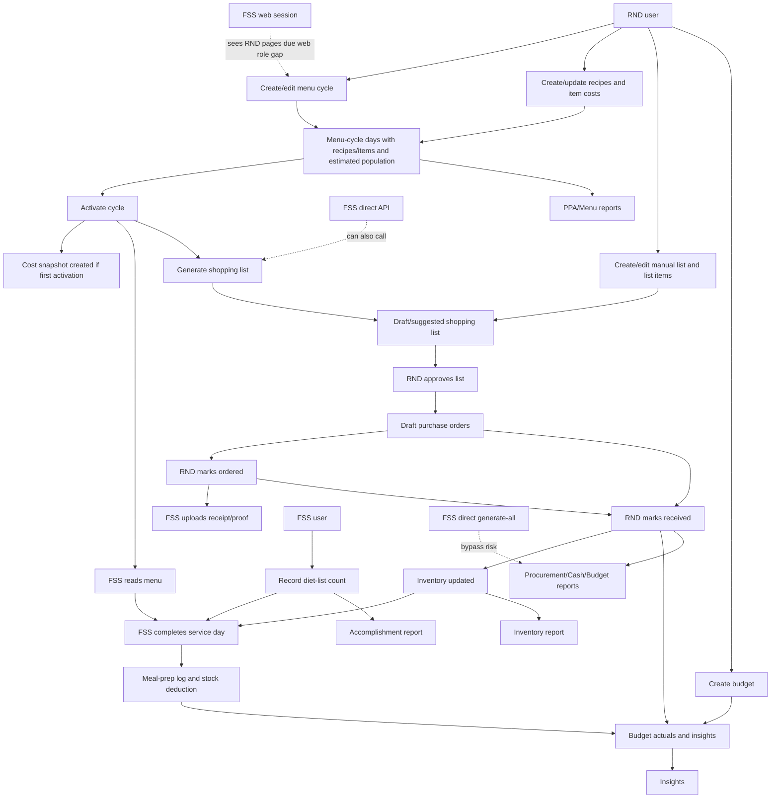
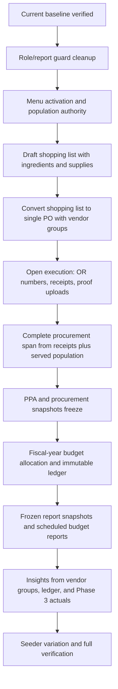
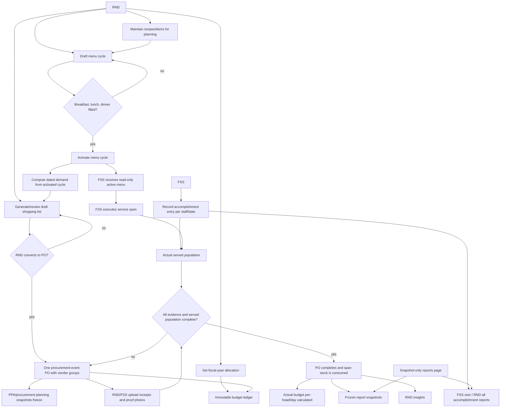

# Document 2 - Food Service Workflow Audit (AS-IS + TO-BE)

Date: 2026-06-26  
Source of truth: `docs/reviews/food-service-operations/2026-06-26-food-service-workflow-deep-audit.md`  
Secondary references checked: `docs/modules/rnd.md`, `docs/modules/fss.md`

This document uses the deep audit as the current-state baseline. Where `rnd.md` or `fss.md` conflicts with verified code behavior, the deep audit wins.

## Role Baseline

This section is intentionally first because all workflow conclusions depend on the actual RND/FSS split.

### RND Current Baseline

| Area | Current RND access and actions |
| --- | --- |
| Web pages | RND can access the web Food Service pages under `frontend/app/(rnd)/food-service/...`: menu-cycle planning, procurement, inventory, budget, reports, and related shared components. |
| Menu cycles | Create, edit, delete, activate, cost, save templates, instantiate templates, and read all cycles. |
| Recipes | Create, edit, delete, list, read, and use recipes in menu cycles. |
| Food service items | Read ready-to-eat items and update item catalog cost/unit fields. |
| Shopping lists | Create manual lists, generate suggested lists, edit lists and items, delete lists, approve lists into purchase orders. |
| Purchase orders | Read POs, update PO status/details, delete POs, upload/delete attachments. |
| Suppliers | Manage suppliers through RND-only routes. |
| Inventory | Read, create, update, delete, restock, and use inventory rows. |
| Meal prep | Can complete and reverse service days through shared routes and web service panel. |
| Diet-list counts | Can access shared diet-list routes, although normal workflow ownership is FSS execution. |
| Budgets | Create, update, delete, summarize, add adjustments, and call daily-log API. |
| Insights | Read spend, cost-per-head, and consumption analytics. |
| Reports | Browse/render/archive/download Food Service reports and clinical reports available to RND. |

### RND Current Limits

| Limit | Current behavior |
| --- | --- |
| FSS-only UI separation | RND can access many `/api/fss` shared routes because the API intentionally allows both roles on operational endpoints. |
| Owner scoping | Broad RND access is used; no model policies were found. |
| Operational handoff enforcement | RND can perform some execution actions such as meal-prep completion and inventory changes because routes are shared. |
| Report guard consistency | RND has the broadest report access, but report behavior still depends on generator-specific data availability. |

### What RND Creates, Approves, Or Generates

| Output | Current originator |
| --- | --- |
| Menu cycles and menu-cycle days | RND |
| Menu-cycle templates | RND |
| Recipes | RND |
| Shopping lists | RND normally; FSS can generate suggested lists through API |
| Purchase orders | RND approval of shopping lists |
| Received procurement/inventory updates | RND status update to `received` |
| Budgets and adjustments | RND |
| Food Service reports | RND through Reports Browser; FSS bypass exists for some report generation paths |

### Where RND Workflow Ends And FSS Takes Over

| Handoff | Trigger | Record passed | State at handoff | Enforced or bypassable |
| --- | --- | --- | --- | --- |
| Menu planning to execution | RND activates a menu cycle | `menu_cycles`, `menu_cycle_days`, cost snapshot | Active cycle | Partially enforced; empty/incomplete cycles can be activated |
| Procurement planning to proof upload | RND creates/updates PO to ordered | `purchase_orders`, `purchase_order_items` | Usually ordered PO | Partially enforced; status lifecycle is weak |
| Food availability to kitchen execution | Inventory rows exist through receiving/manual stock | `inventory` | Stocked or no-stock rows | Bypassable; FSS/RND can manually adjust inventory |
| Budget plan to actual tracking | Budget exists and operations produce received POs/meal-prep logs | `budgets`, POs, meal-prep logs | Budget period with derived actuals | Partially enforced; overlapping/missing data can make metrics pending |
| Report evidence | Operational records exist | Menu cycles, POs, budgets, inventory, diet-list counts | Report-specific instances | Partially enforced; some reports can render from incomplete/blank data |

### FSS Current Baseline

| Area | Current FSS access and actions |
| --- | --- |
| Mobile pages | Dedicated mobile tabs: Dashboard, Menu, Prep, Inventory, Procurement. |
| Web pages | Due web role gating issue, FSS can see non-admin/RND web navigation and pages. Backend blocks RND-only writes. |
| Dashboard | Reads service-day, PO-awaiting-receipt, inventory no-stock, and announcement data. |
| Menu | Reads menu cycles and recipe profiles. |
| Prep | Records diet-list counts, marks service day served, retries with shortfall allowed, reads today's headcount. |
| Inventory | Reads inventory rows, restocks, adjusts quantities when an inventory row exists. |
| Procurement | Reads purchase orders and uploads/deletes receipt/proof attachments. |
| Shopping lists | Can generate suggested shopping lists by direct API, although normal mobile UI was not found. |
| Meal prep | Can complete and reverse service days through shared backend routes. |
| Budgets and insights | Can read shared budget and insight endpoints by API; mobile has no visible budget/insights tabs. |
| Reports | Can browse/render/archive accomplishment reports by backend route; no normal FSS reports UI found. |

### FSS Current Limits

| Limit | Current behavior |
| --- | --- |
| Planning writes | FSS is blocked from creating/updating/deleting menu cycles, recipes, budgets, suppliers, PO status, and shopping-list item edits by RND-only route groups. |
| Procurement receiving | FSS can upload proof but cannot mark PO received, so inventory is not updated by proof upload alone. |
| Report scope | FSS should be accomplishment-report-only by controller guards, but `generateAll` and show/download/view gaps weaken this boundary. |
| Visible web boundary | Web layout/sidebar do not cleanly block FSS from RND pages. |

### Where FSS Workflow Begins From RND Handoff

| Handoff point | What triggers it | Record/data received | State FSS receives | Enforcement |
| --- | --- | --- | --- | --- |
| Menu execution | RND activates menu cycle | Active menu and day slots | Active, but not guaranteed complete | Shared read route; completeness not enforced |
| Procurement proof | RND creates/marks PO ordered | PO and PO items | Draft/ordered/received depending on RND update | FSS can upload proof; cannot receive |
| Inventory operations | RND receiving or manual stock creates rows | Inventory rows | Existing row or missing/no-stock row | FSS can adjust existing rows and create rows through API |
| Meal service | Active cycle has today's slots | Menu-cycle days and inventory | Service day ready or shortfall state | FSS can complete/reverse day |
| Accomplishment capture | FSS daily work/diet-list collection | Ward/task/population data | New diet-list count rows | Backend forces user ID but permits duplicates |

### Role Boundary Enforcement

| Boundary area | Correctly enforced in backend | Frontend-only or weak | Missing/bypassable path |
| --- | --- | --- | --- |
| Menu-cycle writes | RND-only routes | FSS web can see page due role leak | Direct API blocked for FSS writes |
| Recipe writes | RND-only routes | FSS web can see page paths indirectly | Direct API blocked for FSS writes |
| Supplier management | RND-only routes | FSS web may see supplier tab | Direct API blocked for FSS writes |
| Shopping-list item edits/approval | RND-only routes | FSS web can see procurement UI | FSS can generate suggested list |
| PO status updates | RND-only route | FSS procurement mobile omits status update | Status lifecycle itself is weak for RND |
| Inventory updates | Shared FSS/RND route | Exposed intentionally | FSS can manually alter operational stock |
| Budget reads | Shared route | FSS mobile has no tab | FSS direct API can read |
| Insights reads | Shared route | FSS mobile has no tab | FSS direct API can read |
| Reports | Most actions guarded by role/type | No FSS reports UI | `generateAll` and show/download/view guard gaps |
| Web RND pages | Not role-protected beyond login | Sidebar treats all non-admin as RND | FSS can enter RND UI surfaces |

### Secondary Documentation Conflicts

| Secondary claim | Verified current code behavior |
| --- | --- |
| `fss.md` treats Budget and Insights as not FSS scope. | Shared `/api/fss` routes allow FSS to read budgets and insights. |
| `fss.md` says FSS does not build procurement. | FSS cannot approve/edit lists, but can generate suggested shopping lists by API. |
| `fss.md` says FSS reports are accomplishment only. | Controller mostly enforces that, but `generateAll` and report retrieval paths create bypass risk. |
| `fss.md` describes dashboard accomplishment log widget. | Mobile Prep has diet-list/accomplishment entry; dashboard summary does not expose a dedicated accomplishment-log widget in the verified response. |
| `rnd.md` describes reports as browse-not-generate. | Browser flow exists, but deprecated generate/store/generate-all paths still exist. |
| `rnd.md` says values freeze at date/report context. | Menu cost freezes on activation, but active menu rows can still change after snapshot; PO/budget reports derive from current persisted records. |

## AS-IS Section

### Executive Summary

| Risk | Current finding | Why it matters |
| --- | --- | --- |
| Role boundary leakage | FSS can see RND web navigation/pages and has direct API access to some planning-adjacent reads and generation. | Demo users can encounter screens/actions that do not match the intended RND/FSS separation. |
| Report authorization inconsistency | `generateAll` and report retrieval paths do not apply the same FSS type guard used by render/archive/store. | FSS can create and access non-accomplishment Food Service reports through direct API behavior. |
| Lifecycle weakness | Menu cycles, shopping lists, purchase orders, and meal-prep logs have state transitions that are not fully enforced. | Users can create active/incomplete plans, finalized lists without approval flow, double-received POs, or reversed service days that cannot be completed again. |
| Data integrity risk | Diet-list duplicates, missing served population, budget overlap, and dashboard/inventory counting differences can produce inconsistent operational figures. | Reports and dashboard values can be challenged during defense if numbers do not reconcile. |
| Report data completeness | Some reports can render from incomplete, draft, or blank data. | Report output may appear valid even when source workflow was not completed. |
| RND/FSS handoff ambiguity | FSS uploads procurement proof, but RND is still required to mark the PO received and update inventory. | The operational story is defensible only if the handoff is explained precisely. |

### Ranked AS-IS Risk Summary

| Rank | Risk | Current evidence | Defense impact |
| ---: | --- | --- | --- |
| 1 | FSS role boundary is visibly weak on web | FSS can reach RND web navigation/pages because web layout checks login, not role. | Demo can show wrong-role screens before any API issue is discussed. |
| 2 | FSS report scope is not consistently enforced | `generateAll` and retrieval paths do not apply the same FSS type guard. | Formal reports can be generated or retrieved by the wrong role through direct paths. |
| 3 | Active menu cycle does not guarantee operational readiness | Activation does not require complete menu slots/population. | RND-to-FSS handoff can fail procurement, meal prep, and PPA report questions. |
| 4 | Receiving can corrupt stock if status is cycled | PO receiving is triggered by status change from non-received to received. | Inventory, budget, and procurement reports can become numerically wrong. |
| 5 | Service reversal can trap the daily workflow | Reversed log keeps the unique cycle/date key occupied. | A simple correction during demo can dead-end the FSS workflow. |
| 6 | Actual population can be overstated or inconsistent | Duplicate diet-list rows are allowed and consumption can use a different basis. | Accomplishment, per-head budget, and variance reporting can be challenged. |
| 7 | Report instance readiness is too permissive | Reports can use draft/incomplete menu cycles, blank inventory, or weak source states. | Defense artifacts may look official but lack valid source data. |

### RND-to-FSS Operational Handoff Table

| Handoff | AS-IS trigger | AS-IS record/state | Current weakness | Defensible TO-BE interpretation |
| --- | --- | --- | --- | --- |
| Menu plan to kitchen | RND activates menu cycle. | Active `menu_cycle` with day rows and optional population. | Completeness is not guaranteed and active rows can still change. | Activation means the menu is complete enough for execution and report cost basis is stable. |
| Demand to procurement | RND or FSS calls generated shopping-list endpoint. | Draft/suggested shopping list from menu-cycle demand. | FSS can generate by API and incomplete cycle data can create partial coverage. | RND owns demand generation from activated menu cycles. |
| Procurement to FSS proof | RND creates/marks PO ordered. | Draft/ordered PO and items. | Ordered/proof/received transitions are weak. | Ordered PO is the FSS prompt to upload receipt/proof; receiving remains a controlled confirmation. |
| Proof to inventory | FSS uploads receipt/proof, then RND marks received. | Attachment row, then received PO updates inventory. | Upload alone does not update stock and users may misunderstand the handoff. | Proof is evidence; received transition is the single inventory/budget event. |
| Menu and stock to service | FSS completes day against active cycle and inventory. | Meal-prep log and stock deductions. | Reversal blocks re-completion; population basis can diverge. | FSS completion records actual service and recoverable corrections. |
| Daily work to reports | FSS records diet-list/accomplishment rows. | `diet_list_counts`, optional served population sync. | Duplicate/inconsistent rows can inflate totals. | Accomplishment rows are controlled source data for actual served population. |
| Operations to RND reports | RND renders reports from source records. | Report source varies by type. | Incomplete/draft/blank sources can be reportable. | Reports appear only when source state supports the report's meaning. |

### Current Workflow Narrative Per Module

#### Menu Cycles And Menu Planning

RND creates menu cycles, assigns recipes or ready-to-eat items to day/meal slots, enters estimated populations, computes costs, saves templates, and activates a cycle. FSS reads the active/saved cycle for execution. The current workflow allows incomplete cycles and missing populations. Activation does not require every service slot to be present or populated. Active cycles can still be edited after the activation cost snapshot is created.

#### Recipe Scaling

RND owns food-service recipe creation and update. Recipes are built from fs-item ingredients and quantities. The backend validates ingredient existence and unit compatibility. Recipe costs recalculate from item costs. FSS can read recipes and profiles but cannot write them through normal backend routes.

#### Population Handling

Population exists in two places: RND estimates population per menu-cycle slot, and FSS records actual ward/staff counts through diet-list count rows. Diet-list counts can update an existing meal-prep log's served population, and complete-day can use diet-list totals. Duplicate diet-list entries are allowed, so actual served totals can be inflated. A service-day population override is recorded but does not rescale stock usage.

#### Shopping Lists

Shopping lists can be generated from active menu-cycle demand over a date range. The generator nets out inventory and open ordered PO quantities. RND normally performs this from the web procurement page, but the endpoint allows FSS too. RND can also create manual lists and edit items. Approval creates purchase orders grouped by supplier and finalizes the list. Direct status update can also finalize a list outside approval.

#### Purchase Orders And Procurement

RND approval creates draft POs. RND can update status to ordered or received. When status changes to received, ReceivingService updates inventory and item costs. FSS can read POs and upload receipt/proof attachments from mobile procurement. Uploading proof does not mark the PO received. The status model allows direct received status and can permit receive/reopen/re-receive behavior.

#### Inventory

Inventory can be updated by receiving POs or by manual FSS/RND stock actions. FSS mobile supports restock and deduct flows. Inventory rows may be missing for catalog items. The inventory rows endpoint counts missing rows as no-stock, while the dashboard no-stock count only counts existing rows with quantity at or below zero.

#### Budget

RND creates budgets and adjustments. FSS/RND can read budget summaries. Actuals are derived from completed meal-prep logs when available, otherwise from received purchases. Manual daily logs exist through backend API but no clear reviewed UI entry was found. Budget periods can overlap, and create request validation does not match database required period fields.

#### Reports

RND uses Reports Browser to select real instances, render live PDFs, archive, and download reports. FSS has backend access for accomplishment reports, but no normal FSS reports UI was found. Food Service reports depend on source records with varying completeness rules. Deprecated report generation paths still exist and create guard inconsistencies.

#### PPA

PPA generation is menu-cycle-based. It has a real RND originator because RND can create menu cycles and use Reports Browser. It does not require a seeded PO record. Its weakness is that selectable menu cycles do not have to be active or complete.

#### Accomplishment Reports

FSS mobile Prep creates diet-list count rows, which are the source for accomplishment reports. RND can browse/render accomplishment reports. FSS can use backend report endpoints directly, but no visible FSS report browser was found. The data source is real, not seeded-only.

#### Insights

Insights read from received POs, menu-cycle costs, and meal-prep logs. They have real data originators, but FSS UI exposure is inconsistent: mobile has no insights tab, while the API allows FSS and the web role leak can expose RND pages.

### AS-IS Workflow Diagram

AS-IS diagram notes:

| Flow | What the diagram intentionally shows |
| --- | --- |
| Procurement handoff | FSS proof upload is not the same event as receiving; receiving is still RND status update. |
| Report handoff | Operational data feeds reports, but report authorization and report readiness have separate guard gaps. |
| Role split | RND owns most planning states, while FSS executes daily operations; shared routes blur that boundary in several places. |
| Failure path | FSS web access and direct report generation are shown as bypass risks because they exist outside the intended visible workflow. |

## TO-BE Section

The TO-BE workflow below is a target operating model for a defensible capstone module. It is not an implementation plan and does not specify code changes.

### Final TO-BE Sequencing Rule

The C+B redesign must land before the D+E redesign. Budget ledger, frozen reports, and final insights all depend on a stable procurement event model from C+B.

Sequence implications:

| Dependency | Why it must come first |
| --- | --- |
| Date-driven shopping-list generation | It is the foundation for procurement spans and cross-cycle demand. |
| Population authority | Shopping-list quantities, menu scaling, and actual per-head reporting depend on clear estimate-vs-served rules. |
| Shopping-list `draft/converted` state | PO conversion cannot be logically clean while `finalized` remains a manual status option. |
| Single PO with vendor groups | Budget ledger, PPA, reports, procurement UI, and insights need one procurement-event source of truth. |
| PO converted/completed events | D+E budget/report automation depends on stable event payloads from C+B. |
| Frozen report snapshots | Reports page cannot become snapshot-only until the event sources exist. |

### Resolved Product Decisions

These decisions answer the previously open redesign questions and are now part of the final TO-BE workflow.

| Area | Locked decision |
| --- | --- |
| FSS procurement role | FSS never generates, creates, edits, or converts shopping lists. FSS only uploads receipt/proof photos against converted POs/vendor groups. |
| Receiving/proof | Both RND and FSS can upload receipt/proof photos. There is no separate FSS receive action. Procurement completion is system-driven from evidence plus served-population completion. |
| Menu-cycle completeness | Required meals are breakfast, lunch, and dinner. AM/PM snacks are optional. Procurement spans crossing multiple cycles must have required meals filled for every selected date. |
| Active cycle edits | Served population logging remains allowed after activation because it is execution data. Frozen structural menu/procurement/report snapshots must not be silently changed by later edits. |
| Stock deduction | Estimate population drives procurement quantities; served population drives actual per-head/day. Stock is automatically consumed at procurement-span completion based on the frozen planned/procured items, with manual inventory increase allowed for leftovers. |
| Accomplishment uniqueness | One accomplishment entry per FSS staff member per service date. Diet-list collected is a numeric count; apportioned/distributed food is the patient-count number; off-duty excludes checks/counts. |
| Inventory reports | Inventory reports list existing inventory records only; they do not need missing catalog/no-stock items. |
| Report visibility | FSS sees/downloads only their own accomplishment reports. RND sees all Food Service reports and all staff accomplishment reports. |
| Budget overlap | The final D+E model removes overlapping budget periods by using one fiscal-year allocation per year. |
| RND ownership | Broad RND Food Service access is acceptable for capstone; full owner/facility scoping is not required. |

### Proposed Workflow Narrative Per Module

#### Menu Cycles And Menu Planning

Current inconsistency: menu cycles can be activated while incomplete, and active cycles can be edited after cost snapshot.  
Correct workflow: RND drafts and edits a cycle until it is complete enough for the selected service dates. Activation should be the handoff to FSS execution. The activated cycle should have stable menu rows, population estimates, and frozen cost basis.  
RND/FSS handoff: activation passes the active menu plan to FSS.  
Immutable after handoff: served dates, active menu slots used for procurement/reporting, and frozen cost basis.  
Editable after handoff: non-reporting notes or future draft cycles.  
State trigger: explicit RND activation.  
Report feed: activated cycle and frozen cost basis feed PPA/menu-calendar/cost reports.

#### Recipe Scaling

Current inconsistency: recipe scaling is mostly coherent, but active-cycle edits after recipe/item price changes can blur report cost meaning.  
Correct workflow: RND owns recipe/item definitions before activation. Recipe costs may continue to update for planning, but reports for activated cycles should rely on frozen values.  
RND/FSS handoff: FSS receives read-only recipe/menu information through active cycle.  
Immutable after handoff: recipe quantities as used by the activated service plan.  
Editable after handoff: future recipe versions or draft planning data.  
Report feed: recipe ingredient usage and frozen cost values feed PPA, menu costing, and consumption.

#### Population Handling

Current inconsistency: estimated population, diet-list counts, served population, and complete-day overrides do not always reconcile.  
Correct workflow: RND estimate sizes procurement and planned cap. FSS diet-list counts provide actual served population. Service-day completion should use one clear actual population source for reporting, with duplicate/inconsistent entries prevented or clearly handled.  
RND/FSS handoff: RND estimate passes to FSS as expected service population; FSS returns actual headcount through diet-list/accomplishment entry.  
Immutable after handoff: estimate used for procurement and planned budget cap once activated.  
Editable after handoff: actual diet-list counts before report finalization, under controlled rules.  
Report feed: actual served population feeds accomplishment, budget per-head, cost efficiency, and variance reporting.

#### Shopping Lists

Current inconsistency: FSS can generate suggested lists, and RND can finalize lists outside approval semantics.  
Correct workflow: RND generates or creates draft shopping lists from activated menu demand, reviews ingredient and supply lines, and converts the list into a PO. FSS should not create planning procurement artifacts.  
RND/FSS handoff: no direct handoff yet; shopping list remains RND planning until POs are issued.  
Immutable after handoff: converted shopping-list quantities, vendor grouping, structural line data, and estimated planning snapshot.  
Editable before handoff: draft shopping-list items, supplies, vendor selections, and shopping-list-level estimate population.  
State trigger: RND Convert to PO action.  
Report feed: converted shopping lists and PO event snapshots feed PPA, procurement, budget, and insights.

Final TO-BE rule for overlapping spans: menu-linked draft shopping lists may not overlap on the same calendar date. This prevents two draft lists from competing over which list owns a population cascade. Manual supplies-only lists may overlap because they do not cascade menu-cycle population.

#### Purchase Orders And Procurement

Current inconsistency: proof upload and receiving are split across roles, but receiving can occur without proof and status can cycle.  
Correct workflow: RND converts one shopping list into one procurement-event PO with vendor groups. FSS and RND can add OR numbers and upload receipt/proof images on vendor groups during open execution. Completion happens automatically when all vendor groups have required receipt evidence and every procurement-span date has served population.  
RND/FSS handoff: converted PO/vendor groups pass to FSS for operational proof upload while structure remains locked.  
Immutable after handoff: item lines, quantities, estimated costs, vendor grouping, procurement span, and planning snapshot.  
State trigger: Convert to PO starts open execution; completion/freeze triggers when receipts and served population are complete.  
Report feed: converted/completed PO events feed inventory, PPA, procurement snapshots, budget ledger, actual per-head metrics, and supplier spend insights.

The old per-supplier PO model is not the final TO-BE workflow. Legacy rows may need migration or read-only handling, but the normal workflow is one procurement event with vendor groups.

#### Inventory

Current inconsistency: inventory can be changed manually by FSS/RND, and no-stock counts differ between dashboard and inventory list.  
Correct workflow: inventory has two defensible sources: procurement-span completion/consumption events and controlled manual stock adjustment. Dashboard and inventory list can keep operational no-stock logic, while formal inventory reports list existing inventory records only.  
RND/FSS handoff: completed procurement spans consume the frozen planned/procured items for the selected dates; leftovers are handled through manual inventory increase.  
Immutable after handoff: historical procurement completion and consumption records.  
Editable after handoff: current stock through controlled adjustments.  
Report feed: current inventory feeds inventory report; consumption snapshots feed budget actuals.

#### Meal Prep

Current inconsistency: reversal blocks re-completion, and population override does not rescale usage.  
Correct workflow: FSS completes a service day against the active cycle and available inventory. Reversal should return the day to a recoverable state. Population used for reporting should be clear and consistent with diet-list counts.  
RND/FSS handoff: active cycle and stocked inventory become FSS daily execution work.  
Immutable after handoff: completed service log once finalized for reporting.  
State trigger: FSS mark-served action.  
Report feed: meal-prep logs feed budget actuals, consumption insights, and variance notifications.

#### Budget

Current inconsistency: budget reads are shared broadly, period validation mismatches database, overlapping periods can create ambiguous summaries, and manual logs are API-only from reviewed UI.  
Correct workflow: RND owns one fiscal-year allocation per year and an immutable ledger. Budget remaining balance is derived from the fiscal allocation plus append-only ledger entries. PO deductions are created from the PO conversion event, and actual per-head/day becomes available only when the PO reaches completion with served population.  
RND/FSS handoff: FSS does not own budget planning; FSS execution produces actual data consumed by RND budget views.  
Immutable after handoff: fiscal-year allocation records and ledger entries; corrections are offsetting entries, not edits/deletes.  
Editable after handoff: none for historical entries; RND adds new ledger entries with reasons.  
Report feed: fiscal allocation, ledger entries, PO conversion deductions, and Phase 3 actual per-head values feed budget reports and insights.

#### Reports

Current inconsistency: report type guards differ by action, and some report instances can be produced from incomplete data.  
Correct workflow: Food Service reports are frozen snapshots created by workflow events or scheduled jobs. The redesigned Reports page reads stored snapshots only; it does not run live recalculation, expose live preview, or offer a manual generate/archive button for the final Food Service workflow. RND sees budget, procurement, and PPA reports. FSS sees only their own accomplishment reports.  
RND/FSS handoff: FSS produces execution data; RND produces formal Food Service reports, except FSS accomplishment report access if exposed.  
Immutable after handoff: archived report output and prepared-by/signatory snapshot.  
State trigger: PO conversion creates PPA/procurement planning snapshots; PO completion freezes execution columns; month-end schedule creates budget report snapshots; FSS accomplishment rows update/freeze by procurement span.  
Report feed: each report reads from stored snapshot data, not live operational queries.

#### PPA

Current inconsistency: selectable menu cycles can be draft or incomplete.  
Correct workflow: PPA is auto-created at PO conversion from the procurement-event snapshot. Planning columns freeze immediately. Execution columns update during open execution and freeze when the PO completes.  
RND/FSS handoff: RND formalizes the planned activity; FSS execution can later provide actuals through other reports.  
Immutable after handoff: planning columns at conversion and execution columns at completion.  
Report feed: converted shopping list, vendor groups, menu snapshot, estimated population, OR totals, and served population.

#### Accomplishment Reports

Current inconsistency: source data exists through FSS mobile, but normal FSS report UI was not found, and duplicate rows can inflate totals.  
Correct workflow: FSS records daily accomplishment/diet-list rows once per intended staff/ward/day context. The report presents that source data without depending on seeded served-population values.  
RND/FSS handoff: FSS creates the accomplishment evidence; RND can review/use it for reporting if required.  
Immutable after handoff: rows included in an archived report.  
Report feed: diet-list count rows and task flags.

#### Insights

Current inconsistency: endpoints allow FSS, while FSS mobile has no insights UI and secondary docs say insights are RND-owned.  
Correct workflow: insights are RND-facing analytics over completed and pending procurement events. They use vendor groups, fiscal-year ledger, full date ranges, and Phase 3 actual per-head values. Phase 2 spans appear as pending markers rather than disappearing.  
RND/FSS handoff: FSS completion and proof upload produce data; RND views aggregate analytics.  
Report feed: PO conversion/completion events, vendor groups, ledger entries, and served population.

#### Cross-Module Dependencies

Current inconsistency: Food Service population and report readiness are mostly internal to menu-cycle/diet-list data, while clinical patient census is separate.  
Correct workflow: Food Service should clearly distinguish planned population, actual served population, and any clinical census/diet-order source used for context. Clinical Care records may support patient menu plans and census reports, but Food Service reports should not silently depend on seeded or unrelated clinical data.  
RND/FSS handoff: clinical population context may inform RND planning; FSS actual diet-list counts close the operational loop.  
Report feed: demographic/patient reports stay clinical; Food Service reports use Food Service source records unless explicitly joined.

### TO-BE Workflow Diagram

## TO-BE Role Boundary Summary

| Action | Correct owner |
| --- | --- |
| Create/edit/activate menu cycles | RND |
| Maintain recipes and item planning costs | RND |
| Generate/review/convert shopping lists | RND only |
| Upload receipt/proof photos | FSS and RND |
| Complete procurement span | System-driven when required photos and served population are complete |
| Execute service day | FSS, with RND visibility |
| Record diet-list/accomplishment rows | FSS; one entry per staff/date |
| Manual inventory adjustment | FSS/RND only if treated as controlled operational adjustment |
| Budget planning and review | RND |
| Insights | RND-facing; fed by FSS execution data |
| Food Service reports except accomplishment | RND |
| Accomplishment report | FSS sees/downloads own report; RND sees all staff accomplishment reports |

## TO-BE State Rules

| Entity | Should freeze when | Should remain editable when | Report dependency |
| --- | --- | --- | --- |
| Menu cycle | On activation for service/reporting dates | Draft or future cycles before activation | PPA, menu calendar, shopping-list generation |
| Recipe/item cost basis | When captured in activated cycle snapshot | Future planning versions | Menu cost, PPA |
| Shopping list | On Convert to PO | Draft before conversion | Procurement event, PPA planning snapshot |
| Purchase order structure | On conversion from shopping list | Never after conversion | Procurement, PPA, budget ledger |
| Vendor-group operational fields | At procurement span completion | Open execution phase | Procurement execution snapshot |
| Inventory consumption | At procurement span completion | Manual increase allowed for leftovers | Inventory report, budget actuals |
| Accomplishment entry | At report/span freeze | Same-day correction window before freeze | Accomplishment report, served population |
| Fiscal-year budget allocation | On creation for the year | Never; use ledger corrections | Budget report |
| Report snapshot | On workflow trigger or scheduled generation | Never; snapshot is historical output | Defense/submission record |

## TO-BE Demo Acceptance Criteria

These criteria describe what the Food Service workflow must demonstrate to be defensible. They are not code tasks by themselves; they are the behavioral checks that the final implementation scope should satisfy.

| Area | Acceptance criterion |
| --- | --- |
| Role boundary | FSS users cannot reach RND planning, budget, procurement-authoring, supplier, or report pages through normal web navigation. |
| Menu activation | RND cannot hand off a menu cycle that lacks the minimum service-day/menu/population data needed for the selected demo path. |
| Frozen planning data | Once a menu cycle is active for reporting/service, menu rows and cost basis do not silently diverge. |
| Procurement lifecycle | RND converts the shopping list into one procurement-event PO; RND/FSS proof uploads are visible as evidence; completion is system-driven after required receipts/proofs and served-population data are complete. |
| FSS daily service | FSS can record diet-list counts, complete service day, handle shortfall, and correct a mistaken service completion without dead-ending. |
| Population reconciliation | Planned population, actual diet-list population, and consumption basis can be explained from the UI/report data. |
| Inventory dashboard | Dashboard no-stock count matches the detailed inventory interpretation used in the inventory screen. |
| Report readiness | RND report browser does not present formal report instances that are blank, draft-only, or source-incomplete for the demo story. |
| FSS reports | FSS report access is accomplishment-only unless an explicit different scope is chosen later. |
| Budget and insights | Budget actuals and insights use completed procurement-span events, frozen planning snapshots, served-population data, and fiscal ledger entries that can be explained as derived summaries. |

## Workflow Problems Carried Into Gap Analysis

| Problem group | Representative deep-audit findings |
| --- | --- |
| Role boundary | FS-WF-001, FS-WF-003, FS-WF-004, FS-WF-005, FS-WF-006, FS-WF-026, FS-WF-035, FS-WF-036 |
| Lifecycle state | FS-WF-016, FS-WF-018, FS-WF-019, FS-WF-020, FS-WF-021, FS-WF-022, FS-WF-034 |
| Population and execution | FS-WF-013, FS-WF-014, FS-WF-015 |
| Report integrity | FS-WF-005, FS-WF-006, FS-WF-007, FS-WF-008, FS-WF-010, FS-WF-012, FS-WF-031, FS-WF-035 |
| Budget and procurement consistency | FS-WF-009, FS-WF-011, FS-WF-027, FS-WF-033 |
| Frontend/backend mismatch | FS-WF-001, FS-WF-012, FS-WF-024, FS-WF-025, FS-WF-026, FS-WF-036 |
| Dead-end or orphaned features | FS-WF-024, FS-WF-025, FS-WF-029, FS-WF-030 |

## Audit Conclusion

The AS-IS module is functional enough to demonstrate an end-to-end Food Service story if the presenter follows a narrow legacy path: RND creates and activates a menu cycle, RND generates procurement, RND keeps PO/inventory status consistent, FSS logs diet-list/service activity, and RND renders reports. The final TO-BE workflow replaces that fragile receive-oriented story with RND-only procurement planning, shared receipt/proof uploads, system-driven procurement-span completion, frozen report sources, and role-appropriate report visibility.
