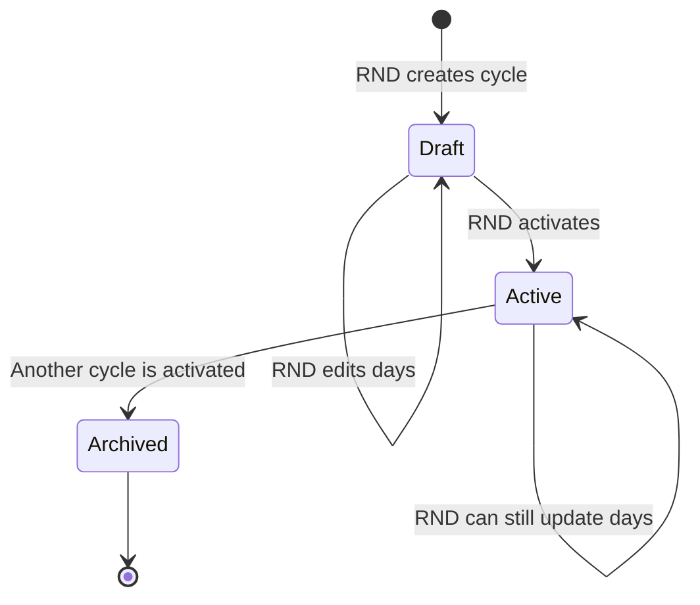
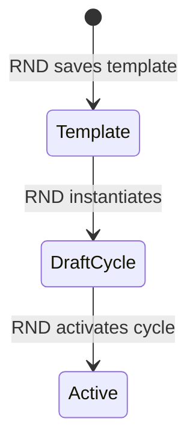
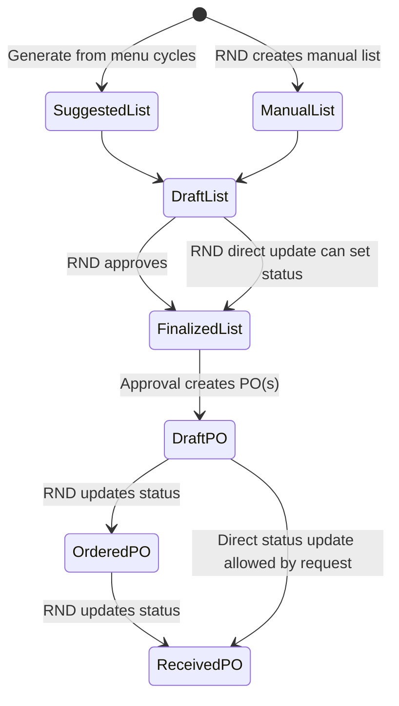
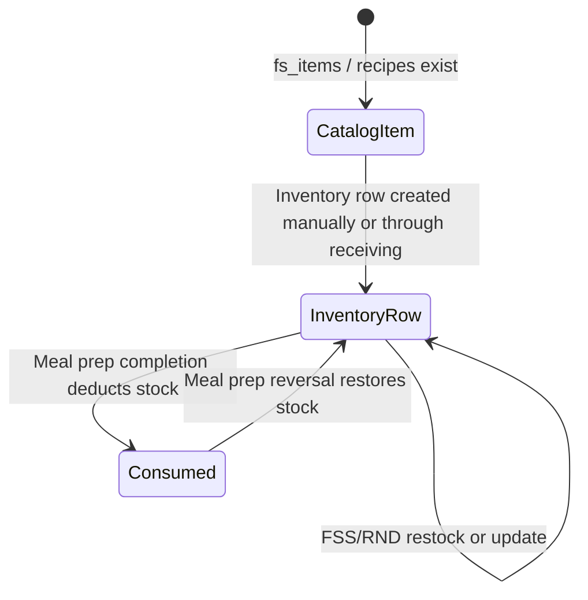
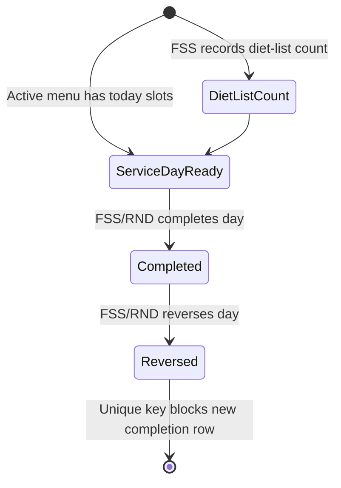
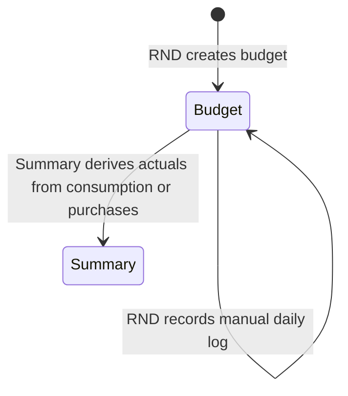
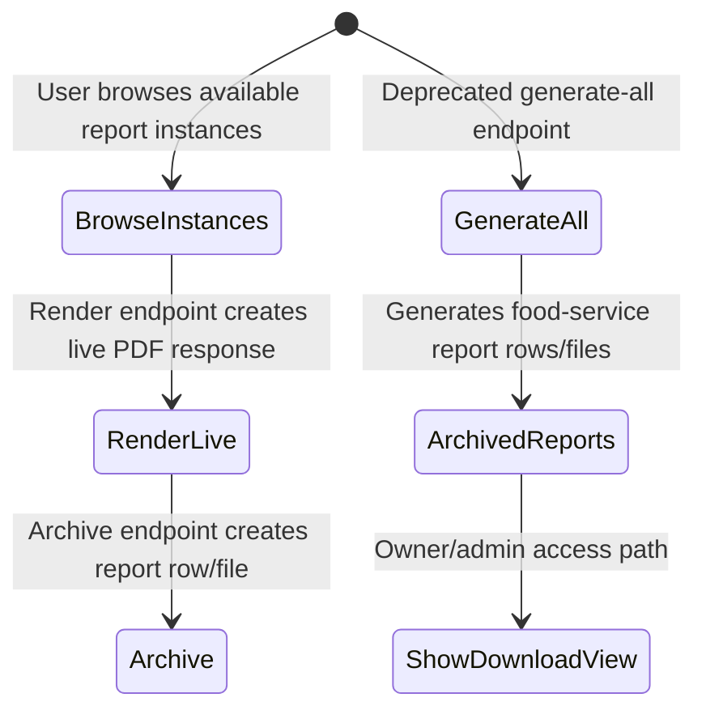

# Document 1 - Food Service Workflow Deep Audit

Date: 2026-06-26  
Scope: Current Food Service behavior only  
Purpose: Establish the code-backed baseline for later workflow, gap, and implementation-scope documents.

This document describes how the Food Service module currently works in the repository. It does not propose fixes, redesign workflows, or define a future target state. All later documents in this sequence should treat this file as the current-state reference.

## Evidence Map

| Area | Evidence reviewed |
| --- | --- |
| API routing and role split | `backend/routes/api.php` |
| Role middleware | `backend/app/Http/Middleware/RoleMiddleware.php` |
| Laravel app/runtime context | Laravel Boost application info and database schema |
| Menu cycle planning | `backend/app/Http/Controllers/FSS/MenuCycleController.php`, `MenuCycleTemplateController.php`, `MenuCycleCostService.php` |
| Recipes and food service items | `FoodServiceRecipeController.php`, `FsItemController.php`, related models and schema |
| Shopping lists and procurement | `ShoppingListController.php`, `PurchaseOrderController.php`, `ReceivingService.php` |
| Inventory | `InventoryController.php`, `Inventory.php`, inventory schema |
| Meal preparation and diet-list counts | `MealPrepLogController.php`, `DietListCountController.php`, `ConsumptionService.php` |
| Budget and insights | `BudgetController.php`, `BudgetService.php`, `BudgetActualService.php`, `ProcurementCostEfficiencyService.php`, `InsightsController.php` |
| Reports | `ReportController.php`, `ReportBrowser.php`, report generators, report tests |
| Web frontend | `frontend/app/(rnd)/...`, `frontend/components/foodservice/...`, `frontend/components/reports/...` |
| Mobile frontend | `mobile/app/(tabs)/...` |
| Existing tests | Food Service operation, permission, diet-list, accomplishment report, and report-scope tests |

## Role And Route Baseline

The API has two main Food Service access surfaces.

| Prefix | Middleware | Current meaning |
| --- | --- | --- |
| `/api/rnd` | `auth:sanctum`, `role:RND`, `audit` | RND-only web operations, including shared report routes |
| `/api/fss` | `auth:sanctum`, `role:FSS,RND` | FSS and RND shared operations, with nested RND-only route blocks for planning and administrative writes |

The raw route list does not fully show nested `role:RND` middleware inside the `/api/fss` group. The source of truth is `backend/routes/api.php`.

### Shared FSS/RND Routes

These are reachable by both FSS and RND users through `/api/fss`:

| Functional area | Shared operations |
| --- | --- |
| Dashboard | Summary |
| Inventory | List rows, create/update/delete inventory rows, restock |
| Purchase orders | List, read, upload attachments, delete attachments |
| Shopping lists | Generate suggested list, cost-efficiency, list, read |
| Menu cycles | List, read, cost-today, compute, served-population |
| Food service items | List ready-to-eat items, read item price trend |
| Recipes | List, read, read recipe profile |
| Budgets | List, read, summary |
| Insights | Spend, cost-per-head, consumption endpoints |
| Meal prep logs | List, complete day, reverse day |
| Diet-list counts | Store, list |
| Announcements | Read |
| Reports | Shared report route set, with controller-level guards on many report actions |

### RND-Only Routes Nested Under `/api/fss`

These routes require `role:RND` even though their URL prefix is `/api/fss`:

| Functional area | RND-only operations |
| --- | --- |
| Suppliers | Create, update, delete, list supplier management routes |
| Purchase orders | Update status/details, delete |
| Shopping lists | Create, update, delete, approve, add/update/delete list items |
| Food service items | Update catalog item details |
| Menu cycles | Create, update, delete, activate, save templates, instantiate templates |
| Recipes | Create, update, delete |
| Budgets | Create, update, delete, adjustments, daily logs |

## Frontend Role Baseline

| Surface | Current behavior |
| --- | --- |
| Web middleware | Checks authentication and redirects admin users, but does not role-protect RND pages from FSS users |
| Web RND layout | Requires a user object but does not check `user.role === "RND"` |
| Web sidebar | Shows Admin navigation only for `Admin`; every non-admin user gets RND navigation |
| Mobile FSS app | Dedicated FSS tabs: Dashboard, Menu, Prep, Inventory, Procurement |
| Reports UI | Web reports browser supports `rnd` and `admin` API prefixes; no normal FSS reports browser was found |

Current effect: an authenticated FSS user can be presented with RND web navigation and pages. Backend middleware still blocks RND-only writes, but readable shared endpoints and FSS/RND routes remain reachable.

## Database Enforcement Baseline

Food Service relies mostly on request validation, route middleware, and service logic. Database constraints exist, but they do not fully encode workflow state rules.

| Entity | Database constraints observed | Workflow rules not fully encoded in database |
| --- | --- | --- |
| `menu_cycles` | `status` enum, `is_active`, foreign key to RND user | Single active cycle, activation completeness, active-cycle immutability |
| `menu_cycle_days` | Unique `(menu_cycle_id, day_of_week, meal_type)` | Required complete week/menu grid, required population, exactly one recipe/item |
| `shopping_lists` | `status` enum `draft/finalized` | Approval-only finalization, non-empty final lists, PO dependency |
| `purchase_orders` | `status` enum `draft/ordered/received`, unique PO number | Ordered-before-received transition, attachment-before-receiving, preventing receive/reopen/re-receive loops |
| `inventory` | Unique `fs_item_id`, unique `recipe_id` | Exactly one of `fs_item_id` or `recipe_id`, no workflow source requirement |
| `diet_list_counts` | Indexes by date/cycle | No uniqueness by staff/date/ward, no off-duty/population consistency rule |
| `meal_prep_logs` | Unique `(menu_cycle_id, service_date)` | Re-completion after reversal |
| `budgets` | Period fields required by database | Overlap prevention, request/database nullability alignment |
| `reports` | Type/status/file metadata | Full role/type guard across all controller actions |

## Enforcement Matrix

| Workflow step | Frontend enforcement | Backend enforcement | Database enforcement | Can be bypassed? |
| --- | --- | --- | --- | --- |
| FSS opens RND web pages | Not blocked by web middleware/layout | Backend blocks RND-only writes but allows shared reads | None | Yes, UI exposure exists |
| RND creates menu cycle | RND web menu-cycle page | RND-only route | Required fields and foreign keys | Partially; empty/incomplete cycles can exist |
| RND activates menu cycle | RND web menu-cycle page | RND-only route; archives previous active through controller | `status`, `is_active` fields only | Yes; no DB single-active rule and no completeness rule |
| RND saves active menu cycle | RND web page permits save | RND-only update route | Unique day slots | Yes; active content can be changed after activation |
| FSS reads active menu | Mobile Menu tab and API | FSS/RND read route | None beyond stored rows | No role bypass needed; intended shared read |
| RND creates recipe | RND route/API | RND-only route, request validation, unit compatibility check | Foreign keys and recipe rows | Partially; depends on controller path |
| RND updates item price/unit | RND inventory page | RND-only route | Stored item fields | Partially; effects depend on recalculation logic |
| FSS adjusts inventory | Mobile inventory and API | FSS/RND route, validation | Inventory row uniqueness | Yes; FSS can manually change stock without procurement origin |
| RND generates shopping list | Web procurement page | FSS/RND route, validation | Shopping-list rows | Yes; route also allows FSS |
| FSS generates shopping list | No normal mobile UI found; API allows | FSS/RND route allows it | Shopping-list rows | Yes; role allows generation |
| RND approves shopping list | Web procurement page | RND-only route; creates POs by supplier | PO/list/item rows | Mostly through controller; direct status update can bypass approval semantics |
| RND marks PO ordered | Web procurement page | RND-only update route | Status enum | Yes; weak transition model |
| FSS uploads receipt/proof | Mobile procurement tab | FSS/RND attachment route | Attachment rows | No; upload does not receive PO |
| RND marks PO received | Web procurement page | RND-only update route; ReceivingService updates inventory | Status enum and inventory rows | Yes; receive can occur without proof and transition can be reopened |
| FSS logs diet-list count | Mobile Prep tab | FSS/RND route forces `fss_user_id` to authenticated user | Rows and indexes | Yes; duplicate/inconsistent rows possible |
| FSS completes service day | Mobile Prep tab | FSS/RND route; ConsumptionService deducts stock | Unique meal-prep date/cycle | Partially; reversal creates dead-end |
| FSS reverses service day | API and web service panel | FSS/RND route; stock is restored | Same unique meal-prep key | No re-completion path after reversal |
| RND creates budget | Web budget page | RND-only route/request | Period fields required by DB | Partially; request allows nullable dates but DB does not |
| RND reads budget summary | Web budget page | FSS/RND route | Budget/PO/log rows | Shared route allows FSS too |
| RND renders food report | Web reports browser | RND route plus controller guards | Report rows/files | Partially; data completeness varies by report |
| FSS renders accomplishment report | No normal FSS UI found | Controller guard allows FSS for accomplishment | Diet-list/report rows | Direct API only |
| FSS generates all food reports | No normal UI found | `generateAll` lacks FSS type guard | Report rows/files | Yes, direct API path exists |

## Actual Lifecycle State Review

### Menu Cycle Lifecycle

Observed behavior:

| State/action | Current behavior |
| --- | --- |
| Draft creation | RND can create a cycle with a week start date and optional days |
| Day sync | Update deletes existing day rows and recreates submitted rows |
| Missing slots | Rows without `recipe_id` or `fs_item_id` are skipped |
| Population | `estimate_population` is nullable |
| Activation | Controller archives current active cycle and sets selected cycle active |
| Cost snapshot | First activation freezes a cost snapshot if none exists |
| Active update | Active cycle days can still be edited after activation |
| Database single-active rule | Not enforced by database |

### Template Lifecycle

Observed behavior:

| Area | Current behavior |
| --- | --- |
| Template creation | RND can save a template directly or from an existing cycle |
| Instantiation | Creates a draft menu cycle from template rows |
| Population | Template instantiation does not carry `estimate_population` into the new cycle |
| Ownership | Template rows store `rnd_user_id`, but broad RND access is used |

### Shopping List And Purchase Order Lifecycle

Observed behavior:

| State/action | Current behavior |
| --- | --- |
| Generated list | FSS and RND can call generation endpoint |
| Generation source | Active menu cycles covering each date in the requested range |
| Uncovered dates | Stored as metadata when partial coverage exists |
| Stock netting | On-hand inventory and open ordered PO quantities reduce suggested need |
| Approval | RND-only approval groups items by supplier and creates one PO per supplier group |
| Finalization | Approval finalizes the list, but RND update can also set list status directly |
| PO receiving | Only RND can set PO status to `received`; receiving updates inventory |
| Attachments | FSS/RND can upload receipt/proof attachments, but upload does not receive PO |

### Inventory Lifecycle

Observed behavior:

| Area | Current behavior |
| --- | --- |
| Inventory rows | May point to an `fs_item` or a recipe |
| Manual stock changes | FSS and RND can create, update, delete, and restock inventory rows |
| Receiving source | RND setting PO to `received` updates inventory through ReceivingService |
| Cost source | Receiving updates item purchase price and recipe costs for touched items |
| Dashboard count | Dashboard no-stock count uses only existing inventory rows |
| Inventory rows API | Rows endpoint also treats missing inventory rows as no stock |

### Meal Preparation And Diet-List Lifecycle

Observed behavior:

| State/action | Current behavior |
| --- | --- |
| Diet-list entry | FSS mobile Prep form posts ward, population, task flags, off-duty flag |
| User attribution | Backend forces `fss_user_id` to authenticated user |
| Duplicate rows | No unique constraint prevents multiple entries for same staff/date/ward |
| Completion target | Existing diet-list counts override provided served population |
| Stock deduction | Uses menu-cycle day estimates from `usageForDays` |
| Shortfall | Without `allow_shortfall`, insufficient stock aborts; with it, available stock is consumed and shortfall recorded |
| Reversal | Restores consumed stock and marks log reversed |
| Re-completion | Database unique key blocks a new log for the same cycle/date after reversal |

### Budget Lifecycle

Observed behavior:

| Area | Current behavior |
| --- | --- |
| Creation | RND-only budget create route |
| Period fields | Request allows nullable period fields, but database requires period dates |
| Actual source | Uses meal-prep consumption if present; otherwise falls back to received purchases |
| Cash-flow source | Received purchase orders are reported separately as cash flow |
| Adjustments | Stored separately as addition/deduction rows |
| Manual logs | API exists; normal budget page did not show a clear entry UI for daily logs |
| Overlap | Overlapping budget periods are not blocked |

### Report Lifecycle

Observed behavior:

| Area | Current behavior |
| --- | --- |
| RND reports UI | Web Reports Browser supports RND report browsing, live rendering, archive, download |
| FSS reports UI | No normal FSS reports browser was found |
| FSS report backend | Controller allows FSS to browse/render/archive accomplishment reports |
| Food-service report set | Program/project activity, dietary cash book, procurement pack, budget report, inventory report |
| Accomplishment report | Separate report type backed by diet-list counts |
| Deprecated generate-all | Shared under `/api/fss`, lacks FSS type guard |
| Show/download/view | Owner/admin guard is present; FSS report-type guard is not applied there |

## Lifecycle Gaps Table

This table records lifecycle gaps observed in the current code. It describes current behavior only and does not prescribe fixes.

| Entity | Current lifecycle gap | Downstream effect |
| --- | --- | --- |
| Menu cycles | Activation does not require a complete menu grid or population values. | Active menus can be incomplete for FSS execution, procurement, and reports. |
| Menu cycles | Active cycles can still be updated after activation and cost snapshot. | Current menu rows and frozen cost values can diverge. |
| Menu-cycle templates | Instantiated cycles do not copy population values. | Template-created plans may look complete but fail demand/procurement assumptions. |
| Shopping lists | Status can be set to finalized outside the approval action. | Finalized lists can exist without approval-created purchase orders. |
| Purchase orders | Status transitions allow direct receiving and receive/reopen/re-receive behavior. | Inventory and budget source data can be updated at the wrong time or more than once. |
| Procurement proof | Attachment upload is separate from receiving. | FSS proof upload does not update inventory or budget actuals. |
| Diet-list counts | Duplicate or contradictory rows are allowed. | Served population and accomplishment report totals can be inflated. |
| Meal-prep logs | Reversal restores stock but leaves the unique date/cycle key occupied. | A reversed service day cannot be completed again through the normal insert path. |
| Inventory | Manual stock changes and receiving/consumption changes share the same current-quantity record. | Current stock is visible, but stock origin is not fully distinguishable. |
| Budget | Period overlap is not blocked and request validation does not fully match database requirements. | Budget coverage and report periods can be ambiguous. |
| Reports | Source availability checks vary by report type and action. | Reports can appear available from incomplete, draft, or blank data. |
| Reports | FSS type guards are not applied consistently across all report actions. | FSS report scope can be bypassed through direct/shared report paths. |

## Module Workflow Narrative

### 1. Menu Cycles

| Question | Current answer |
| --- | --- |
| What the user does | RND creates, edits, activates, deletes, and saves templates for menu cycles through the web Food Service menu-cycle page/API. FSS reads menu cycles through mobile Menu and shared API routes. |
| Data entered | Cycle name, week start date, day-of-week, meal type, recipe or ready-to-eat item, quantity, estimated population. |
| Records created or modified | `menu_cycles`, `menu_cycle_days`, optional `menu_cycle_templates` and template days. |
| Dependencies | Recipes, ready-to-eat `fs_items`, authenticated RND user for writes. |
| Validation rules | RND-only write routes; day rows reference existing recipe/item when provided; quantity and population validation in request/controller path. |
| What can happen next | Cycle can be activated, costed, used for shopping-list generation, used for service-day completion, and used for reports. |
| Enforced or bypassable | Role enforcement exists for writes. Completeness, population presence, and single active cycle are not fully enforced by database. |
| Evidence | `MenuCycleController`, `MenuCycleTemplateController`, `MenuCycleCostService`, menu-cycle frontend page, schema. |

### 2. Menu Planning

| Question | Current answer |
| --- | --- |
| What the user does | RND fills a weekly grid with recipes or ready-to-eat items and per-slot populations. |
| Data entered | Recipe/item choice, meal slot, quantity, estimated population. |
| Records created or modified | `menu_cycle_days`; old rows are deleted and replaced on sync. |
| Dependencies | Active food-service recipes and active ready-to-eat items. |
| Validation rules | Rows with no recipe/item are skipped; database prevents duplicate day/meal slots per cycle. |
| What can happen next | Menu can be costed, activated, instantiated as template, shown to FSS, used for procurement and service logs. |
| Enforced or bypassable | The grid can be partial. Population can be missing. Active plans can still be changed. |
| Evidence | `syncDays` in `MenuCycleController`, web menu-cycle editor. |

### 3. Recipe Scaling

| Question | Current answer |
| --- | --- |
| What the user does | RND creates and updates recipes with ingredient lines. FSS reads recipe profiles. |
| Data entered | Recipe name, servings, instructions/metadata, fs-item ingredient IDs, quantities, units. |
| Records created or modified | `food_service_recipes`, recipe ingredient rows, recipe cost fields. |
| Dependencies | Ingredient `fs_items`, unit compatibility, item purchase/base unit details. |
| Validation rules | RND-only writes; ingredients required; quantity minimum; unit compatibility asserted; deletion blocked when recipe is used by menu-cycle days. |
| What can happen next | Recipe appears in menu-cycle planning and inventory rows, and contributes to cost computation and consumption. |
| Enforced or bypassable | Normal controller path enforces compatibility; direct database writes are not workflow-enforced. |
| Evidence | `FoodServiceRecipeController`, recipe schema, tests. |

### 4. Population Handling

| Question | Current answer |
| --- | --- |
| What the user does | RND enters estimated population per menu slot. FSS records diet-list population and can complete service day. |
| Data entered | `estimate_population` on menu-cycle days, diet-list count population, optional service-day population/served population. |
| Records created or modified | `menu_cycle_days`, `diet_list_counts`, `meal_prep_logs`. |
| Dependencies | Active menu cycle, service date, optional diet-list rows. |
| Validation rules | Diet-list population must be non-negative. Existing diet-list counts override provided service population during completion. |
| What can happen next | Population drives menu costing, shopping-list generation, consumption, budget per-head actuals, and accomplishment reporting. |
| Enforced or bypassable | Missing menu-slot population causes generation gaps. Duplicate diet-list rows can inflate population. Service population override is recorded but does not rescale usage calculation. |
| Evidence | `DietListCountController`, `ConsumptionService`, `MenuCycleCostService`, mobile Prep tab. |

### 5. Shopping Lists

| Question | Current answer |
| --- | --- |
| What the user does | RND creates manual lists and approves lists. FSS and RND can generate suggested lists through API; normal mobile FSS UI for generation was not found. |
| Data entered | Date range, list name, manual item lines, item quantities/prices/suppliers. |
| Records created or modified | `shopping_lists`, `shopping_list_items`. |
| Dependencies | Active menu cycles, menu-cycle populations, fs-items, inventory, open ordered PO quantities, suppliers. |
| Validation rules | Generation requires date range and name; fully uncovered ranges return 422; manual item mutations are RND-only. |
| What can happen next | RND approval finalizes list and creates purchase orders grouped by supplier. |
| Enforced or bypassable | FSS can call generation. RND can directly update status to finalized outside the approval action. |
| Evidence | `ShoppingListController`, procurement web page, tests. |

### 6. Purchase Orders

| Question | Current answer |
| --- | --- |
| What the user does | RND approves a shopping list to create POs, updates PO status/details, and can mark a PO received. FSS reads POs and uploads receipt/proof attachments. |
| Data entered | Supplier grouping, PO number, OR number, order date, total amount, status, notes, receipt/proof files. |
| Records created or modified | `purchase_orders`, `purchase_order_items`, `purchase_order_attachments`, inventory rows on receiving. |
| Dependencies | Shopping-list items, supplier IDs, fs-items, authenticated user role. |
| Validation rules | PO update is RND-only. Attachments accept receipt/proof image files. Receiving runs when status changes to `received` from another status. |
| What can happen next | Received POs update inventory, item prices, recipe costs, budget actuals, procurement reports, and insights. |
| Enforced or bypassable | Attachments do not receive POs. Status can be set directly to received. Reopening and receiving again can run receiving logic again. |
| Evidence | `PurchaseOrderController`, `ReceivingService`, procurement web and mobile pages, tests. |

### 7. Procurement

| Question | Current answer |
| --- | --- |
| What the user does | RND turns menu demand into shopping lists and purchase orders. FSS supports procurement by viewing POs and uploading proofs. |
| Data entered | Generated coverage period, manual list data, PO status, files. |
| Records created or modified | Shopping lists, shopping-list items, purchase orders, purchase-order items, attachments, inventory rows. |
| Dependencies | Menu-cycle demand, population estimates, suppliers, inventory, receiving status. |
| Validation rules | RND-only for approval and status changes; FSS/RND for generated list creation and attachments. |
| What can happen next | Procurement data becomes source for inventory, cash book, procurement pack, budget cash flow, supplier spend insights. |
| Enforced or bypassable | Operational receiving is RND-owned even though proof upload is FSS-accessible. |
| Evidence | Shopping-list and purchase-order controllers/services, mobile procurement tab, web procurement page. |

### 8. Inventory

| Question | Current answer |
| --- | --- |
| What the user does | FSS and RND view, create, edit, delete, restock, and deduct inventory rows. RND receiving also updates inventory. |
| Data entered | Item/recipe reference, quantity, unit, unit price, notes. |
| Records created or modified | `inventory`; receiving also updates `fs_items` purchase price and dependent recipe costs. |
| Dependencies | Existing `fs_items` or recipes. |
| Validation rules | Controller requires exactly one item/recipe source and non-negative quantity on normal update paths. |
| What can happen next | Inventory is used for shopping-list netting, meal-prep deduction, inventory reports, and dashboard counts. |
| Enforced or bypassable | Manual FSS/RND changes can alter stock without procurement origin. Dashboard and rows endpoint count no-stock differently. |
| Evidence | `InventoryController`, `ReceivingService`, mobile inventory tab, web inventory page. |

### 9. Budget

| Question | Current answer |
| --- | --- |
| What the user does | RND creates budgets, adjustments, and can call daily-log API. FSS and RND read budget lists and summaries. |
| Data entered | Budget name/type, amount, period, population/per-head fields, adjustments, manual daily spend logs. |
| Records created or modified | `budgets`, adjustment rows, daily log rows. |
| Dependencies | Received POs, meal-prep logs, served population, optional menu-cycle link. |
| Validation rules | RND-only writes; summary validates range/granularity. Request/database nullability mismatch exists for budget period dates. |
| What can happen next | Budget summary feeds reports, insights, planned-vs-actual charts, procurement cost efficiency. |
| Enforced or bypassable | Overlapping periods are allowed. Daily logs appear API-only from reviewed frontend. |
| Evidence | `BudgetController`, `BudgetActualService`, `BudgetService`, budget web page. |

### 10. Reports

| Question | Current answer |
| --- | --- |
| What the user does | RND uses web Reports Browser to browse instances, render live reports, archive, and download. FSS backend can render/archive accomplishment reports directly, but no normal FSS reports UI was found. |
| Data entered | Report type, period, instance ID, optional parameters such as budget ID or menu cycle ID. |
| Records created or modified | `reports` rows and generated report files when archived or generated. |
| Dependencies | Report-specific data: menu cycles, received POs, budgets, inventory, diet-list counts. |
| Validation rules | Controller guards many report actions by role/type, but not all report actions share the same guard path. |
| What can happen next | Reports can be rendered, archived, listed, viewed, downloaded. |
| Enforced or bypassable | FSS direct `generate-all` path can generate non-accomplishment food-service reports; show/download/view do not apply FSS type guard. |
| Evidence | `ReportController`, `ReportBrowser`, report generators, report tests. |

### 11. Program/Project Activity Report

| Question | Current answer |
| --- | --- |
| What the user does | RND can render/report menu-cycle-based PPA through Reports Browser when menu cycles exist. |
| Data entered | `menu_cycle_id` through report instance selection. |
| Records created or modified | Live render creates a PDF response; archive creates a report row/file. |
| Dependencies | Menu cycle and menu-cycle days. |
| Validation rules | Generator requires a menu cycle ID; browser source includes menu cycles without requiring active/complete status. |
| What can happen next | PPA can represent current stored menu-cycle rows and cost snapshot/live cost data. |
| Enforced or bypassable | Draft or incomplete cycles can be selectable. Active cost snapshot and edited current menu rows can diverge. |
| Evidence | `ProgramProjectActivityGenerator`, `ReportBrowser`, menu-cycle source. |

### 12. Accomplishment Reports

| Question | Current answer |
| --- | --- |
| What the user does | FSS records diet-list count/accomplishment data in mobile Prep. RND can browse/render accomplishment reports through web Reports Browser. FSS can access accomplishment report backend endpoints directly. |
| Data entered | Service date, ward, population, task flags, off-duty flag, optional menu-cycle ID. |
| Records created or modified | `diet_list_counts`; report rows/files if archived. |
| Dependencies | Diet-list count rows. Existing meal-prep log is optional for report generation. |
| Validation rules | Store request validates required fields and forces authenticated FSS user as owner. |
| What can happen next | Report generator groups counts by staff and period. |
| Enforced or bypassable | Duplicate rows can inflate counts. FSS has backend capability but no normal reports UI found. |
| Evidence | `DietListCountController`, `AccomplishmentReportGenerator`, mobile Prep tab, accomplishment report tests. |

### 13. Insights

| Question | Current answer |
| --- | --- |
| What the user does | RND web Budget page displays insights panel. FSS can reach insights endpoints through shared API. |
| Data entered | Query parameters such as period/date range. |
| Records created or modified | None; read-only aggregation. |
| Dependencies | Received POs, menu-cycle costs, completed meal-prep logs. |
| Validation rules | Route allows FSS/RND. |
| What can happen next | Aggregated spend, cost-per-head, and consumption data are displayed. |
| Enforced or bypassable | FSS endpoint access exists even though mobile FSS UI has no insights tab. |
| Evidence | `InsightsController`, `InsightsPanel`, `FoodServiceOpsTest`. |

### 14. RND Permissions

| Question | Current answer |
| --- | --- |
| What the user does | RND performs planning, procurement approval/status, supplier management, recipe/catalog management, budget writes, and report rendering. |
| Data entered | All planning and administrative Food Service data. |
| Records created or modified | Menu cycles, templates, recipes, catalog items, budgets, shopping lists, POs, reports, inventory. |
| Dependencies | Authenticated active RND user. |
| Validation rules | Nested `role:RND` routes and request validation. |
| What can happen next | RND-created data drives FSS execution and reports. |
| Enforced or bypassable | Broad RND visibility is used; no model policies were found. |
| Evidence | Routes, role middleware, controllers, tests. |

### 15. FSS Permissions

| Question | Current answer |
| --- | --- |
| What the user does | FSS reads menus/budgets/recipes/POs, records diet-list counts, completes/reverses service day, updates inventory, uploads procurement attachments, and can generate shopping lists through API. |
| Data entered | Diet-list counts, service completion, inventory quantities, attachment files, generated shopping-list request data. |
| Records created or modified | Diet-list counts, meal-prep logs, inventory rows, PO attachments, generated shopping lists. |
| Dependencies | Authenticated active FSS user and existing planning/procurement data. |
| Validation rules | Route middleware allows shared actions and blocks nested RND-only writes. |
| What can happen next | FSS execution data feeds accomplishment reports, inventory, budget actuals, and insights. |
| Enforced or bypassable | Web frontend exposes RND pages to FSS. Backend report and shopping-list generation paths have broader access than the stricter execution-only model. |
| Evidence | Routes, mobile app, web middleware/layout, permission tests. |

## Dead-End Flow Audit

| Feature/function | Normal originator found? | Seeded/hardcoded/manual DB needed? | Frontend entry point found? | Backend endpoint/service | Current result |
| --- | --- | --- | --- | --- | --- |
| Create menu cycle | Yes, RND | No | Web RND menu-cycle page | `POST /api/fss/menu-cycles` under RND middleware | Creates draft cycle |
| Activate menu cycle | Yes, RND | No | Web RND menu-cycle page | `POST /api/fss/menu-cycles/{id}/activate` | Activates cycle and archives previous active |
| Program/project activity report | Yes, RND if menu cycle exists | No | Web Reports Browser | Report render/archive | Can render selectable menu cycles, including incomplete/draft cycles |
| Menu calendar report | Yes, RND if menu cycle exists | No | Web Reports Browser | Report render/archive | Can render selectable menu cycles |
| Generate shopping list | Yes, RND through web; FSS through API | No | Web RND procurement page; no mobile FSS generator found | `POST /api/fss/shopping-lists/generate` | Creates suggested list when menu-cycle coverage exists |
| Approve shopping list into POs | Yes, RND | No | Web RND procurement page | `POST /api/fss/shopping-lists/{id}/approve` | Creates supplier-grouped draft POs |
| FSS upload PO proof | Yes, FSS | No | Mobile procurement tab | `POST /api/fss/purchase-orders/{id}/attachments` | Adds attachment only |
| Receive PO into inventory | Yes, RND | No | Web RND procurement page | `PUT /api/fss/purchase-orders/{id}` with status `received` | Updates inventory and item costs |
| Budget auto-deduction | Partially; derived not persisted | No | Web budget summary reads derived values | `BudgetActualService`, `BudgetController@summary` | Received POs and meal-prep logs are aggregated; no persisted deduction mutation |
| Manual budget daily logs | Backend yes | No | No clear reviewed UI entry point | `POST /api/fss/budgets/{id}/daily-logs` under RND middleware | API-only from reviewed frontend |
| Accomplishment data capture | Yes, FSS | No | Mobile Prep tab | `POST /api/fss/diet-list-counts` | Creates diet-list count rows |
| Accomplishment report render | Backend yes | No | RND web Reports Browser; no FSS reports UI found | Report render/archive | RND can render; FSS can call backend directly |
| Insights graphs | Yes | No | Web RND budget page | `InsightsController` | Aggregates received POs, menu costs, meal-prep logs |
| Inventory report | Always available | Blank DB possible | Web Reports Browser | `InventoryReportGenerator` | Singleton source reports renderable even with no inventory rows |
| Cleaning logs | No active flow | Not applicable | No active Food Service UI found | Routes intentionally 404 in tests | Removed/off-scope behavior |
| Scheduled Food Service jobs | No | Not applicable | Not applicable | Scheduler only has follow-up notification command | No Food Service scheduled job found |

## C+B / D+E Redesign Reality Check

This section maps the planned C+B and D+E redesign assumptions to the current codebase. It is still current-state audit evidence only.

| Planned redesign area | Current code/database evidence | Audit classification |
| --- | --- | --- |
| Date-driven shopping-list generation | `ShoppingListController::generate()` accepts `start_date` and `end_date`, resolves each date through `MenuCycle::coveringDate()`, records `coverage_status` and `uncovered_dates`, and does not use `shopping_lists.menu_cycle_id`. | Confirmed |
| Cross-week cycle resolution | `MenuCycle::coveringDate()` exists and picks active cycle first, then latest-starting cycle covering the date. | Confirmed, with overlap ambiguity |
| `estimate_population` vs `served_population` separation | `menu_cycle_days.estimate_population` and `meal_prep_logs.served_population` are separate columns. Consumption logic can still record population separately from stock usage basis. | Confirmed, but inconsistent |
| Shopping-list-level population cascade | No shopping-list population field, population timestamp, or last-write-wins authority exists. | Missing |
| Overlapping draft shopping-list spans | Current code can create separate draft suggested lists over date ranges; no overlap guard was found. | Conflicted / dead-end risk |
| Menu-cycle activation population guard | Activation exists but does not block incomplete plans or missing populations. | Conflicted; already captured by `FS-WF-021` |
| Shopping-list missing-population guard | Generation treats missing population as uncovered and only blocks fully unbuyable spans. It does not return the stricter planned-day-specific error described in C+B. | Partially confirmed / conflicted |
| Shopping-list states | `shopping_lists.status` is `draft/finalized`; requests, factories, and frontend services use the same values. | Conflicted with `draft/converted` redesign |
| RND-only shopping-list generation | Route currently allows FSS/RND for `shopping-lists/generate`. | Conflicted; captured by `FS-WF-003` |
| Supplies shopping-list tab | `fs_items.kind` can represent item kinds, but no complete supplies tab and supplies-to-PO conversion flow was verified. | Missing or partial foundation |
| One PO per shopping list | `PurchaseOrderController::approve()` creates one `purchase_orders` row per supplier group. | Conflicted |
| Vendor group model | No vendor-group table/model was found; `purchase_order_items` and attachments belong directly to purchase orders. | Missing |
| PO lifecycle phases | Current PO status enum is `draft/ordered/received`. Receiving is status-change driven. | Conflicted |
| Vendor-group OR/receipt/proof input | OR number and attachments are PO-level, not vendor-group-level. FSS can upload attachments; RND controls PO status. | Partially confirmed / missing |
| PO completion from receipts plus served population | Current PO completion is manual status `received`; it does not depend on served population across a procurement span. | Missing |
| Procurement event page | Current web procurement page uses list/PO/supplier tabs and flat status dropdowns. | Missing |
| PPA auto-generation | PPA is generated through report browser/render/archive using selected menu cycles. It is not auto-created at PO conversion. | Conflicted / dead-end risk for redesign |
| Shared menu-cycle list view | Cycle list/read foundations exist, but full RND/FSS chronological list with per-day plan indicators and scaled servings is not fully verified as a shared UI. | Partial foundation |
| Fiscal-year budget allocation | Current `budgets` table is period-based with `period_start`, `period_end`, `allocated_amount`, population, and per-head fields. | Conflicted |
| Append-only budget ledger | Existing `budget_adjustments` and `budget_daily_logs` are not a fiscal-year immutable ledger source of truth. | Missing |
| Budget auto-deduction on PO creation | Budget actuals are derived from received POs/meal-prep logs; no PO-created ledger event was found. | Missing |
| Frozen automatic reports | Reports support stored `snapshot`, but current Food Service reports are browsed/rendered/archived through live generators. | Conflicted |
| Scheduled monthly Food Service budget report | Scheduler only has follow-up reminders; no Food Service scheduled report job was found. | Missing / dead-end risk |
| FSS own frozen accomplishment reports | FSS creates diet-list data and backend allows accomplishment report access, but no normal FSS report UI or procurement-span freeze model was found. | Partial foundation / missing |
| Insights redesign | Spend-by-supplier route exists and uses received POs; final redesign would need to switch to vendor groups and fiscal ledger. | Partial foundation |
| Seeder variation for final reports | `FoodServiceDemoSeeder` seeds Food Service data, but variation against final PO/report freeze behavior cannot exist before the new lifecycle exists. | Deferred until final model |

## Detailed Current-State Findings

These findings are current-state observations, not implementation recommendations.

| ID | Severity | Area | Current behavior | User-visible impact |
| --- | --- | --- | --- | --- |
| FS-WF-001 | High | Web role boundary | FSS users are treated as non-admin and can see RND web navigation/pages. | FSS may see planning/procurement/budget screens that backend later rejects on writes. |
| FS-WF-002 | Medium | Authorization model | No model policies were found; broad route-level role checks dominate. | RND users can broadly access Food Service records rather than owner-scoped records. |
| FS-WF-003 | Medium | Shopping lists | FSS can call shopping-list generation endpoint. | FSS can create procurement planning artifacts even though approval/editing is RND-only. |
| FS-WF-004 | Medium | Shared read scope | FSS can read budgets, insights, recipes, menu cycles, purchase orders, and shopping lists through shared routes. | FSS API visibility is broad. |
| FS-WF-005 | High | Reports | `generateAll` lacks FSS type guard while shared through `/api/fss`. | FSS can generate non-accomplishment Food Service reports by direct API call. |
| FS-WF-006 | High | Reports | `show`, `download`, and `view` use owner/admin checks but do not apply FSS type guard. | Reports generated through a bypass path can be retrieved by the generating FSS owner. |
| FS-WF-007 | Medium | Reports/menu cycles | PPA and menu calendar instance browsing includes any menu cycle. | Draft or incomplete plans can appear reportable. |
| FS-WF-008 | Low | Reports/inventory | Inventory report singleton reports `hasData=true`. | Blank inventory can still produce an empty report. |
| FS-WF-009 | Medium | Budget validation | Budget create request allows nullable period dates while database requires them. | Missing period dates can reach database failure behavior. |
| FS-WF-010 | Medium | Procurement pack | Browser selects received POs, but generator can render a directly supplied PO regardless of received status. | Direct parameter path can produce procurement pack for non-received PO. |
| FS-WF-011 | Medium | Budget actuals | Budget deductions are derived from received POs/consumption, not persisted as budget balance mutations. | Users may expect a saved deduction when the system only recalculates summary values. |
| FS-WF-012 | Medium | Accomplishment reports | Data capture exists on mobile, but no normal FSS report UI was found. | FSS can record accomplishments but cannot visibly generate/download the report through reviewed UI. |
| FS-WF-013 | Medium | Diet-list counts | Duplicate staff/date/ward rows are allowed; off-duty rows can still include population/tasks. | Accomplishment and served-population totals can be inflated or logically inconsistent. |
| FS-WF-014 | Medium | Meal prep | Service completion can lack served population unless diet-list rows exist or a value is provided. | Budget per-head actuals and efficiency metrics can remain pending/null. |
| FS-WF-015 | Medium | Meal prep population | Population override is recorded but does not rescale ingredient usage. | Recorded prepared-for count can differ from the stock deduction basis. |
| FS-WF-016 | High | Meal prep reversal | Reversal restores stock but unique `(menu_cycle_id, service_date)` blocks completing that day again. | A mistaken reversal creates an operational dead end. |
| FS-WF-017 | Low | Dashboard/inventory | Dashboard no-stock count differs from inventory rows endpoint. | Dashboard number can undercount no-stock catalog items. |
| FS-WF-018 | Medium | Shopping-list lifecycle | RND can update shopping-list status directly to finalized. | A finalized list can exist without the approval-created PO path. |
| FS-WF-019 | Medium | PO lifecycle | PO can be marked received directly without enforced ordered state or proof attachment. | Inventory and budget effects can occur before expected procurement evidence exists. |
| FS-WF-020 | High | PO lifecycle | A received PO can be reopened and received again, which can trigger receiving logic again. | Inventory can be double-added through status cycling. |
| FS-WF-021 | High | Menu-cycle activation | Empty or incomplete cycles can be activated. | FSS may see an active menu that cannot support procurement/service/reporting cleanly. |
| FS-WF-022 | Medium | Menu-cycle reporting | Active cycles can be edited after cost snapshot is frozen. | Menu content and frozen cost snapshot can diverge in reports. |
| FS-WF-023 | Low | Templates | Template instantiation does not copy population values. | Instantiated cycles require population entry before procurement/costing works cleanly. |
| FS-WF-024 | Low | Event budgeting | Backend supports event allocation, but reviewed web save payload hardcodes event fields off/null. | Event allocation is not normally authorable and can be overwritten. |
| FS-WF-025 | Low | Budget daily logs | Manual daily-log backend/API service exists but no clear reviewed UI entry was found. | Manual budget actuals are API-only from reviewed frontend. |
| FS-WF-026 | Low | Insights | FSS can access insights API; mobile has no insights tab. | API access and visible FSS UI do not match. |
| FS-WF-027 | Medium | FSS receiving handoff | FSS uploads proof but cannot mark PO received. | Inventory does not update until RND changes PO status. |
| FS-WF-028 | Low | Notifications | Awaiting-receipt notification is tied to RND setting PO status ordered. | No scheduled Food Service reminder job was found. |
| FS-WF-029 | Low | Scheduled jobs | No Food Service scheduled job was found in scheduler. | Any expected automatic Food Service background workflow is absent. |
| FS-WF-030 | Low | Removed feature | Cleaning-log routes are intentionally 404 in tests. | Cleaning logs are not part of active Food Service workflow. |
| FS-WF-031 | Medium | Dietary cash book | Browser `hasData` checks `order_date`; generator uses `COALESCE(received_date, order_date)`. | Some received POs can be omitted from instance availability if order date is outside period. |
| FS-WF-032 | Low | Inventory quantity | Controller paths prevent negative update quantities; shortfall consumption sets stock to zero. | Normal paths avoid negative stock, but stock can still be manually changed. |
| FS-WF-033 | Medium | Budget periods | Overlapping budgets are allowed; covering date chooses one budget by query rules. | Summary and per-head figures can be ambiguous across overlapping periods. |
| FS-WF-034 | Medium | Active cycles | Single active cycle is controller-managed but not database-enforced. | Seeded/direct writes can produce multiple active cycles. |
| FS-WF-035 | Medium | FSS reports UI | FSS accomplishment report backend exists but no normal FSS report browser was found. | FSS cannot complete a visible report workflow from the reviewed app surfaces. |
| FS-WF-036 | Medium | Supplier/UI role exposure | Supplier management UI can be exposed to FSS through web role leak, though API rejects writes. | FSS may see actions that fail with 403. |

## Report Completeness Matrix

| Report or analytic output | Minimum data operationally required | Actual implementation requires | Incomplete output can generate? | Blank/omitted sections | Missing data surfaced? | Key code paths |
| --- | --- | --- | --- | --- | --- | --- |
| Program/Project Activity | Activated menu cycle; menu-cycle days with recipe/item, quantity, and population; stable cost basis. | `menu_cycle_id` and existing menu-cycle rows. `ReportBrowser` lists menu cycles without active/completeness filter. | Yes. | Empty or partial menu slots can produce weak output. | Mostly silent; source completeness is not blocked. | `ReportBrowser`, `ProgramProjectActivityGenerator`, `MenuCycleCostService`. |
| Menu Calendar | Menu cycle with planned day/meal rows. | Existing menu cycle selected from report instances. | Yes. | Missing day/meal slots appear as absent plan content. | Mostly silent. | `ReportBrowser`, `MenuCalendarGenerator`. |
| Dietary Cash Book | Period with received POs or budget replenishment data, using a consistent date basis. | Browser checks `order_date`; generator uses `COALESCE(received_date, order_date)`. | Partially. | Periods can be hidden or included inconsistently. | Not clearly surfaced. | `ReportBrowser`, `DietaryCashBookGenerator`. |
| Procurement Pack | Received PO with supplier/items, purchase values, and supporting receipt/proof when available. | Browser lists received POs; generator can render direct `purchase_order_id` even if not received. | Yes through direct parameter path. | Missing attachments or non-received status can still produce weak procurement evidence. | Not consistently blocked. | `ReportBrowser`, `ProcurementPackGenerator`, `PurchaseOrderController`. |
| Budget Report | Budget period, allocated amount, planned population/cap, and actuals from meal prep or received POs. | Existing budget ID. Actuals may be pending or fallback-derived. | Yes. | Actual/per-head sections can be pending or ambiguous. | Some source metadata exists, but completeness is not a hard gate. | `ReportBrowser`, `BudgetReportGenerator`, `BudgetActualService`. |
| Inventory Report | Current inventory records or a clear no-stock/empty-inventory state. | Singleton source always reports `hasData=true`. | Yes, even with blank inventory. | Can render empty inventory as a valid report. | No hard warning in source availability. | `ReportBrowser`, `InventoryReportGenerator`. |
| Accomplishment Report | Diet-list/accomplishment rows for the reporting period with defensible staff/date/ward totals. | Diet-list count rows by service date. | Yes if duplicate/contradictory rows exist. | Duplicate rows can inflate totals; off-duty/population contradictions can appear. | No duplicate/off-duty consistency guard. | `DietListCountController`, `AccomplishmentReportGenerator`. |
| Insights | Received POs, completed meal-prep logs, and menu-cycle costs for the requested range. | Read-only aggregate endpoints over existing data. | Yes, but as analytics rather than formal reports. | Empty or partial charts can appear depending source data. | Mostly implicit through empty series/pending states. | `InsightsController`, `InsightsPanel`. |

## Data Integrity Review

Concrete risks:

| Risk | Example | Related findings | Code paths |
| --- | --- | --- | --- |
| Role boundary drift | FSS sees RND web pages and can directly hit some planning-adjacent shared endpoints. | FS-WF-001, FS-WF-003, FS-WF-004, FS-WF-036 | `frontend/middleware.ts`, `(rnd)/layout.tsx`, `Sidebar.tsx`, `routes/api.php`. |
| Report authorization mismatch | FSS type guard applies to render/archive/store but not consistently to generate-all/show/download/view. | FS-WF-005, FS-WF-006 | `ReportController`. |
| Active plan incompleteness | Empty or partial cycle can be activated and used downstream. | FS-WF-021, FS-WF-034 | `MenuCycleController`, `menu_cycles`, `menu_cycle_days`. |
| Frozen/live data mismatch | Active menu rows can change after cost snapshot. | FS-WF-022 | `MenuCycleController`, `MenuCycleCostService`. |
| Population inconsistency | Diet-list duplicates inflate totals; meal-prep population override does not rescale usage. | FS-WF-013, FS-WF-014, FS-WF-015 | `DietListCountController`, `ConsumptionService`, `MenuCycleCostService`. |
| Receiving double-count risk | PO status can move away from received and back to received, running receiving again. | FS-WF-019, FS-WF-020 | `PurchaseOrderController`, `ReceivingService`. |
| Service correction dead-end | Reversed meal-prep log blocks re-completion by unique key. | FS-WF-016 | `ConsumptionService`, `meal_prep_logs` schema. |
| Dashboard/report mismatch | Dashboard no-stock count differs from inventory rows no-stock definition. | FS-WF-017 | `FssDashboardService`, `InventoryController`. |
| Budget ambiguity | Period validation mismatch and overlapping budgets can produce unclear planned/actual source. | FS-WF-009, FS-WF-011, FS-WF-033 | `BudgetController`, `BudgetActualService`, budget schema. |
| Orphaned/API-only features | Event allocation and manual budget daily logs exist without full visible workflow. | FS-WF-024, FS-WF-025, FS-WF-029, FS-WF-030 | Menu-cycle UI, budget API/service, scheduler. |

## Risk Matrix

| Rank | Finding ID | Severity | Primary risk | Likelihood | Impact |
| ---: | --- | --- | --- | --- | --- |
| 1 | FS-WF-005 | High | FSS can generate non-accomplishment reports through direct/shared path | Medium | Report role boundary failure |
| 2 | FS-WF-006 | High | FSS can retrieve generated non-accomplishment reports as owner | Medium | Report access boundary failure |
| 3 | FS-WF-021 | High | Incomplete menu cycles can be activated | High | Invalid RND-to-FSS handoff |
| 4 | FS-WF-020 | High | PO receive/reopen/re-receive can double-add inventory | Medium | Inflated stock and budget actuals |
| 5 | FS-WF-016 | High | Reversed service day cannot be completed again | Medium | FSS workflow dead-end |
| 6 | FS-WF-001 | High | FSS sees RND web pages | High | Visible role/demo failure |
| 7 | FS-WF-022 | Medium | Active cycle edits diverge from frozen snapshot | Medium | Report/menu cost mismatch |
| 8 | FS-WF-013 | Medium | Duplicate or contradictory diet-list rows inflate served population | High | Accomplishment and budget actual error |
| 9 | FS-WF-014 | Medium | Service completion can lack served population | Medium | Per-head actuals pending or misleading |
| 10 | FS-WF-015 | Medium | Population override does not rescale consumption | Medium | Stock and served-count mismatch |
| 11 | FS-WF-019 | Medium | PO can be received without ordered/proof transition | Medium | Weak procurement evidence |
| 12 | FS-WF-007 | Medium | PPA/menu reports can use draft/incomplete cycles | Medium | Incomplete formal reports |
| 13 | FS-WF-031 | Medium | Cash book browse and generator date bases differ | Medium | Missing or inconsistent cash-book periods |
| 14 | FS-WF-035 | Medium | FSS accomplishment report has no normal FSS UI | Medium | Incomplete visible FSS report workflow |
| 15 | FS-WF-009 | Medium | Budget request allows missing period dates that DB rejects | Medium | Budget create failure or unclear validation |
| 16 | FS-WF-018 | Medium | Shopping list can finalize outside approval | Medium | List/PO traceability gap |
| 17 | FS-WF-027 | Medium | FSS proof upload does not receive PO | High | Handoff confusion |
| 18 | FS-WF-033 | Medium | Overlapping budgets allowed | Low-Medium | Ambiguous budget reporting |
| 19 | FS-WF-034 | Medium | Single active cycle not DB-enforced | Low-Medium | Seed/direct-write ambiguity |
| 20 | FS-WF-003 | Medium | FSS can create suggested shopping-list records | Medium | Procurement role drift |

Severity grouping:

| Severity group | Findings |
| --- | --- |
| High | FS-WF-001, FS-WF-005, FS-WF-006, FS-WF-016, FS-WF-020, FS-WF-021 |
| Medium | FS-WF-002, FS-WF-003, FS-WF-004, FS-WF-007, FS-WF-009, FS-WF-010, FS-WF-011, FS-WF-012, FS-WF-013, FS-WF-014, FS-WF-015, FS-WF-018, FS-WF-019, FS-WF-022, FS-WF-027, FS-WF-031, FS-WF-033, FS-WF-034, FS-WF-035, FS-WF-036 |
| Low | FS-WF-008, FS-WF-017, FS-WF-023, FS-WF-024, FS-WF-025, FS-WF-026, FS-WF-028, FS-WF-029, FS-WF-030, FS-WF-032 |

## Failure and Edge Case Coverage

| Scenario | Current result | Main findings | Code paths |
| --- | --- | --- | --- |
| FSS opens web app after login | FSS is treated as non-admin and sees RND navigation/pages. | FS-WF-001, FS-WF-036 | `frontend/middleware.ts`, `(rnd)/layout.tsx`, `Sidebar.tsx`. |
| FSS directly calls shopping-list generation | Request succeeds if menu-cycle coverage exists. | FS-WF-003 | `ShoppingListController@generate`, `routes/api.php`. |
| FSS directly calls report generate-all | Guard path does not restrict to accomplishment report. | FS-WF-005, FS-WF-006 | `ReportController@generateAll`, show/download/view actions. |
| RND activates empty or partial cycle | Activation succeeds and previous active cycle is archived. | FS-WF-021 | `MenuCycleController@activate`. |
| RND edits active cycle after activation | Day rows can be replaced after cost snapshot. | FS-WF-022 | `MenuCycleController@update`, `syncDays`. |
| Template creates a new cycle | Recipe/item/quantity copy, but population does not copy. | FS-WF-023 | `MenuCycleTemplateController@instantiate`. |
| RND finalizes list without approval | Status can be updated directly to finalized. | FS-WF-018 | `ShoppingListController@update`. |
| RND marks PO received from draft | Receiving logic runs and updates inventory. | FS-WF-019 | `PurchaseOrderController@update`, `ReceivingService`. |
| RND reopens and receives same PO again | Receiving can run again after status changes away from received. | FS-WF-020 | `PurchaseOrderController@update`, `ReceivingService`. |
| FSS uploads receipt/proof | Attachment is stored; inventory is unchanged until RND receives. | FS-WF-027 | `PurchaseOrderController@uploadAttachment`. |
| FSS records duplicate diet-list rows | Rows are accepted and can inflate served population. | FS-WF-013 | `DietListCountController@store`. |
| FSS completes day with population override | Recorded population can differ from quantity basis used for deduction. | FS-WF-015 | `ConsumptionService@completeDay`, `MenuCycleCostService::usageForDays`. |
| FSS reverses a completed day | Stock is restored, but normal re-completion conflicts with unique key. | FS-WF-016 | `ConsumptionService@reverseDay`, `meal_prep_logs` schema. |
| Dashboard no-stock count is compared to inventory list | Counts can disagree because missing inventory rows are handled differently. | FS-WF-017 | `FssDashboardService`, `InventoryController@rows`. |
| Budget is created without dates | Request can allow nullable dates while DB requires period fields. | FS-WF-009 | `StoreBudgetRequest`, budgets schema. |
| Inventory report from blank DB | Report remains available because singleton source has data. | FS-WF-008 | `ReportBrowser`, `InventoryReportGenerator`. |
| Dietary cash book for received-date period | Browse availability and generation can disagree. | FS-WF-031 | `ReportBrowser`, `DietaryCashBookGenerator`. |

## Top 10 Food Service Problems

1. FSS web sessions can see RND navigation and planning pages (`FS-WF-001`).
2. FSS report scope is bypassable through generate-all and report retrieval paths (`FS-WF-005`, `FS-WF-006`).
3. Incomplete menu cycles can be activated and handed to FSS (`FS-WF-021`).
4. Active cycle rows can change after activation cost snapshot (`FS-WF-022`).
5. Purchase orders can be received through weak status transitions and double-counted through status cycling (`FS-WF-019`, `FS-WF-020`).
6. Reversed service days cannot be completed again through the normal workflow (`FS-WF-016`).
7. Diet-list rows can duplicate or contradict actual staff work state (`FS-WF-013`).
8. Served population and stock consumption can describe different quantities (`FS-WF-014`, `FS-WF-015`).
9. Reports can be generated from incomplete, draft, or blank source data (`FS-WF-007`, `FS-WF-008`, `FS-WF-010`, `FS-WF-031`).
10. FSS proof upload does not complete receiving, so procurement handoff is easy to misunderstand (`FS-WF-027`).

## Top 10 Quick Wins

1. Role-gate the RND web layout/sidebar so FSS cannot enter RND pages.
2. Apply one report type guard across all FSS report actions, including deprecated generate paths and retrieval.
3. Add activation completeness checks for menu cycles.
4. Block or control edits to active/reporting menu cycles after activation.
5. Make PO receiving single-effect and prevent receive/reopen/re-receive inventory duplication.
6. Add diet-list uniqueness and off-duty consistency validation.
7. Make service-day reversal recoverable.
8. Align dashboard no-stock count with inventory row logic.
9. Require defensible source data before showing report instances for PPA, procurement, budget, cash book, and inventory.
10. Align dietary cash book browser and generator date basis.

## Top 10 Architectural Problems

1. Food Service lifecycle rules live in controller/service paths rather than explicit state machines.
2. Route-level role middleware substitutes for model policy and record-scope rules.
3. RND and FSS share broad `/api/fss` read/action surfaces, making role boundaries hard to explain.
4. Report eligibility is not consistently tied to workflow completion.
5. Inventory stores current quantity without a complete stock movement ledger.
6. Procurement receiving is status-change driven rather than a dedicated immutable receiving event.
7. Population is split across estimates, diet-list counts, service logs, and budget metrics without one visible reconciliation model.
8. Cost freezing and live catalog recalculation coexist without explicit report-version semantics.
9. Frontend role availability and backend role enforcement are not aligned.
10. API-only or removed features remain in the architecture without a clear demo/product surface.

## Top 10 Questions Before Redesign - Answered

These questions are now resolved by the user answers on 2026-06-26 and should not be reopened during implementation unless the user explicitly changes scope.

| # | Question | Answered decision |
| ---: | --- | --- |
| 1 | Should FSS ever generate shopping lists, or must all procurement planning be RND-only? | Answered: procurement planning is RND-only. FSS must not generate, create, or modify shopping lists. FSS only uploads receipt/proof photos against purchase orders converted from shopping lists. |
| 2 | Does FSS proof upload only support RND receiving, or should FSS have a controlled receive action? | Answered: both RND and FSS can upload receipt/proof photos. There is no separate FSS receive action. The final workflow should treat photos as execution evidence and let the system complete the procurement span when the required evidence and served-population conditions are met. |
| 3 | What exact menu-cycle completeness threshold is required before activation? | Answered: breakfast, lunch, and dinner are required. AM and PM snacks are optional. For a selected procurement span, every selected date must have a covering menu-cycle plan with breakfast, lunch, and dinner; if the span crosses another cycle with missing required meals, block the flow and require the plan to be filled first. |
| 4 | Should active cycle edits be forbidden, versioned, or allowed only for future unserved dates? | Answered with clarification: served/actual population logging must remain allowed after activation because it is execution data. Structural menu data that feeds a converted shopping list, PO, or frozen report should not silently change those frozen outputs. Served population is not an active-cycle structural edit. |
| 5 | Which population should drive stock deduction: RND estimate, FSS actual served count, or a separate prepared count? | Answered: population should not drive stock deduction. Estimate population drives planning/procurement quantities. Served population drives actual budget per-head/day. Stock should be automatically deducted/consumed at the end of the procurement/grocery span based on the frozen planned/procured items for that span; staff can manually increase inventory if leftovers remain. |
| 6 | What uniqueness rule defines one valid diet-list/accomplishment row? | Answered from `docs/Nutriscope Forms/accomplishment report for fss.jpg`: one accomplishment entry is per FSS staff member per service date. The form is a staff sheet with day columns and task rows. The diet-list collected row is a numeric count, and the apportioned/distributed food row is the patient-count number. `off duty` must be mutually exclusive with task checks and numeric counts for that staff/date. |
| 7 | Should inventory reports include missing catalog items as no-stock, or only existing inventory rows? | Answered: inventory reports do not need missing catalog/no-stock items. They should report existing inventory records only. Dashboard no-stock behavior can still be handled separately. |
| 8 | Which Food Service reports must be generated by RND only, and should FSS see/download accomplishment reports directly? | Answered: FSS can see and download only their own accomplishment report. RND can see all Food Service reports and every staff member's accomplishment reports. |
| 9 | How should overlapping budgets be treated for planned caps and actual reporting? | Answered by design: overlapping period budgets should disappear under the D+E fiscal-year model. There is one fiscal-year allocation per year, so overlapping budget periods are not part of the final workflow. |
| 10 | Is broad all-RND Food Service access acceptable for capstone, or should records be owner/facility scoped? | Answered: broad RND Food Service access is acceptable for capstone. RND is the main owner/user of the module and can see all Food Service records and reports. Full owner/facility scoping remains out of scope unless the user changes requirements. |

## Current-State Summary

The Food Service module has a real operational chain: RND can create menu cycles, recipes, budgets, shopping lists, purchase orders, and reports; FSS can read operational data, log diet-list counts, complete service days, adjust inventory, and upload procurement proofs. The main current-state risks are not absence of features, but inconsistent role boundaries, weak lifecycle transitions, partial report guards, and data-completeness gaps that allow demo-visible states to become logically inconsistent.
