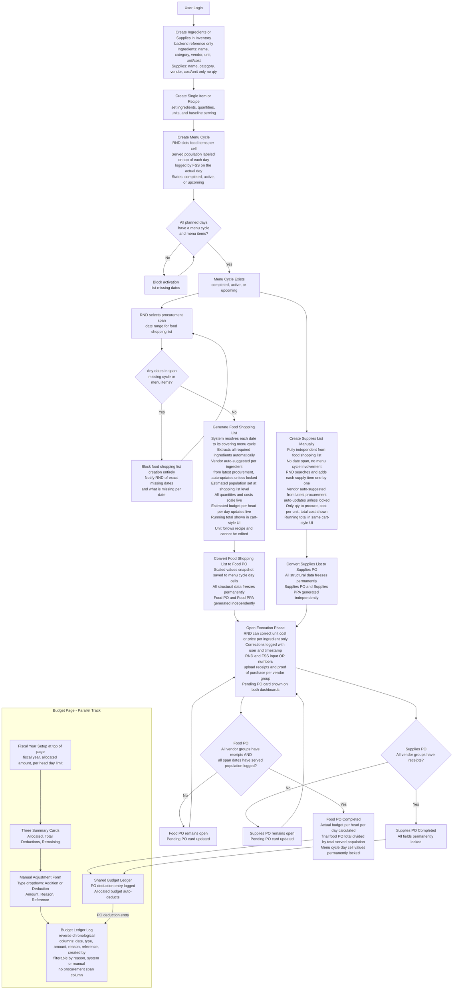

Use caveman mode and laravel boost always, and laravel-best-practices skills and superpowers when needed

Already did a comprehensive review of files that we may need to look for or for structuring the variable names or migrations necessary. use foodservice-analysis-and-restructure.md as the main context of reference

make sure all i mentioned here would be the only kinds of data or variables that i would see , remove anything i didnt mention as they are no longer required for the system, do not add any extra 

**UI**
- All tables must have an action column with Edit and Delete buttons
- Delete or open actions should not be triggered by clicking the row name
- Remove any edit action beside the name
- when dealing with front end always look for reusable components if there is one for it
- all tables must be consistent on how they look and structured
- ui ux pro max skill

---

**Nutritional Care**
- *(none)*

---

**Food Service Workflow**

*Inventory*
- Remove the inventory page for food service staff entirely, they no longer need to do stocking
- Inventory is solely used as a backend reference list of items available for procurements, it should not be a navigable page for FSS
- Supplies in inventory have no qty field when creating or editing, only cost per unit
- The vendor auto-updates from the latest procurement unless the user manually locks it, in which case it stays fixed until unlocked

*Recipes and Food Items*
- When someone changes the unit in recipes it should auto convert based on the unit in the inventory
- Decimal points should only be max 2 decimal places
- Create either a single item or a recipe, set ingredients and their quantity and unit, set a baseline serving for those ingredients meaning how much ingredients would it need for that baseline serving
- The unit in the recipe should auto convert the rate of the price based on the inventory unit
- If a unit cannot be converted, warn the user and do not allow the use of bundle units or similar when the inventory unit is something that can be converted
- Outliers without a convertible unit are okay, just warn the user

*Menu Cycle*
- The landing page of Menu Cycle should be the current active menu cycle, not the list
- The list should still be accessible but not the default view
- Menu cycles have three states: completed, active, and upcoming
- RND slots food items on each cell of the menu cycle
- When you select a cell that has a food it should display a UI similar to edit recipe but showing its actual values, if the cell has no PO conversion yet then only list the ingredients, once the shopping list is converted to a PO the scaled values are transferred and saved as a snapshot to that cell permanently and those are what will be displayed
- The value entered on top of each menu cycle day cell is the served population, label it clearly as served, it is the actual headcount FSS logs on the day itself and is paired with that specific day, it is not the same as estimated population and must never affect procurement planning
- FSS has two views of the menu cycle: a full menu cycle view and a day by day prep view
- FSS can backfill served population in both views anytime before the related PO is completed

*Dashboard*
- Remove any inventory or stock related cards from both RND and FSS dashboards
- Remove budget per head per day from KPI cards on both dashboards
- Add a Pending PO card to both RND and FSS dashboards that shows any POs currently in open execution and what they are waiting on

*Budget*
- Remove graphs and insights from budget and their backends, unnecessary calculations, frontend, and migrations if they have one
- Budget per head per day should be set in Settings for both admin and RND
- The fiscal year setup section moves to the top of the budget page above the summary cards
- The summary cards slim down to three only: Allocated, Total Deductions, and Remaining
- Remove the separate PO Deductions, Manual Additions, Manual Deductions, and Over Allocation cards
- Remove the progress bar
- Budget view should show below the cards: a log of deductions and additions in reverse chronological order with columns for date, type, amount, reason, reference, and created by, filterable by reason from system or manual, no procurement span column
- Remove the budget report itself

*Reports*
- Remove the following reports entirely including their backends, frontends, and any related migrations: Dietary Cashbook, Budget, and Inventory
- Fix any remaining reports to accommodate the current state and ensure no stale data, no dead end values, everything must be reproducible and come from an actual input processed by the system

*Procurement*

Food Shopping List:
- Food shopping list and supplies list are two fully independent procurement tracks, they have their own PO, their own PPA, and their own reports, they only share the same budget ledger for deductions and nothing else
- When you generate a food shopping list it should include all the required ingredients for those food cycle span, if any dates in the span are missing a cycle or menu items block the creation entirely, notify RND of the exact missing dates and what is missing per date, do not create a partial list
- In the shopping list, only estimated servings and estimated per head/day should be at the top
- Estimated population is set once at the shopping list level and applies uniformly across the entire procurement span
- Once estimated population is set, all ingredients and their quantities scale live to that population, all costs scale live as well, and the estimated budget per head per day for the entire procurement span updates live
- Unit is not editable in the shopping list, it follows whatever unit was set when the recipe or single item was created
- Proportions are derived from the recipe or food item's baseline serving, scaled by the estimated population
- The shopping list UI should follow an ecommerce cart layout, each ingredient listed with its scaled quantity and cost, a running total procurement cost displayed at the top or bottom of the cost column, and the addition per ingredient visible alongside it
- Vendor is auto-suggested per ingredient from the latest procurement of that ingredient, auto-updates unless manually locked
- After the user sets prices and estimated population, the system should automatically calculate the estimated budget per head per day using the total procurement span cost, based on the span of days multiplied by the estimated population against the total procurement cost
- It should never display as blank or a dash once the estimate is set because all the values needed to calculate it are already there
- When converted to a PO, all structural data freezes, the scaled values snapshot is saved to menu cycle day cells permanently

Supplies List:
- Supplies list is a fully independent procurement track from the food shopping list, it has its own PO, its own PPA, and its own reports
- Supplies list is not working, it should be a fully manual process with no date span and no menu cycle involvement
- RND searches and adds each supply item one by one
- Supplies in inventory have no qty, only cost per unit, so the supplies list only shows qty to procure, cost per unit, and total cost per item
- Same vendor principle applies: vendor is auto-suggested from the latest procurement of that supply item, auto-updates unless manually locked
- The supplies list UI mirrors the food shopping list UI in how costs are calculated and displayed, running total shown in the same cart style layout
- When converted to a supplies PO, the PO shows vendors, drilling into a vendor shows only qty, cost per qty, and total cost, same UI pattern as the food procurement vendor drill down view
- The allocated budget auto-deducts from the shared budget ledger when the supplies PO is completed, logged as a PO deduction entry same as food

*Purchase Order and Finalization*
- Converting a food shopping list to a PO means the procurement is confirmed, at the moment of conversion the scaled values for each food item and ingredient are transferred and saved as a permanent snapshot to their respective menu cycle day cells
- Converting a supplies list to a PO is its own separate conversion, independent from the food PO
- All structural data at the point of conversion is frozen and cannot be changed for both food and supplies POs, this includes items, quantities, estimated costs, and vendor groupings
- Once converted, both POs enter an open execution phase where RND and FSS can still input OR numbers, upload receipts, and upload proof of purchase on their respective vendor groups, but nothing structural changes
- During open execution RND can correct the unit cost or price per ingredient on a vendor group line if there was a wrong input, the total recalculates automatically from the corrected values, every correction is logged with the user who made it and the timestamp, this is the only editable field during open execution
- Both RND and FSS are notified with a Pending PO card on their dashboards showing what the PO is waiting on
- The food PO is not considered complete until every vendor group has receipts uploaded and every calendar day in the procurement span has served population logged by FSS
- The supplies PO is not considered complete until every vendor group has receipts uploaded
- FSS can backfill served population anytime before food PO completion
- Once all required fields are filled the respective PO transitions to completed, the allocated budget auto-deducts based on the final locked PO total, this deduction is logged in the shared budget ledger as a PO deduction entry
- For the food PO, actual budget per head per day is calculated at completion using the final locked PO total divided by the total served population across the span
- After either PO is completed nothing can change, all fields are permanently locked
- The mobile app must be able to access both POs, connected to the same backend as RND but limited to FSS only uploading photos for proof of purchase and receipts, and entering the OR number

---

**Workflow Summary**

---

**Your Output Structure**

Produce your output section by section matching the concerns above. For each section provide:

- **Files to touch** — exact file paths that will be modified
- **Files to delete** — exact file paths to be removed entirely
- **Existing variables, column names, and model names to reuse** — exact names as they appear in the codebase, with the file path and line number where they are defined
- **New variables, columns, or model names to create** — proposed exact names, their type, and their purpose based on the plan
- **Migrations to add, modify, or drop** — exact migration file names if they exist, or proposed new migration names, and what each one does
- **File references** — any controller, service, route, component, or hook file that is relevant to that concern even if it is not being directly modified, so the executing agent knows what exists nearby

Be specific. Do not describe in general terms. Name the variable, name the column, name the file, name the migration. If you are not sure of an exact name read the codebase until you find it before listing it.

At the very end produce a single section called **Errors and Conflicts Found** listing anything broken or conflicting you encountered while reading, with the exact file path and line number where possible. Do not fix anything. Do not implement anything. This plan will be handed to another agent for execution.